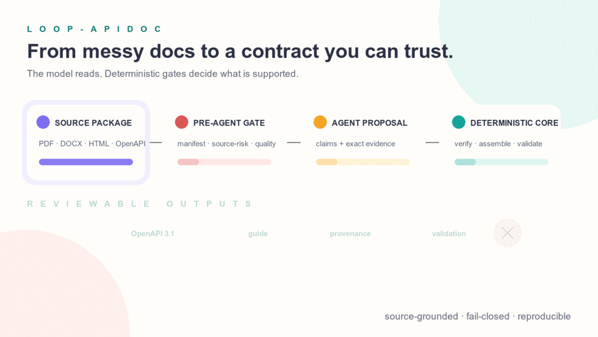

# loop-apidoc

> Loop Engineering 的**來源依據式（source-grounded）API 文件 pipeline**

## 架構方向

穩定的產品核心是 evidence-to-contract 平台：**Evidence Ledger → Grounded Claim Graph →
Canonical API Contract IR → 確定性 assurance → 受治理 release**。模型、agent、prompt、CLI
命令、儲存與產物目的地都只實作 typed port，可隨時替換。Runtime Adapter 的輸出只是 claim
proposal，不是來源真相或批准決策；OpenAPI 是確定性 projection，不是 canonical truth。

新的 `domain/`、`core/`、`adapters/`、`evaluation/` package 已實作這條
model-independent 邊界。下方 agent-native 流程仍是現行 CLI 的相容 adapter。詳見
[架構總覽](docs/ARCHITECTURE.md)與
[設計決策](docs/DESIGN_DECISIONS.md)。

*English version: [README.en.md](README.en.md)*

`loop-apidoc` 是一套可重複執行的 CLI，將格式與完整度不一的 API 串接文件，整理成一致、可追溯的標準化產物：

- **OpenAPI 3.1 YAML**（`openapi.yaml`）
- **繁體中文 Markdown 串接文件**（`api-guide.zh-TW.md`）
- **離線人工核對頁**（`review.html`）：把缺漏、來源衝突與未確認事項列為可持續追蹤的治理項目，不把文件未提供 Server URL、authentication details 或 sandbox credentials 一律標成整合風險
- **來源追溯資料**（`provenance.json`）
- **驗證與缺漏報告**（`validation/report.{json,md}`）

核心原則：**供應商來源是規範性、供應商文件明載 claim 的唯一權威**。來源未提供的內容絕不推測；若必填資訊缺失，驗證會失敗並明確列出缺口，不會拿慣例補空白。被動匯入的實作觀察屬於另一條經驗性權威軸：它只能描述某個精確 Applicability Envelope 內實際觀察到的行為，永遠不會變成供應商來源支持。

---

## 為什麼需要 loop-apidoc

### 串接文件的現實

第三方 API(金流、遊戲、物流……)的串接文件形式極度分歧:掃描版 PDF、官網 HTML、Word 附件、半套的 OpenAPI。同一份規格常散落在多份文件、版本互不同步;人工整理耗時、易漏,而且整理完的結果回答不了「這個欄位是文件哪一頁說的?」——串接出錯時無從稽核,文件改版時無從比對。

loop-apidoc 把這些異質來源整理成單一標準形:OpenAPI 3.1 + 繁中指南 + provenance(逐項回指來源位置)+ 驗證報告。缺什麼、哪裡互相衝突,報告明講;產物可 `diff`、可在本機 `review` 工作台人工覆核、可經 `foundry` 資產化、可隨時重建。

### 在 vibe coding 中為什麼重要

vibe coding 的本質是把實作交給 coding agent——而 agent 的產出品質,直接取決於餵給它的規格品質:

- **原始文件是幻覺的溫床。** 直接把 PDF 或網頁丟給 agent,遇到缺漏它會用「常見慣例」腦補:自動假設 OAuth、REST 慣例、標準錯誤格式。串接金流時,這種貌似合理的臆測正是最貴的 bug。loop-apidoc 的 fail-closed 原則把「來源沒說」變成明確列出的缺項,而不是留給 agent 自由發揮的空間。
- **agent 需要機器可讀的 ground truth。** `openapi.yaml`、`integration-contract.json` 與 `examples/` 是 agent 可直接消費的規格——比起每個 session 重讀幾十頁 PDF,token 更省、結果可重複,而且多個 agent、多個專案讀到的是**同一份事實**。
- **人要能稽核 agent 的依據。** provenance 逐項回指來源,`review.html` 供離線人工核對——vibe coding 不是放手不管,而是把人的角色從「逐行寫碼」移到「驗收規格與產物」,這件事需要可追溯性才做得到。
- **規格是資產,不是一次性 prompt。** `review` 先在本機呈現候選版與目前版的差異，保存可交棒給工具或 agent 的結構化 handoff；人按下明確核准後，`foundry` 才把 run 升級為版本化資產（`.foundry/api/` 的 `current` 指標）。文件改版時 `diff` 按下游影響分類——每一次 vibe coding 迭代都站在同一份受治理的規格上，而不是每次重新理解一遍。

### 與「直接請 AI agent 整理」有什麼不同?

本工具的擷取引擎**同樣是模型**(agent-native:讀文件的正是當前 coding agent)。差別不在「用不用 AI」,而在模型外那一圈**確定性的工程**:

| | 直接請 agent 整理 PDF/URL | loop-apidoc |
| --- | --- | --- |
| 產出正確性 | 模型自我宣稱,無人把關 | 模型產出只是輸入,須通過確定性驗證閘:`verify-extraction` 跨檔不變式 → structure/completeness/consistency/**no-speculation** 檢查,不過就 FAIL |
| 幻覺 | 遇缺漏用 REST/OAuth 慣例腦補,且看起來合理 | fail-closed 機器強制:進入 OpenAPI 的內容必須回溯到來源依據的 plan item,否則 `UNSUPPORTED_ASSERTION`/`SOURCE_UNVERIFIED` 擋下 |
| 可稽核性 | 一段散文,無法問「這句是哪頁說的」 | `provenance.json` 與 OpenAPI 位置一對一對齊;`review.html` 供人工核對 |
| 可重複性 | 每個 session 結果不同 | 後半段是純確定性 CLI:同一份擷取 JSON 永遠產出同一份成品 |
| 遺漏偵測 | 長文件讀到哪算哪,漏了不會說 | URL coverage 帳本(expected vs fetched)、preparation 就緒度、端點數量/identity 比對——漏抓會被點名 |
| 修正方式 | 「再改一下」,不保證收斂 | typed issues(severity 閘 + `target_file`/`field_path`/`requery_scope` 路由)驅動修正迴圈,可判定收斂/停滯 |
| 改版與治理 | 重問一次,無法比對 | `diff` 按下游影響分類、`review` 保存可續辦的人工結論、`score` 量化品質、`foundry` 版本化資產 |
| 實證 | 無 | 十三個真實廠商 case 的 benchmark 回歸 harness;早期實測第一輪 validate 就攔下 6 個「直接整理會犯的錯」 |

Benchmark 證據分兩個層級：CI 在沒有 gitignored 來源快照時，仍能確定所有已提交 fixture
可被探索，且與 required inventory 完全一致；source-backed PASS 則必須持有原始來源快照，
只有 `scripts/quality_gate.py --strict-local` 能證明所有 required case 都實際執行且零
skip。已探索或被 skip 的 case，並未通過來源支撐的重新驗證。詳見
[benchmark harness canonical contract](docs/BENCHMARK_VALIDATION_PLAN.md)。
exact-evidence 相關變更可另跑 `scripts/quality_gate.py --sanitized-fixtures`，在 CI
重播經審核、保留原始行號的來源片段；這是範圍較窄的 fixture-backed 保證，不能稱為
source-backed 或 strict-local PASS。
Implementation-backed conformance benchmark 是第三條、分開回報的 assurance lane；它只衡量
宣告的 Applicability Envelope、時間與 suite version 內觀察到的行為，不能算成 source-backed
`--strict-local` pass，也不能增加 documentary grounding coverage。

**兩種做法各有適用場景,誠實地說:**

- **直接請 agent 整理**:零建置、一句話就有結果。要**快速看懂**一份文件在講什麼、做一次性的低風險探索,這樣就夠了——用 loop-apidoc 反而是殺雞用牛刀。
- **loop-apidoc**:要走完整 pipeline(擷取 JSON → 驗證 → 修正迴圈),初次成本與 token 花費較高。換到的是可驗證、可稽核、可重複、可治理。適用於**要上線的串接**(尤其金流等出錯代價高的場景)、多專案/多 agent 共用同一份規格、以及文件會持續改版需要追蹤差異的情境。

判斷準則:**整理結果會被拿去寫進 production 程式碼,就值得過閘;只是要看懂,直接問就好。**

一句話:**vibe coding 把「寫程式」變快了,「規格正確」就成了新的瓶頸——loop-apidoc 補的正是這個瓶頸。用模型,但不信任模型:模型負責讀,「對不對」交給不會腦補的確定性程式碼。**

---

## 運作方式

擷取引擎是**當前的 coding agent 自己**:在 Claude Code plugin 或 OpenAI Codex CLI 的 session 裡,確定性工具先取得／前處理 agent 實際會讀的來源包、建立 manifest,並執行 pre-model `inspect-source-risk`。只有與來源穩定綁定的 pass audit 才能進入 agent 來源品質審查與**對來源唯讀的 subagent fan-out**。主 agent 寫出 `inventory.json`(＋選填 `integration.json`),各端點 subagent 各自寫出 `endpoints/ep<N>.json`,先以 `verify-extraction` 檢查擷取契約,再呼叫確定性 CLI `assemble` 跑後段 plan → generate → validate。

### 完整流程



```
來源取得／preprocess → manifest → inspect-source-risk → agent 來源品質審查 → assess-sources --source-risk → 擷取(agent 唯讀 subagent fan-out) → verify-extraction → assemble: manifest → 規格化計畫 → 生成(OpenAPI + Markdown) → 驗證
```

驗證會輸出分類後的問題報告。修正由 agent 自行驅動:`assemble` 以 `--json` 回報結果,agent 依報告回頭重讀來源、覆寫擷取 JSON,再重新執行 `assemble`,直到通過或判定為無法修正的缺漏／衝突。

### 實作回饋與 Effective Contract

已核准的 Foundry asset 是 **Normative Contract**：不可變更地記錄供應商來源明載的
內容。`feedback assess` 會把該 base 與被動、正規化的 Observation Bundle 比對，計算
`confirms`、`contradicts`、`inconclusive` 或 `out_of_scope` 關係及 conformance coverage；
它不會改變文件依據、base asset、candidate 或任何 current pointer：

Observation kind 是語意 allowlist，不只是允許的 enum 值。`operation_success`／
`response_status` 必須綁定同一 selected operation 與該 operation claim 的
`/responses/<status>/status_code`；`response_field`／`response_json_type` 必須綁定該
operation response 引用的 schema，以及相符的 `/fields/.../name` 或 `/fields/.../type`。
跨 operation 或 field/type 不相符時一律 fail closed。

```bash
uv run loop-apidoc feedback assess \
  --project ./my-api --docset payment --asset <asset-id> \
  --bundle ./feedback-bundle.json --output ./feedback-assessment
```

命令不做 network I/O，且 `--output` 必須位於 `.foundry` 之外；會寫出
`feedback-assessment.{json,md}`。退出碼 `0` 代表無需變更、case 可結案，`1` 代表輸入
有效但仍有 discrepancy、inconclusive 或待人工處理事項，`2` 代表輸入或完整性檢查失敗。

治理流程是明確的，不會把 assessment 結果偷偷發布：

```bash
# 把可審查 finding 轉成 amendment proposal 檔。
uv run loop-apidoc feedback propose \
  --assessment ./feedback-assessment/feedback-assessment.json \
  --at 2026-08-02T10:00:00+08:00 --output ./feedback-proposals

# 保存 immutable、digest-bound case；submit 時 --proposal 可省略。
uv run loop-apidoc feedback submit \
  --project ./my-api --docset payment --bundle ./feedback-bundle.json \
  --assessment ./feedback-assessment/feedback-assessment.json \
  --proposal ./feedback-proposals/<proposal-id>.json

# 或對有／無 proposal 的 case 寫入一次 non-approval decision。
uv run loop-apidoc feedback review \
  --project ./my-api --docset payment --case <case-id> \
  --reviewed-by reviewer-001 --reviewer-version 1 \
  --at 2026-08-02T10:30:00+08:00 --disposition needs_evidence \
  --route provider_clarification

# 由具名的獨立人工核准有期限 amendment，並發布 exact-scope current。
uv run loop-apidoc feedback approve \
  --project ./my-api --docset payment --case <case-id> \
  --approved-by approver-001 --approver-version 1 \
  --at 2026-08-02T10:30:00+08:00 --expires-at 2026-09-02T10:30:00+08:00

# 依一個精確 target Applicability Envelope 解析 current Effective asset。
uv run loop-apidoc feedback current \
  --project ./my-api --docset payment --target ./target-envelope.json \
  --at 2026-08-02T11:00:00+08:00
```

`feedback compose` 是不發布的預覽：傳入 `--target`、針對每個候選 amendment 重複
`--amendment`，並在 `.foundry` 外寫出 `effective-contract.{json,md}`。沒有 open
discrepancy 時退出 `0`，仍有 open discrepancy 時退出 `1`，輸入或完整性錯誤則退出 `2`。
`feedback propose` 有至少一份 proposal 時退出 `0`、不需提案時退出 `1`、錯誤時退出
`2`；會讀寫治理狀態的 `submit`、`review`、`approve`、`current` 成功時退出 `0`，錯誤時
退出 `2`。Proposal 的 `--at` 不得早於 Observation Bundle 的 `observed_until`。沒有
`--proposal` 的 case 仍可稽核，但不能 approve。`submit` 建立 immutable
`candidate` case stage。`review` 可處理有或無 proposal 的 case，只寫入一次 non-approval
decision：`--disposition` 必須是 `rejected` 或 `needs_evidence`，必填的 corrective `--route`
不得為 `closed_no_change` 或 `amendment_proposal`。其 `--at` 不得早於 observation
completion；若有 proposal，也不得早於 `proposal.created_at`。任何 feedback report／proposal／
case／decision／amendment 持久化前，deterministic privacy gate 都會拒絕敏感欄位名稱，以及明顯 email／phone／
national-ID／SSN／passport／Luhn-valid payment-card 值；低 entropy PII 必須省略，不能改以 hash 保留。`approve` 則是 proposal 的另一個階段，
會附加綁定的 write-once decision／amendment，再發布另一份 immutable approved Effective
release。核准必須由具名且獨立的人工執行，
並指定含時區的 expiry；它只更新 exact-scope Effective pointer，不會改動全域 normative
`current`。同 target 衝突會 fail closed；只有 `--supersedes-amendment` 明確指定同 scope
被取代的 amendment 時，核准才會把既有 lineage 納入 composition 並記錄。選填的
`--rationale` 與可重複的 `--revalidation-trigger` 可保存其餘決策脈絡；後者只是自由文字
review declaration。目前沒有外部 trigger-signal contract，因此不代表會自動重驗或執行。
Approval lineage 從 `current` 共用的 bound exact-scope integrity read 開始。Pointer 的
`effective_asset_digest` 綁定完整、strict-validated canonical 的 current
`EffectiveAsset`（包含所有宣告欄位）；未知欄位會 fail closed。每個 successor 的
`supersedes` 必須與 `supersedes_asset_digest` 成對，形成 immutable hash chain。Governed 與
user-facing traversal 逐節驗證 predecessor asset digest 與 amendment artifact digest。新的
reviewed amendment 可明確 supersede 並恢復 expired lineage；任何歷史 asset metadata、
amendment 或 supersession 竄改都 fail closed，絕不能污染下一次 approval／composition。

Assessment 的八條 deterministic route 全部可達：全數確認走 `closed_no_change`；一般
inconclusive 走 `needs_evidence`；高風險 contradiction 走 `provider_clarification`；
harness／fixture failure 走 `implementation_correction`；out-of-scope 或 DNS／proxy／gateway
failure 走 `environment_configuration_correction`；沒有 documentary evidence 的安全
contradiction 走 `extraction_correction`；重複 network／timeout／rate-limit failure 走
`provider_runtime_regression_review`；有 documentary grounding 的安全 contradiction 走
`amendment_proposal`。只有 `confirms`／`contradicts` 計入 assessed claim；`inconclusive`／
`out_of_scope` 仍是 untested 且 open。

Proposal 與 Effective composition 綁定的是完整 Normative release digest，不只 projected
contract，也包含 documentary fragments 與 support relationships。`feedback current` 因此是
as-of validity check，不是盲目讀 pointer；若 query time 早於 approval／composition、
Effective release 已過期、其 base 已不是全域
normative `current`，或 pointer／bounded artifact binding stale，就會拒絕。Pointer 另以
`effective_asset_digest` 綁定完整、strict-validated canonical 的 current
`EffectiveAsset`（包含所有宣告欄位）；未知欄位會 fail closed。asset／pointer 也綁定
`effective-contract.json`、`compatibility-amendment.json`、`provenance.json`。`current` 會對
這些 binding 執行 bounded path／parse／digest／lineage cross-check。
成功時 JSON 會揭露 `valid_until`、`open_discrepancy_count`、`stale_amendment_count`、
`untested_material_claim_count`、`unresolved_contradiction_count`，讓下游保留 bounded
assurance 訊號。
Governed feedback／Effective JSON model 會拒絕未知欄位。Current 只接受 `APPROVED`，並
cross-validate contract identity、amendment IDs、validity／counts、approval actor／time 與
provenance approval／assessment／bundle bindings。Stale amendment 只指可驗證的
release／contract／source／policy／approval-time drift；expired 與 inapplicable 分開。
所有 governed lineage read 收斂至 `foundry.query`。

若可重現行為與來源不同，只能提出一個待人工審查、有期限且綁定 scope 的
**Compatibility Amendment**。**Effective Contract** 是一份確定性組合：一個已核准
Normative Contract release，加上只適用於某個精確目標 Applicability Envelope 的有效、
已核准 amendments；它不改寫 normative base。Foundry 的全域 `current` 仍只指向
normative asset，effective 選擇則綁定 deployment／scope，每個 override 都保留規範性與
觀察證據 lineage。衝突、到期、scope 不符、drift、未解 discrepancy 與未測 material
claim 都會明確揭露並 fail closed；系統沒有 global Effective current，也不宣稱普遍、永久的
「100% 真實」。

正式 **Provider Erratum** 走另一條路：把它當補充供應商來源取得，再完整經過
source-risk → source-quality → extraction → verification → assembly → review → Foundry
approval。這份具來源權威的新 release 才能 supersede 前一個 normative asset；尚未獲供應商
確認的本機觀察，只能影響經審查且有 scope 的 Effective Contract。
`feedback provider-erratum --metadata <path> --artifact <path> --output <dir>` 會驗證本機 artifact
binding，寫出不改動治理狀態的 `provider-erratum-handoff.{json,md}` 與上述有序流程；它不會
自行執行或繞過該流程。

---

## 以 Claude Code plugin 執行(agent-native)

除了 CLI,本專案也是一個 Claude Code plugin:在 Claude session 裡呼叫 `loop-apidoc` skill,給它一或多個來源(本機檔案或公開 URL),由 agent 自己擷取、呼叫 `loop-apidoc assemble` 組裝與驗證,並在驗證失敗時自行回頭補齊缺漏。

此模式由當前 agent 直接擔任擷取引擎(唯一擷取路徑)。安裝 plugin 後即可在 Claude Code 中使用;CLI 由 plugin 內含,透過 `uv run --project "${CLAUDE_PLUGIN_ROOT}" loop-apidoc assemble` 呼叫。

### 在 OpenAI Codex CLI 使用

同一份 skill 也能在 Codex 執行。Codex 不會設 `${CLAUDE_PLUGIN_ROOT}`,因此把 CLI 裝成全域指令,並把 skill 掛進 Codex 的 skills 目錄:

```bash
# 1. 把 CLI 裝成全域 loop-apidoc 指令(取代 plugin 內含的 uv run --project)
uv tool install --from /path/to/loop-apidoc loop-apidoc

# 2. 把 skill 掛進 Codex(symlink 即可,改檔自動同步)
ln -s /path/to/loop-apidoc/skills/loop-apidoc ~/.codex/skills/loop-apidoc
```

SKILL.md 以 `<APIDOC>` 佔位符自動辨識環境:有 `$CLAUDE_PLUGIN_ROOT` 走 plugin 內含 CLI,否則退到全域 `loop-apidoc`。其餘流程(擷取 → `assemble` → 驗證 → 修正)兩邊一致。

### Agent 交付層級

skill 在讀取來源前會先說明並詢問交付層級：`minimal`（預設）、`review`、`handoff` 或
`full`。`minimal` 只讓 agent 交付與傳遞 OpenAPI、provenance、驗證結果及需要時的整合
契約；未選取的衍生產物不會載入 agent context 或在 agent 間傳遞，以減少 token 消耗。
這是 agent 交付策略，不改變 CLI 的來源依據、驗證或相容 run-dir 結構。

發行說明：[`0.37.0`](docs/RELEASE_NOTES_0.37.0.md)。

---

## 安裝

需求:Python `>=3.11`,並使用 [`uv`](https://docs.astral.sh/uv/) 管理環境。

```bash
# 安裝相依套件
uv sync

# 確認 CLI 可執行
uv run loop-apidoc --help
```

### 完整發布流程

專案以 [Tagsmith](https://github.com/CarlLee1983/Tagsmith) 與 release script 固定版本化流程。版本
只輸入一次；準備命令會同步 Python／plugin／文件版本、更新 lock，並建立不可覆寫的 release-note
骨架：

```bash
# 將 <next-version> 替換為大於目前版本的 SemVer，並建立對應的 release notes
npm run release:prepare -- --version <next-version> --summary "新增發佈流程"

# 補齊 release notes、只選一項 Strategy impact，執行完整驗證後提交 metadata
git add . && git commit -m "release: publish <next-version>"

# 讀取 pyproject.toml 的已提交版本，先推送 HEAD 到 origin/main，以 Tagsmith 建立相同 tag，
# 再依已提交的 release notes 建立 GitHub Release
npm run release:tag -- --message "loop-apidoc <next-version>"

# 只預覽 tag 動作；不會寫入 GitHub Release
npm run release:tag -- --message "loop-apidoc <next-version>" --dry-run

# 僅限補救：已由 Tagsmith 發布 tag，但最後 GitHub Release 步驟失敗時使用
npm run release:github
```

低階 Tagsmith 指令仍可用於單獨檢查與預覽：

```bash
npm ci
npm run tag:next -- --level minor
```

`release:tag` 不接受 bump level，以避免 tag 與 package version 分岔；正式執行會先確認 GitHub CLI
的登入權限，未通過就不會 push 或打 tag，接著確認已提交的 `docs/RELEASE_NOTES_<version>.md`，推送
`HEAD` 至 `origin/main`，再由 Tagsmith 負責 tag 格式、順序、重複與推送保護，最後透過 GitHub CLI
依 release notes 建立相同版本的非草稿 GitHub Release。GitHub 必須驗證 tag 已存在，因此不能自行建立
競爭的 tag。Tagsmith（不是 GitHub Actions 或 GitHub CLI）是唯一 tag 發布者；`release:github` 僅在
已發布 tag 的最後 GitHub Release 步驟失敗時作補救。release push 與 release 建立後都要觀察 CI；檢查
失敗時以後續修正與新 release 處理，絕不 force-move 已發布 tag。

release-note 骨架要求只選一項 `Strategy impact`：若產品方向、優先序與 subsystem scope 未改變，
需寫明理由；若有改變，則列出同次更新的策略文件。`release:tag`（含 dry-run）與
`release:github` 在宣告缺失、仍為 placeholder 或同時選取兩項時，會在驗證 GitHub 登入與任何
外部動作之前中止。

記錄命令輸出的 Release URL，接著確認 `main` push 觸發的 CI 才算完整發布：

```bash
gh run list --branch main --limit 1
gh run watch <run-id> --exit-status
```

---

### 文件治理

[Docsentry](https://github.com/CarlLee1983/Docsentry) 會以本機 repository 證據驗證選定的
Markdown 文件，偵測失效的本地連結與文件中已不存在的 `npm run` 指令；CI 會在 `npm ci` 後執行
相同檢查。

```bash
npm run docs:check
```

它的範圍刻意限於 `.docsentry.json` 選取的 Markdown 檔案，不驗證 HTML 手冊、遠端網址、散文風格、
翻譯品質或生成的 run 產物。

---

## 支援的來源格式

PDF、Markdown、Microsoft Word（`.docx`；舊版二進位 `.doc` 不支援,manifest 會標明）、OpenAPI JSON／YAML、靜態 HTML 快照、公開 URL。

---

## 使用方式

### `manifest` — 建立來源 manifest

```bash
uv run loop-apidoc manifest --sources ./sources-or-file [--url <URL> ...] \
  [--url-coverage ./work/url_sources/coverage.json] [--output manifest.json]
```

掃描本機來源,記錄相對路徑、格式、大小、SHA-256、掃描時間、是否受支援、重複判定與處理狀態;公開 URL 另記錄擷取時間、HTTP 狀態與內容雜湊。省略 `--output` 時輸出至 stdout。

`--sources` 可接受本機來源目錄或單一來源檔案；若提供檔案，系統會以其父目錄作為 `sources_root`，且 manifest 僅包含該檔案。

### `catalog-url` / `select-url` — 先建立導航索引，再選取擷取範圍

```bash
# 只下載入口頁一次；它不會追蹤或下載側欄子頁。
uv run loop-apidoc catalog-url \
  --url "https://docs.example.com/api/introduction" \
  --output ./work/url_sources/catalog.json

# 選擇要擷取的文件分支與主題；此步驟同樣不下載正文。
uv run loop-apidoc select-url \
  --catalog ./work/url_sources/catalog.json \
  --branch "轉帳錢包" --term "轉帳" \
  --output ./work/url_sources/selection.json
```

`catalog.json` 是完整的導航 **coverage universe**，用於看見網站有哪些文件；
`selection.json` 可作為人工指定的模型閱讀起點。它不必限制工具端的快取範圍。

當網站擷取成本低、但模型 context 昂貴時，快取完整 catalog，然後只把候選卡片交給模型：

```bash
# 保存 raw HTML 與清除導覽後的正文；建立 heading、內部連結與實體索引。
uv run loop-apidoc cache-url-pages \
  --catalog ./work/url_sources/catalog.json \
  --output ./work/url_corpus

# 以正文內部連結、共享 Action／錯誤碼和導航層級產生小型候選卡片。
uv run loop-apidoc related-url-pages \
  --corpus ./work/url_corpus/corpus.json \
  --url "https://docs.example.com/api/action19" \
  --output ./work/action19-candidates.json
```

`cache-url-pages` 不呼叫模型；`corpus.json` 不嵌入正文，只指向本機 `raw/` 與 `body/`
檔。`related-url-pages` 輸出標題、breadcrumb、分數和關聯理由，模型只在需要時才讀取
候選頁的 `body_file`。這可保留完整來源與 coverage，又避免不相干分支、重複側欄和所有
正文一起進入模型。

若快取的 HTML 頁面是尚未渲染的 SPA shell，loop-apidoc 只會在同一 origin 探測四個固定
路徑：`/swagger.json`、`/openapi.json`、`/v3/api-docs` 與 `/api-doc/v3/sections`。回應必須
是根欄位含 `openapi` 或 `swagger` 的 JSON 文件才會接受並另存為獨立 corpus source；探測失敗、
非規格回應與一般 JSON 都不會記錄。命令會將偵測到的 shell 數量輸出至 stderr。

靜態單頁文件的 sidebar anchor 會保留為 catalog 節點的 `anchor`，並在 corpus 的單一入口
頁卡片中列為 `sections`（同一 HTML 只下載一次）。catalog 為空或沒有側欄時，使用
`cache-url-entry --url ... --output ...` 直接快取入口頁。已下載的 HTML 可用
`normalize-html-snapshot --input page.html --url ... --output sources/page.md` 轉為受支援
Markdown；命令會寫出帶原始 URL 與 SHA-256 的 `.source.json` provenance sidecar。HTML
本身也會在 manifest 中列為受支援格式。

若互動式瀏覽器能顯示受保護頁面，但直接 HTTP 取源被擋，可在完全不連線 origin 的情況下
匯入已儲存的 HTML／Markdown：

```bash
uv run loop-apidoc import-rendered-url \
  --input ./captures/quickstart.html \
  --url "https://docs.example.com/quickstart/" \
  --captured-at "2026-07-29T08:30:00+08:00" \
  --capture-method browser_save \
  --sources ./sources \
  --coverage ./work/url_sources/coverage.json \
  --confirmed-by-user
uv run loop-apidoc manifest --sources ./sources \
  --url "https://docs.example.com/quickstart/" \
  --url-coverage ./work/url_sources/coverage.json \
  --output ./work/manifest.preflight.json
```

importer 會保留原始位元組，並寫出含原始／canonical URL、擷取時間與方法、SHA-256 的
versioned provenance sidecar；格式錯誤與任何輸出碰撞都會拒絕。匹配的
`fetched_rendered` 結果讓 `manifest`／`assemble` 使用通過驗證的本機快照，不再探測受保護
origin；URL、路徑、method 或 digest 不一致則 fail closed。

若 URL 本身就是 Swagger 2.0 或 OpenAPI 3.x JSON／YAML，請先把它固定為本機來源，而不是
走 HTML 導覽流程：

```bash
uv run loop-apidoc snapshot-openapi-url \
  --url "https://example.com/openapi.json" \
  --sources ./sources \
  --coverage ./work/url_sources/coverage.json \
  --confirmed-by-user
```

此命令只下載一次，驗證規格宣告後寫入原始位元組、SHA-256 與 `method: direct` 的 coverage
ledger；既有快照或 coverage 不會被覆寫。後續 `manifest` 與擷取工作一律讀取該本機檔案。

### GitBook `llms.txt` — deterministic Markdown acquisition

For a GitBook entry that publishes `llms.txt`, cache the documented Markdown corpus directly
instead of spending model context on a JavaScript shell:

```bash
uv run loop-apidoc cache-gitbook-llms \
  --url "https://example.gitbook.io/docs" \
  --sources ./sources \
  --coverage ./work/url_sources/coverage.json
uv run loop-apidoc manifest --sources ./sources --url "https://example.gitbook.io/docs" \
  --output ./work/manifest.preflight.json
uv run loop-apidoc inspect-source-risk --sources ./sources \
  --manifest ./work/manifest.preflight.json --output ./work/source-risk
uv run loop-apidoc extract-markdown-drafts \
  --sources ./sources --manifest ./work/manifest.preflight.json \
  --output ./work/markdown-api-facts.json
uv run loop-apidoc scaffold-extraction \
  --sources ./sources --manifest ./work/manifest.preflight.json \
  --output ./work/scaffold
```

The cache fetches `llms.txt` once and caches every first-seen same-origin `.md` URL beneath the
entry path, preserving its URL hierarchy under `sources/`. Each successful page gets an original
URL/SHA-256/timestamp sidecar. Index/output failures fail before a partial corpus is written;
individual page failures remain `fetch_failed` in the coverage ledger. 在
`inspect-source-risk` 通過前，不得檢視 source-derived drafts 或重讀其 citations。The facts JSON is a
non-authoritative, line-cited draft of explicit endpoint headings, labelled parameter tables,
and fenced examples. It helps bounded agent review but never replaces source reading,
`verify-extraction`, or final agent-written extraction JSON.
`scaffold-extraction` 將這些機械事實投影成 extraction-shaped 的 `inventory.json` 與
`endpoints/ep<N>.json`，另附 coverage report 與 copy instructions。scaffold 不是
`--extraction` 參數：必須先把 JSON 複製到 `./work`、逐一覆核 citation、補齊 security、
integration 與 `missing[]`，再對 `./work` 執行 `verify-extraction`。

### Codex 與 Claude Code 的模型分工

skill 不綁定特定模型：由宿主將快速模型用於候選頁路由、一般模型用於受限的單頁擷取、
高推理模型用於跨頁審核。CLI 持續負責抓取、解析、provenance、coverage 與驗證；角色間
只傳遞 artifact 路徑與精簡摘要，不能因為模型 context 較大就把完整 corpus 放進去。詳見
[`model-orchestration.md`](skills/loop-apidoc/reference/model-orchestration.md) 的角色矩陣、
交接契約與 Codex／Claude 對應方式。

### `inspect-source-risk` — agent 讀來源前的確定性風險閘

```bash
uv run loop-apidoc inspect-source-risk \
  --sources ./work/sources_md --manifest ./work/manifest.preflight.json \
  --output ./work/source-risk [--max-bytes 5242880]
```

在來源文字進入模型 context 前，掃描 manifest 精確綁定的來源包。支援 UTF-8
Markdown、HTML、OpenAPI JSON/YAML；PDF、Word、無效 UTF-8、超過上限的文字與其他不可掃描
pending source 都是 blocker，需先轉換再重建 manifest。預設每檔 5 MiB。規則涵蓋兩個方向：
來源會不會**操縱** agent（Unicode tag、bidi override、控制字元、指令覆寫文字），以及來源會不會
**洩漏東西給** agent（`SR-SECRET-VALUE` 為 blocker，只認結構本身即證據的 PEM 私鑰區塊與 JWT；
`SR-CREDENTIAL-REFERENCE`、`SR-CONTACT-PII`、`SR-PII-VALUE`、`SR-PAYMENT-CARD` 為 warning）。憑證引用只給
warning，是因為合格的 API 文件本來就會示範 `Authorization: Bearer <TOKEN>`，值是真是假無法從文字確定；
卡號經 Luhn 驗證並排除各卡組織公告的測試卡號，候選不跨行（相鄰兩行數字接起來約十分之一會通過
Luhn），但 NBSP 與全形空格仍算分隔符。固定格式的
`source-risk-report.{json,zh-TW.md}` 最多保留 1,000 筆 finding；若尚有更多命中，最後一筆固定為 blocker `SR-FINDINGS-TRUNCATED`，讓高密度惡意輸入 fail closed 而不放大成無上限報告。Warning 另有 500 筆的獨立額度，溢出時產生 warning 級的 `SR-WARNINGS-TRUNCATED`——沒有這道分隔，一份合格大型文件裡高頻的聯絡信箱與憑證引用會經由截斷 blocker 把 verdict 變成 reject，而報告裡沒有任何一筆實質命中；blocker 仍可用滿整個上限，所以警告永遠擠不掉真正的命中。報告只記 rule ID、severity、source ref 與 locator，絕不回顯
命中的 payload，也不改寫來源 bytes。schema/ruleset 版本、`max_bytes`、manifest digest、逐來源
SHA-256 coverage 與穩定 source-binding digest 會阻止 stale audit 重用。退出碼：`0` = pass、
`1` = reject、`2` = 無效、不安全、無法讀取或綁定不符的輸入。

### `assess-sources` — 擷取前來源品質評估

```bash
uv run loop-apidoc assess-sources \
  --sources ./work/sources_md --manifest ./work/manifest.preflight.json \
  --source-risk ./work/source-risk \
  --observations ./work/source-observations.json \
  --source-set "<來源集名稱>" \
  --output ./work/source-quality [--base-manifest <舊 manifest>]
```

擷取前先驗證 `--source-risk` 是同一份 manifest 與穩定 source binding 的 current pass，並對目前來源 bytes 重跑確定性檢查，再把 manifest 與 agent 記錄的來源觀察評成來源品質報告（`source-quality-report.{json,zh-TW.md}`）與來源版本差異（`source-diff.{json,md}`）；JSON 會嵌入已驗證的 source-risk audit。blocker observation 可明列 `required_source_refs`；reject report 依原順序去重後輸出為 bounded next-capture seed，但不抓取或 crawl。退出碼：`0` = pass、`1` = 品質 reject、`2` = 缺少、格式錯誤、已 reject、stale、遭竄改或綁定不符的輸入／audit。產出的目錄可經 `assemble --source-quality` 傳入；assemble 會重建 manifest、再次重跑確定性檢查並重驗嵌入 audit，建立 run-dir 前即拒絕異動或竄改。

### `record-fingerprint` / `check-freshness` — 來源新鮮度排程閘

```bash
# 從已完成/已核准的 run 目錄寫出基準 fingerprint（本機來源 SHA-256、URL 來源版本訊號各抓一次）。
uv run loop-apidoc record-fingerprint --run-dir ./output/<run-id> --output ./work/source-fingerprint.json

# 排程（如 cron）低成本比對目前來源訊號與基準；有本機來源時需帶 --sources。
uv run loop-apidoc check-freshness --fingerprint ./work/source-fingerprint.json --sources ./sources --json
```

`check-freshness` 不呼叫模型，只重算各來源的便宜訊號並與基準比較：OpenAPI URL 來源比較
`info.version`（版本相同即使位元組不同也視為未變）、HTML 先比對 ETag／Last-Modified 再退回
內文 SHA-256、本機檔案比對 SHA-256。退出碼：`0` = 未變（可跳過重新解析）、`1` = 已變（需重跑
擷取）、`2` = 無法判定（有來源抓取或讀取失敗）。加上 `--report-dir` 時另存
`freshness-report.{json,md}`；未帶則不寫檔。

要一次巡檢多份 docset，改用 `check-freshness-batch`：讀取 `freshness-watchlist.json`（每筆列出
`label`、`fingerprint` 側檔相對路徑、選填 `sources`/`run_dir`），逐項執行同一個新鮮度比對，彙總成
單一份報表。

```bash
uv run loop-apidoc check-freshness-batch --watchlist ./work/freshness-watchlist.json --json [--report-dir ./work/freshness]
```

單一項目抓取失敗不會中止整批巡檢，只會把該項標記為 `error`；watchlist 檔案本身格式錯誤則直接失敗。
彙總退出碼：`0` = 全部未變、`1` = 有任一已變、`2` = 有任一無法判定或發生錯誤。加上 `--report-dir` 時
另存 `freshness-scan.{json,md}`；未帶則不寫檔。

要把批次結果轉成受控的人工處理觸發，使用 `governance-scan`：來源變動會產生
`review_required`，而無法判定或讀取錯誤會產生 `attention_required`。這個命令只寫出
`governance-trigger.{json,md}`，**不會**重新擷取、生成、匯入 Foundry 或核准任何契約。當需要保存
本次判定為變動的原始來源，以便後續人工／agent 重新擷取時可重現，加入 `--snapshot-dir`；它會寫出
不可覆寫的內容定址 evidence pack（`sources/<sha256>.source` 與 `governance-snapshot.json`）。未變、無法判定
與錯誤來源不會被快照，也不會為全未變的掃描建立空目錄。

```bash
uv run loop-apidoc governance-scan --watchlist ./work/freshness-watchlist.json --json \
  --report-dir ./work/governance --snapshot-dir ./work/governance-snapshot
```

退出碼同樣是 `0` = no action、`1` = review required、`2` = attention required。

### `validate` — 驗證既有 run 目錄

```bash
uv run loop-apidoc validate --output ./output/<run-id>
```

對 run 目錄輸出執行結構／完整性／一致性／禁止推測四類驗證,並將報告寫入 `<run-dir>/validation/`。通過回傳 `0`,有 ERROR 級問題回傳 `1`。

### `score` — 評分既有 run 目錄

```bash
uv run loop-apidoc score --output ./output/<run-id> [--profile ci|review] [--min-score 85] [--json]
```

讀取既有 run 目錄的 `validation/report.json`、`openapi.yaml`、
`provenance.json`、`manifest.json` 與選填的 `plan/normalization-plan.json`，
輸出 `score/score.json` 與 `score/score.md`。`ci` profile 預設門檻為
`85`，`review` profile 預設門檻為 `70`。退出碼：`0` = pass，`1` =
needs_attention / fail，`2` = run-dir 輸入錯誤。

### `evaluate` — 比較兩個 runtime 的 replay 結果

```bash
uv run loop-apidoc evaluate --baseline ./baseline-replay.json --candidate ./candidate-replay.json --output ./evaluation [--json]
```

比較同一案例、同一版本的兩份已保存 `ReplayReport` JSON，輸出
`evaluation-report.{json,md}`。報告列出所有品質 metric 的 candidate-minus-baseline
delta，以及 cost／latency delta；任一端未回報成本或延遲時保留 `null`。這是 immutable
evaluation artifact：不會 assemble、匯入 Foundry 或核准契約。退出碼：`0` = 完成，`2` =
輸入缺檔、格式錯誤或案例版本不一致。

### `governance-review-plan` — 將來源變動交給人工／agent 審核

```bash
uv run loop-apidoc governance-review-plan --trigger ./governance/governance-trigger.json --snapshot ./snapshots --output ./review-plan [--json]
```

重新驗證 immutable snapshot 的每個 source digest，並寫出 `governance-review-plan.{json,md}`：包含變更來源、既有 run 與必要的人工／agent 步驟。不會抓取、重新擷取、assemble、匯入或核准契約。

### `diff` — 比較兩次 run 的版本差異

```bash
uv run loop-apidoc diff --base ./output/<old-run> --head ./output/<new-run>
```

比較兩個已完成 run directory，依 downstream impact 輸出差異報告。預設寫入
`<new-run>/diff/report.{json,md}`；可用 `--output` 指定其他目錄。差異分類為
`breaking`、`additive`、`changed`、`source_only`，比較範圍包含
`openapi.yaml`、`integration-contract.json`、`provenance.json`、
`validation/report.json` 與 `manifest.json`。第一版不比較 Markdown guide 或
generated examples。退出碼：完成回傳 `0`，輸入 run-dir 缺檔或格式錯誤回傳 `2`。

### `foundry` — API 專案本地資產治理

```bash
uv run loop-apidoc foundry [init|import|approve|list|current] --help
```

提供管理 docset、將 run 目錄匯入為 candidate、以及核准 asset 以更新 `current` 指標的子指令。適用於需要對文件版本進行人為審核與發布管理的場景。Normative `asset.json`／`current.json` 是 strict、versioned 的 `normative-asset/v1`／`normative-current/v1` 格式；current 綁定完整 asset manifest digest 與每個可解析產物的 deterministic digest，讀取會拒絕未知欄位、非 `APPROVED`、缺少 approver lineage、summary／identity 不一致、absolute／traversal／symlink／越界路徑、缺失或 bytes 改變。未綁定的舊格式不會 silent fallback；operator 必須以新 candidate 明確執行 `approve --reapprove-legacy --by <operator> --legacy-current-sha256 <trusted-current-digest> --legacy-asset-sha256 <trusted-asset-digest>`。這兩個 raw-byte SHA-256 必須來自 trusted backup／release inventory；系統會在 legacy parsing 前比對兩份 exact binding，legacy asset bytes 保持不變。這個 flag 只接受未版本化且 summary 一致的 legacy head，遇到 v1 或未知版本會拒絕。Approve 先寫 immutable asset，再以 atomic pointer publication 推進 current；推進失敗會恢復舊的 pointer、docset 與 catalog head，供 retry。

### `review` — 本機比對、交棒與人工核准

```bash
uv run loop-apidoc review --project ./my-api --docset payment --run ./output/<run-id>
```

在 `127.0.0.1` 啟動單使用者工作台，必要時自動把完成的 run 匯入 Foundry candidate，並與目前 `current` 資產比對；第一版則建立 baseline review。畫面呈現驗證結果、版本差異與可記錄的主觀結論。若 candidate 帶有 Core evidence，對應的 validation finding，以及能明確對應的 operation-level version diff，都會直接顯示 relationship（`explicit_support`、`derived_support`、`contradicts` 或 `insufficient`）、fragment locator／digest 與保留的來源 excerpt，並連到 Core review artifacts；不足或矛盾證據會明確標示，不會被呈現為支持。結論寫入 candidate 的 `review/decision.json` 作為給後續工具或 agent 讀取的結構化 handoff。按下核准才更新 `current`；驗證失敗、差異或未完成 handoff 不會鎖死核准，但會把資產狀態標成 `needs_follow_up`。工作台不呼叫模型，也不取代驗證。

### `preprocess` — PDF／DOCX 轉成可掃描 markdown

```bash
uv run loop-apidoc preprocess --sources ./sources --out ./work/sources_md
```

PDF 使用 pymupdf4llm，`.docx` 使用內建 fail-closed OOXML normalizer；受支援的文件會保留標題與表格並輸出 `<原檔名>.md`。DOCX 另寫 deterministic `.source.json` sidecar，記錄 schema／security-policy version、原始與正規化檔名、大小及 SHA-256。壓縮檔上限為 25 MiB、最多 2,048 entries、每個 member 最多 10 MiB、解壓總量最多 50 MiB、壓縮比最多 100:1。此首個 slice 支援 UTF-8-compatible Transitional OOXML textual DOCX；ZIP 路徑／資源上限、巨集與 active DDE field code、markup-compatibility alternate content、外部 relationship、DTD/entity、損壞的 OPC/XML、`altChunk`、embedded media、帶實質內容的 header/footer/note/comment part，以及目前無法忠實輸出的合併儲存格語意，都會在批次輸出前被拒絕，避免靜默漏掉證據或把欄位移到錯誤位置。既有 Markdown／sidecar、衍生路徑碰撞或 normalization error 一律不覆寫並使 `preprocess` 以 exit 2 結束。舊式 `.doc` 維持 passthrough，須先用可信任的外部工具轉檔。目錄輸入保留來源相對路徑，`--sources` 也可指定單一檔案。之後務必針對精確的 `--out` 目錄建立 manifest 並通過 `inspect-source-risk`，agent 才能讀取。

### `verify-extraction` — 檢查擷取 JSON 是否符合契約

```bash
uv run loop-apidoc verify-extraction \
  --sources ./sources --extraction ./work [--url <URL> ...] [--focus ./focus.json] [--json]
```

在呼叫 `assemble` 前，先以同一套輸入閘檢查 agent 產出的擷取目錄（`inventory.json` + `endpoints/*.json`，選填 `integration.json`）：schema、來源引用、跨檔不變式、選填 v1 `evidence[]` 的精確 source/typed locator/normalized fragment SHA-256 驗證，以及**語意完整性閘門**。後者會機械掃描 Markdown 來源的端點宣告、參數表與範例區塊,當某端點的來源小節明明寫了欄位或範例、擷取卻交回空清單時直接 fail closed 並指名缺了哪些欄位,同時拒絕「需進一步擷取」這類佔位答案。來源真的沒寫的東西仍然只是缺口:在 `missing[]` 具名記下即可通過,閘門不會逼出捏造。**不寫檔、不建立 run 目錄**。退出碼：`0` = 乾淨、`2` = 有違規或硬 schema 錯誤（不會是 `1`——`1` 保留給 validate FAIL）。`--json` 把違規以 JSON 陣列印到 stdout 供 agent 解析。

### `--focus` — 依任務對擷取下重點指令

`verify-extraction` 與 `assemble` 皆可選用;不給就與現況完全相同。`focus.json` 裡寫的是
「這次串接少了它就不能上線」的東西 —— 金流的結算回呼、遊戲平台的錢包轉帳端點 —— 擷取
agent 對每一條恰好應答一次,寫進 `<extraction>/focus-response.json`。

`kind` 是 severity 的唯一來源:**Expectation Directive** 斷言供應商來源確實記載了它,
**Coverage Directive** 只指定一個要掃乾淨的範圍、找不到也算完整回答。`intent` 是錨點型別
的唯一來源。應答只有兩種結局:`satisfied` 帶錨點,每個錨點釘在精確的來源片段上(只給檔名
會被拒絕);`not_found` 帶查過的來源。刻意沒有第三種 —— 一條 directive 適不適用是提出者
的判斷,不是 agent 的。

`collect_error_codes` 這個 intent 另有完整性判定:來源在錯誤碼表格裡攤出來的碼構成
**記載錯誤碼下界**,報得比它少會以 `FOCUS_INCOMPLETE` 點名漏掉哪幾個、各記載在哪一行,
severity 一樣由 `kind` 決定;報得比它多仍然通過(那是底線不是等式),來源沒有可辨識的
表格就不下判斷 —— 見
`docs/adr/0005-the-error-code-floor-comes-from-source-structure-alone.md`。

結構性問題(某條 directive 沒人應答、錨點指不到任何已擷取端點、證據指向 manifest 以外的
來源)在建立 run 目錄之前就失敗。focus 材料不會進入 `provenance.json`、score 或任何
Foundry 治理資產,所以同一份來源、不同 focus 的兩次 run 仍可互相比對 —— 見
`docs/adr/0004-focus-directives-never-enter-comparable-artifacts.md`。

#### 怎麼寫 `focus.json`

檔案是嚴格契約:多寫欄位會被拒絕,`id` 在同一份檔案內必須唯一。

| 欄位 | 必填 | 值 |
| --- | --- | --- |
| `version` | 是 | `1` |
| `directives[].id` | 是 | 非空白、檔案內唯一;應答就是靠它回指 |
| `directives[].kind` | 是 | `expectation`(查無記載即落空 → 阻斷)或 `coverage`(查無記載也是完整答案 → 警告) |
| `directives[].intent` | 是 | `find_operation`、`find_field`、`collect_error_codes` —— 錨點型別只由它決定 |
| `directives[].text` | 是 | 非空白。會逐字進入每個擷取 subagent 的 prompt,所以要當成指令來寫 |
| `directives[].rationale` | 否 | 為什麼重要;會帶進報告給下一個讀的人 |

```json
{
  "version": 1,
  "directives": [
    {
      "id": "settlement-callback",
      "kind": "expectation",
      "intent": "find_operation",
      "text": "一定要找到結算完成的回呼通知端點。若來源真的沒有記載,請列出已查過的每一份來源。",
      "rationale": "對帳排程以此回呼為觸發點,缺了它整份契約無法上線。"
    },
    {
      "id": "refund-operation",
      "kind": "coverage",
      "intent": "find_operation",
      "text": "掃過所有與退款、取消、沖正相關的端點;找不到不算失敗。"
    }
  ]
}
```

用 `--focus ./focus.json` 帶進 `verify-extraction`,再帶進 `assemble`。兩邊各自可選、互不
依賴,但要讓應答進到 run 的 focus 報告,`assemble` 這次一定要帶。

#### 怎麼讀應答

擷取 agent 會寫出 `<extraction>/focus-response.json`,對每個 `id` 恰好應答一次。
`reported_by` 指出承載錨點的端點檔;`not_found` 時為 `inventory`:

```json
{
  "version": 1,
  "responses": [
    {
      "id": "settlement-callback",
      "outcome": "satisfied",
      "reported_by": "ep3",
      "anchors": [{
        "type": "operation",
        "value": "POST /v1/callbacks/settlement",
        "evidence": [{
          "version": 1,
          "source": "provider-api.md",
          "locator": {"kind": "line_range", "start_line": 412, "end_line": 412},
          "fragment_digest": "a5a2…5e5d",
          "claim_path": "/summary"
        }]
      }]
    },
    {"id": "refund-operation", "outcome": "not_found", "reported_by": "inventory",
     "searched_sources": ["provider-api.md", "provider-errors.md", "webhooks.md"]}
  ]
}
```

`fragment_digest` 是正規化來源片段的 SHA-256,而且是從 manifest 的 bytes 重新推導比對、
不是照單全收 —— 只給檔名的引用在這裡會被拒絕,即使擷取的其他地方仍然接受。

#### 結果落在哪、然後該做什麼

- `<run-dir>/focus/focus-report.{json,zh-TW.md}` —— 每條指令、錨點怎麼解析、查了哪些來源、
  結局是什麼。跑完要讀的就是這份。
- 結構性失敗(沒人應答、錨點解不到、證據在 manifest 之外)在建立 run 目錄前以 `2` 結束,
  修好擷取再跑。
- `expectation` 誠實回 `not_found` 會通過閘門,成為 `FOCUS_UNMET` 驗證錯誤,產物照常寫出:
  拿著指南、OpenAPI 與已查來源清單,判斷這個缺口是供應商的還是你來源集的。同樣情況在
  `coverage` 只是警告,什麼都不擋。
- `collect_error_codes` 報得比記載下界少會成為 `FOCUS_INCOMPLETE`,具名列出漏掉哪幾個、
  各記載在哪裡。這兩種落差 `verify-extraction` 都會事先在 stderr 預告,並刻意不影響退出碼。

可複製的範本在 [`examples/focus/`](examples/focus/):
[`payment-integration.focus.json`](examples/focus/payment-integration.focus.json) 與對應的
[`payment-integration.focus-response.json`](examples/focus/payment-integration.focus-response.json),
同目錄的 README 也記錄了目前實際接上的檢查有哪些。

### GraphQL／AsyncAPI 狀態

Core 保留經測試的 `GraphqlProjectionCompiler` 與 `AsyncApiProjectionCompiler` 純函式
邊界，但目前不公開 CLI 或 run workflow。等具名下游 consumer 提供真實來源集與驗收契約後，
才會恢復端到端整合；格式 fixture 只能證明 compiler 可測，不能代替產品需求或完整 grounding。

### `assemble` — 從 agent 產出的擷取 JSON 組裝(由 skill 呼叫)

```bash
uv run loop-apidoc assemble \
  --sources ./sources \
  --extraction ./work \
  --output ./output \
  [--url <URL> ...] [--url-coverage ./work/url_sources/coverage.json] \
  --source-quality ./work/source-quality [--extractor-model <模型名稱>] \
  [--focus ./focus.json] \
  [--architecture-mode legacy|shadow|strict] [--json] [--score]
```

**不擷取**,只把 agent 已產出的擷取目錄(`inventory.json` + `endpoints/*.json`,以及選填的 typed `integration.json`)組裝成輸出:manifest → plan → generate → validate。`--source-quality` 為必要參數：其 `assess-sources` 套件必須通過目前來源 bytes 的 source-risk 重驗與 manifest binding，`assemble` 才會建立 run-dir，並把報告與來源差異保留供稽核與 Foundry 使用。這能拒絕產生未稽核的 run，但無法證明本流程外 agent 何時讀過來源文字。`integration.json` 可保存來源明載的 `transport`、`amount_direction`、`idempotency` 與 `line_currency_policy`；request 沒有 currency 欄位不會被當成單幣別證據。`inventory.operational[]` 用來記錄其餘來源明載的全域／跨端點規則；選填的 `applies_to[]` 會把規則連到經閘門驗證的 operation 或欄位，並由固定產生的 `integration-contract.json` 交給下游工具。`--json` 會把 `run_id`、`run_dir`、`review_html`、`ok`、`status`、`report`、`toolchain` 印到 stdout 供 agent 解析並驅動修正迴圈。run 目錄另會寫出 `run.json`，記錄 `toolchain`（`cli_version`、`extraction_contract_version`、`skill_version`、`model`），讓日後的回歸可單憑產物歸因到版本；`--extractor-model` 由 agent 明確帶入擷取所用的模型名稱，省略即為 `null`（CLI 不推測、不捏造）。退出碼:`0`=驗證 PASS、`1`=驗證 FAIL、`2`=擷取輸入檔錯誤。這是上方 [agent-native plugin](#以-claude-code-plugin-執行agent-native) 模式所呼叫的命令。加上 `--score` 時，`assemble` 完成後會額外寫出 `score/score.json` 與
`score/score.md`；assemble 的退出碼仍維持既有驗證語意。有 URL 來源時，可用 `--url-coverage` 傳入 agent 記錄的 `url_sources/coverage.json` 撈取帳本，`assemble` 會做 warning-only 的 URL 涵蓋檢核（不影響驗證嚴重度閘）。搭配 `--score` 的自循環旗標 `--target-score` / `--prev-score` / `--round-index` / `--max-rounds` 可讓 agent 依回報的 loop verdict 決定是否再跑一輪修正。

可用 `--architecture-mode shadow` 明確啟用觀測性的 model-independent Core
旁路；它在 legacy validation report 寫出後執行。成功時把 evidence、claims、
canonical contract、policy decision、workflow/events 與 legacy/Core comparison
寫入 `<run-dir>/core/`，失敗時寫入 `core/error.json`。Shadow 結果不會改變
legacy validation、score、approval、Foundry、`ok`/`status` 或 assemble 退出碼。
預設仍為 `legacy`，不會建立 `core/`。

`--architecture-mode strict` 則是阻斷式的 Core candidate 路徑：legacy validation
必須先通過；每個 legacy plan 中標為 `supported` 的 material claim path 都必須以
精確 fragment evidence 重新驗證，否則只寫 `core/grounding-report.json` 並以 exit
`1` 結束，不會寫入 `core/release.json`。成功才會 atomically 寫入 candidate
`core/release.json` 與 `core/execution.json`；它不會自動核准、發布或改動 Foundry。
strict 執行錯誤會寫 `core/error.json`、run status 為 `blocked` 並以 exit `2` 結束。
Foundry 只會接受 `candidate_eligible=true`、零 approval/publication side effect、且
存在 strict candidate release 的 strict run；`--allow-failing` 不能繞過此閘門。

Shadow mode 的 evidence 是 claim-level，而不是文件級引用。每個 material claim
path 會透過 `explicit_support`、`derived_support`、`contradicts` 或
`insufficient` relationship，連到 exact fragment，再連到 source artifact。
Exact fragment 使用 page、line range、section、table cell、JSON Pointer、CSS 或
XPath 等 typed locator，digest 則以 normalized fragment content 計算。Core 只用
確定性的值比對、表格儲存格、structured path、enum 與 source-fact 檢查決定
support；runtime confidence 不具權威。若 prose fragment 沒有 parsed scalar，通過
source identity、locator、digest 與 path 檢查的 v1 reference 只能支援它綁定的單一
material claim path；只有檔名或整份文件的 legacy citation 仍會降級為
`insufficient`，claim 維持 unverified。OpenAPI JSON Pointer 的 versioned derivation
只限 Core 的文件化 allowlist，並會從 exact fragment 與所有必要的 local-reference
context fragments 重新計算。

若 extraction 條目提供 v1 `evidence[]`，它會記錄精確的 manifest source、typed
locator、normalized fragment SHA-256 與 material claim path。`verify-extraction` 與
`assemble` 會在建立 run 前 materialize、驗證並解析該路徑；shadow 中該 reference
只專屬於所宣告的 claim path，再由 Core 驗證 relationship。欄位與範例見可攜 skill 的
[extraction schema reference](skills/loop-apidoc/reference/extraction-schemas.md)。

---

## 輸出結構

每次執行使用獨立 run directory:

```text
output/
└── <run-id>/                       # run-id 格式:%Y%m%dT%H%M%S.%fZ(含微秒,避免同秒衝突)
    ├── run.json                    # run 描述子（狀態 + toolchain 版本）
    ├── manifest.json               # 來源 manifest
    ├── extraction/                 # 擷取稽核軌跡(非可重跑的原始輸入)
    │   ├── queries.jsonl           # 每輪查詢紀錄
    │   └── answers/                # 各查詢回應 <query_id>.txt
    ├── plan/
    │   └── normalization-plan.json      # 機器可讀規格化計畫
    ├── openapi.yaml                # OpenAPI 3.1
    ├── api-guide.zh-TW.md          # 繁體中文串接文件
    ├── review.html                 # 生成產物人工核對頁(離線 HTML)
    ├── provenance.json             # 每個輸出項目的來源追溯
    ├── integration-contract.json   # 固定產生：typed 領域語意＋operational 規則＋整合機制
    ├── examples/                   # 逐端點 curl / TypeScript / Python 請求範例(產出時)
    ├── handoff/                    # 開發交接輔助(衍生產物,非契約來源)
    │   ├── integration-tasks.md    # 實作順序/執行設定/阻塞項檢查表
    │   ├── postman_collection.json # Postman v2.1 請求形狀集合(可匯入)
    │   └── sdk-hints.json          # 精簡 SDK/client 生成提示(不複製 schema)
    ├── validation/
    │   ├── report.json
    │   └── report.md
    ├── source-quality/              # 必備且已驗證的來源品質稽核
    │   ├── source-quality-report.json # 內嵌已驗證的 source-risk audit
    │   ├── source-quality-report.zh-TW.md
    │   ├── source-diff.json
    │   └── source-diff.md
    ├── score/                       # 文件品質評分（使用 loop-apidoc score 或 assemble --score）
    │   ├── score.json
    │   └── score.md
    ├── core/                        # 選用 Core 產物（shadow 或 strict）
    │   ├── execution.json            # strict: blocking 結果與 Foundry eligibility
    │   ├── source-set.json
    │   ├── evidence.json
    │   ├── runtime-result.json
    │   ├── claims.json
    │   ├── relationships.json
    │   ├── contract.json
    │   ├── decision.json
    │   ├── workflow.json
    │   ├── events.json
    │   ├── release.json              # strict 成功時的未核准 candidate
    │   ├── grounding-report.json     # strict evidence parity 不成立時
    │   ├── comparison.json
    │   └── projections/
    │       ├── openapi.json
    │       ├── review-data.json
    │       └── provenance.json
    └── diff/                       # 與另一個 run 比較版本差異時(loop-apidoc diff)
        ├── report.json
        └── report.md
```

`handoff/` 為衍生的工程導引與工具轉接產物,**契約來源仍是 `openapi.yaml` 與 `integration-contract.json`**,不重複 schema。

> 注意:agent 產出的擷取輸入(`inventory.json` + `endpoints/*.json` + 選填 `integration.json`)位於傳給 `--extraction` 的工作目錄,**不在** run-dir。run-dir 的 `extraction/` 只保留稽核軌跡(`queries.jsonl` + `answers/`)。

只有同時存在於計畫、且具來源依據的內容,才會進入 OpenAPI 與 Markdown。OpenAPI 必填但來源缺失的欄位,會以最小合法占位填入,並標記 `x-loop-status: missing-source` 與 provenance 缺漏紀錄;若該缺漏影響可串接性,完整性驗證仍會失敗。

來源有提供錯誤碼表時,`components.schemas.ErrorCode` 除既有的 enum 與 `x-loop-error-codes` 外,另以 `x-loop-error-code-map` 保留每個錯誤碼的訊息／說明、HTTP 狀態中繼資料、來源引用與來源明載的適用操作(0.9.2 起,純新增、向後相容)。

---

## 驗證規則摘要

| 類別 | 內容 |
| --- | --- |
| **結構** | OpenAPI 3.1 合法性;endpoint 必須有 method、path 與至少一個 response |
| **完整性** | 必要欄位缺漏會使驗證失敗；supported/readable 但零實質引用的來源，以及成功 response 沒有可用 schema 欄位，會以 warning 明確浮現 |
| **一致性** | OpenAPI 與 Markdown／provenance 的 endpoint 集合與 security 名稱需一致 |
| **禁止推測** | 每個輸出項目須對應 provenance 來源;無來源支持的內容視為違規 |

`score/score.json` 與 `score/score.md` 也會列出 response contract 指標：path operation
總數、具可用 response schema 的 operation 數、空殼 operation 數與 response 欄位總數。
這些指標用來揭露交付可用性，不改變 validation severity。

驗證會將問題分類:`OPENAPI_INVALID` / `OUTPUT_MISMATCH` → 可由重新生成修正;`REQUIRED_INFO_MISSING` → agent 重讀相關來源補齊;`SOURCE_UNVERIFIED` / `SOURCE_CONFLICT` / `UNSUPPORTED_ASSERTION` → 無法修正(fail-closed,回報為缺漏／衝突)。修正由 agent 依 `assemble --json` 回報自行驅動(重讀來源、覆寫擷取 JSON 後重跑),而非由 CLI 內建迴圈。

---

## 開發

```bash
# 執行測試
uv run pytest

# 含覆蓋率
uv run pytest --cov=loop_apidoc

# Lint
uv run ruff check .
```

### 套件結構

| 套件 | 職責 |
| --- | --- |
| `loop_apidoc/manifest/` | 來源掃描與 manifest 建立 |
| `loop_apidoc/agentcli/` | `assemble.py`(組裝 agent 寫出的擷取 JSON → plan→generate→validate)、`verify.py`(`verify-extraction`:以 assemble 的輸入閘檢查擷取 JSON,不寫檔)、`evidence.py`(選填 v1 exact-evidence reference 的 read-side materialization/digest verification)、`gate.py`(`check_extraction`:`assemble` 與 `verify-extraction` 共用的純閘門聚合點,含來源事實語意完整度檢查)、`extraction.py`(把 `inventory.json` 轉成 plan 各 stage 答案)、`preprocess.py`(PDF／DOCX→markdown 編排) |
| `loop_apidoc/docx_normalization.py` + `docx_{models,validation,render,publish}.py` | 穩定 facade 加上 bounded 驗證、deterministic rendering 與分段暫存、寫入失敗回滾的 DOCX→Markdown／provenance 發布；每個 Word XML part 都會掃描，不支援的 active DDE field、markup alternative、合併儲存格與外部內容一律 fail closed |
| `loop_apidoc/domain/` | protocol-neutral canonical contract、evidence relationship、領域 profiles，以及純 GraphQL／AsyncAPI projection compilers；目前沒有這兩種格式的公開 run integration |
| `loop_apidoc/core/conformance.py` | 純 `ContractConformance` 邊界，負責八條 deterministic route、讓 inconclusive／out-of-scope 保持 untested/open 的 assessment、綁定完整 Normative-release digest 的 amendment proposal，以及含 unresolved-contradiction accounting 的 exact-scope Effective Contract composition；documentary support 永不被改寫 |
| `loop_apidoc/feedback/` | 被動 normalized-JSON assessment／proposal／composition、治理 submit／write-once non-approval review／approval adapters、驗證三份 digest-bound artifacts 並回傳 bounded open／untested／unresolved counters 的 timezone-aware exact-target Effective 查詢，以及 Provider Erratum handoff；dry-run report 位於 `.foundry` 外，治理寫入透過 Foundry，所有命令都不做 provider network I/O |
| `loop_apidoc/source_facts/` | 來源事實索引與語意完整性閘門(issue #14):`markdown.py` 機械掃描 Markdown 的端點宣告 / 參數表 / 範例區塊,`collect.py` 依 manifest 讀取來源,`gate.py` 比對擷取 JSON 並在來源已證實存在的欄位或範例缺席時 fail closed,`deferral.py` 拒絕「需進一步擷取」這類佔位答案 |
| `loop_apidoc/extraction/` | agent 擷取共用的 models 與工具(models、stages、questions、store、jsonblock) |
| `loop_apidoc/plan/` | 規格化計畫建構與來源比對分類 |
| `loop_apidoc/generate/` | OpenAPI / Markdown / provenance 生成(檔案 I/O 出口之一) |
| `loop_apidoc/validate/` | 結構／完整性／一致性／禁止推測驗證與報告 |
| `loop_apidoc/run/` | run-id 產生、結果／狀態 models、將計畫寫入 run 目錄 |
| `loop_apidoc/diff/` | 比較兩個 run 目錄的版本差異，依 impact 分類並輸出報告 |
| `loop_apidoc/preparation/` | 在 assemble 內把 manifest 與 plan 評成準備度報告 |
| `loop_apidoc/score/` | 既有 run-dir 文件品質評分(JSON/Markdown report, CI gate 狀態) |
| `loop_apidoc/source_risk/` | agent 讀來源前，對 manifest 綁定的 UTF-8 Markdown/HTML/OpenAPI 文字做確定性檢查；固定 no-payload finding、1,000 筆報告上限與 fail-closed truncation、版本化 schema/rules、bounded read、穩定來源綁定、已驗證 report loader 與 `source-risk-report.{json,zh-TW.md}` |
| `loop_apidoc/source_quality/` | 擷取前來源品質評估與來源版本差異報告；要求並嵌入已驗證的 source-risk audit，通過報告可隨 run-dir 稽核保存 |
| `loop_apidoc/url_catalog.py` / `url_corpus.py` | 受限 URL 導航索引、頁面快取與關聯候選，讓 agent 以本機證據讀取網頁文件 |
| `loop_apidoc/foundry/` | API 專案本地資產治理，管理 docset 與 candidate；strict/versioned normative asset 與 current pointer 綁定完整 asset manifest、每個 artifact digest 與安全 contained path，未知欄位與舊格式一律 fail closed。Normative assets 保持 immutable，新 asset 先記錄 supersession，成功後 pointer 才前進，不改寫舊 asset。Feedback case 保留一次綁定的 decision，核准會建立另一份 immutable Effective release。全域 `current` 維持 normative；Effective current 綁定 exact scope／time，pointer 綁定完整 current asset 與三份 artifact digest，successor ID／digest pair 形成逐節驗證的 immutable hash chain，歷史竄改一律 fail closed |
| `loop_apidoc/review/` | 本機單使用者 review 工作台：自動匯入 candidate、以 current/baseline 比對、保存結構化 handoff，並在人工明確核准後交由 Foundry 更新 current |

---

## 設計文件

- 架構總覽與資料流(含流程圖):[`docs/ARCHITECTURE.md`](docs/ARCHITECTURE.md)
- 產品設計決策:[`docs/DESIGN_DECISIONS.md`](docs/DESIGN_DECISIONS.md)
- 貢獻指南:[`CONTRIBUTING.md`](CONTRIBUTING.md)

## 上游致謝與第三方授權

DOCX ingestion 的設計與 ZIP/XML fallback 改作自
[`virgiliojr94/book-to-skill`](https://github.com/virgiliojr94/book-to-skill)
revision `efda3b2212ce1b2c052126e85e14de40a32442e8`。`loop-apidoc` 不把它當作 runtime
dependency，也不承諾其 EPUB／RTF／MOBI 等格式；本地實作另加入 bounded package
validation、整批 preflight、deterministic provenance 與 fail-closed rendering。
完整上游 MIT notice 見 [`THIRD_PARTY_NOTICES.md`](THIRD_PARTY_NOTICES.md)。
