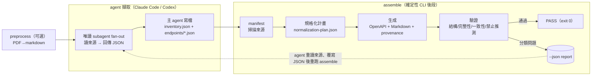
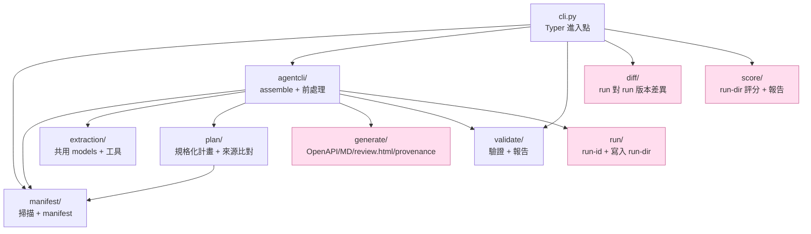

# 架構

本文件說明 `loop-apidoc` 的整體流程、資料流與套件邊界。完整設計依據見 [`docs/superpowers/specs/2026-06-25-loop-api-documentation-pipeline-design.md`](superpowers/specs/2026-06-25-loop-api-documentation-pipeline-design.md)。

## 執行模式:agent-native

`loop-apidoc` 的擷取引擎是**當前的 coding agent 自己**。在 Claude Code plugin 或 OpenAI Codex CLI 的 session 內,agent 依 [`skills/loop-apidoc/SKILL.md`](../skills/loop-apidoc/SKILL.md) 讀來源、以**唯讀 subagent fan-out** 擷取(每個 subagent 只讀檔與搜尋、回傳 JSON,**不寫檔**),主 agent 把回傳的 JSON 寫成 `inventory.json` + `endpoints/*.json`,再呼叫確定性 CLI `assemble` 跑後段 plan→generate→validate,並以 `--json` 回報結果供 agent 自行驅動修正。

擷取(agent)與後段(CLI 純函式管線)以 `inventory.json` + `endpoints/*.json` 為唯一交界:agent 負責「從來源讀出結構化 JSON」,CLI 負責「把 JSON 確定性地組裝、生成、驗證」,兩邊各自可獨立測試。

> 早期曾有以子行程 `claude -p` 擷取的 `run-agent` CLI 模式,已於 2026-06 退役(連同 NotebookLM 擷取後端一併移除);現在**唯一**擷取路徑是 agent-native。

### Skill 可攜性(Claude Code + Codex 雙棲)

`skills/loop-apidoc/SKILL.md` 是**單一可攜檔**,同一份同時供 Claude Code plugin 與 OpenAI Codex CLI 載入,不分叉。可攜性靠兩個抽象:

- **CLI 佔位符 `<APIDOC>`**:SKILL 頂部定義一次解析規則 —— 環境有 `$CLAUDE_PLUGIN_ROOT`(Claude plugin 安裝時自動帶入)走 plugin 內含 CLI(`uv run --project "$CLAUDE_PLUGIN_ROOT" loop-apidoc`),否則退到全域 `loop-apidoc`(Codex / 獨立,`uv tool install`)。前綴用陣列寫法(`RUN=(...)`;`"${RUN[@]}"`)以兼顧 bash/zsh 與含空白路徑;**不**用 `${VAR:+…}` inline 展開(zsh 不切詞會壞)。
- **工具名中性化**:描述 agent 行為時用動作(讀檔、搜尋、抓取 URL)而非單一 runtime 的工具名,擷取的唯讀 subagent fan-out 語意兩邊一致。

設計依據見 [`docs/superpowers/specs/2026-06-27-portable-skill-codex-design.md`](superpowers/specs/2026-06-27-portable-skill-codex-design.md),安裝路徑見 [`README.md`](../README.md)。

## 高層流程



`assemble` 不擷取,只組裝 agent 已寫出的 JSON:`manifest → plan → generate → validate`,再以 `--json` 回報 `ok`/`run_dir`/`report`。修正由 **agent 自行驅動**(無 CLI 內建迴圈):agent 依報告回頭重讀相關來源、覆寫對應的 `inventory.json` 或 `endpoints/<NN>.json`,再重跑 `assemble`,最多 3 輪。`UNFIXABLE`(來源無法確認／衝突／不支援斷言)為 fail-closed,回報為缺漏／衝突而不補寫。

`assemble --score` 在驗證報告寫出後讀取同一個 run-dir artifact 集合並產生
`score/score.{json,md}`；這是後段品質摘要，不會回頭擷取來源，也不改變
validation pass/fail 的語意。

## 套件邊界



`cli.py`(Typer)暴露六個指令:`preprocess`(PDF→markdown)、`manifest`(掃描)、`assemble`(組裝 + 驗證,可選 `--score`)、`validate`(驗證既有 run-dir)、`score`(評分既有 run-dir)、`diff`(比較兩個已完成 run-dir 的版本差異)。`agentcli/` 內含三個檔案:`assemble.py`(組裝 agent 寫出的 JSON)、`extraction.py`(把 `inventory.json` 轉成 plan 各 stage 的初始答案)、`preprocess.py`(pymupdf4llm 把 PDF 轉 markdown)。`diff/` 內含四個檔案:`loader.py`(讀取已完成 run-dir 的產物,輸入有誤拋 `DiffInputError`)、`compare.py`(跨 `openapi.yaml`/`integration-contract.json`/`provenance.json`/`validation/report.json`/`manifest.json` 分類差異)、`models.py`(`DiffFinding`/`DiffImpact`/`DiffReport`)、`report.py`(輸出 `diff/report.{json,md}`)。

**檔案 I/O 出口**:只有 `generate/`(`generate_outputs`)、`run/`(`persist.py` 將計畫寫入 run-dir)、`diff/report.py`(`write_reports` 寫出 `diff/report.{json,md}`)與 `score/report.py`(`write_reports` 寫出 `score/score.{json,md}`)寫檔;其餘模組皆為純函式,便於單元測試。

## 資料流與關鍵 seam

| 階段 | 公開 seam | 產物 |
| --- | --- | --- |
| 前處理(可選) | `prepare_markdown(sources_dir, dest_dir)` / `pdf_to_markdown(pdf_path)` | `<WORK>/sources_md/`(高保真 markdown) |
| 擷取(agent 寫出) | —(agent 依 SKILL 寫檔) | `inventory.json` + `endpoints/*.json` |
| 組裝入口 | `run_assemble_pipeline(*, sources_root, extraction_dir, output_root, run_id, generated_at, urls)` | 整個 run-dir;`--json` 回報 `ok`/`run_dir`/`review_html`/`report` |
| 掃描 | `build_manifest(sources_root, urls, generated_at)` | `manifest.json` |
| inventory→plan 答案 | `inventory_to_stage_answers(inventory)` | plan 各 stage 的初始結構化答案 |
| 計畫 | `build_normalization_plan(extraction, manifest)` | `plan/normalization-plan.json` |
| 生成 | `generate_outputs(plan, manifest, run_dir)` | `openapi.yaml`、`api-guide.zh-TW.md`、`review.html`、`provenance.json`、`handoff/` |
| 驗證 | `validate_outputs(plan, result, manifest)`(純）／ `validate_run_dir(run_dir)`(讀檔) | `validation/report.{json,md}` |
| 評分(可選) | `load_score_inputs(run_dir)` → `evaluate_score(inputs, profile, min_score)` → `write_reports(report, score_dir)` | `<run-dir>/score/score.{json,md}` |
| 版本差異(可選) | `load_run_artifacts(run_dir)` → `build_diff_report(base, head)`(純）→ `write_reports(report, out_dir)` | `<head>/diff/report.{json,md}` |

`handoff/`(`integration-tasks.md`/`postman_collection.json`/`sdk-hints.json`)為衍生工程導引,由 `build_handoff(openapi, plan, integration)` 純函式產出,不做檔案 I/O、不重讀 `openapi.yaml`、不複製 schema;契約來源仍為 OpenAPI 與 integration-contract。

`build_diff_report` 比較兩個已完成 run-dir,依 downstream impact 把差異分類為 `breaking`／`additive`／`changed`／`source_only`(涵蓋 OpenAPI 路徑·方法·參數·schema·security·webhook、integration-contract、provenance、validation 摘要與 manifest;第一版不比較 Markdown guide 與 generated examples)。退出碼:`0`=完成、`2`=輸入 run-dir 缺檔或格式錯誤(`DiffInputError`)。

`run_assemble_pipeline` 會先驗證擷取輸入(`inventory.json` + `endpoints/*.json`)再建 run 目錄;輸入有誤時拋 `AssembleInputError`,CLI 以退出碼 `2` 結束、不留下孤兒目錄。退出碼:`0`=驗證 PASS、`1`=驗證 FAIL、`2`=擷取輸入檔錯誤。

## 擷取分段

擷取採分段策略,避免單一回答承載全部內容(spec §7.1)。`loop_apidoc/extraction/` 提供 stage 與 question 模型,agent 依此分段擷取、`extraction.py` 再把 `inventory.json` 對映回各 stage 餵給 plan:

```
01 來源盤點                   06 逐 endpoint 細節（method/path/參數/req/resp/範例）
02 API 系統概覽與術語          07 共用 schema / enum / 資料限制
03 環境 / base URL / 版本      08 錯誤碼與失敗行為
04 驗證 / 授權 / 簽章          09 rate limit / timeout / retry / idempotency / webhook
05 Endpoint 清單              10 來源衝突、缺漏、無法確認事項
```

agent 擷取會收斂成 `inventory.json`(系統概覽 + endpoint 清單 + 共用 schema/錯誤碼等盤點)與逐 endpoint 的 `endpoints/*.json`,作為後段 plan→generate→validate 的輸入。

## 來源追溯與驗證對齊

`provenance.json` 的 `target` 字串與 OpenAPI 位置**逐一對齊**(如 `paths.{path}.{method}`、`components.schemas.{name}`、`components.securitySchemes.{name}`),驗證的禁止推測檢查即在這些 target 上做交叉比對:任何進入輸出的內容都必須能追溯回具來源依據的計畫項目,否則視為違規。
