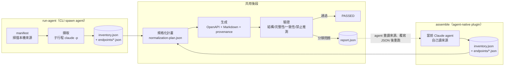
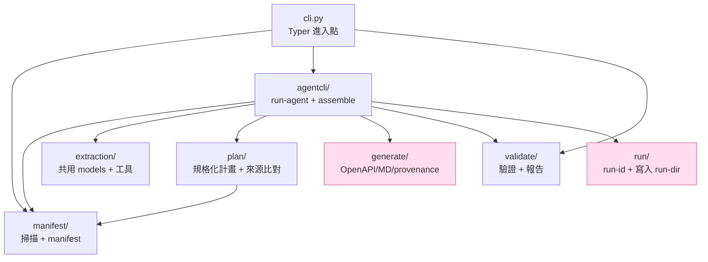

# 架構

本文件說明 `loop-apidoc` 的整體流程、資料流與套件邊界。完整設計依據見 [`docs/superpowers/specs/2026-06-25-loop-api-documentation-pipeline-design.md`](superpowers/specs/2026-06-25-loop-api-documentation-pipeline-design.md)。

## 兩種執行模式

擷取後段(規劃→生成→驗證)在兩種模式下共用同一套確定性管線,差別只在**誰擔任擷取引擎**:

| 模式 | 入口 | 擷取引擎 | 適用 |
| --- | --- | --- | --- |
| coding-agent CLI | `run-agent` | 子行程 `claude -p`(或以 `--executable` 指定其他 agent CLI) | 由 CLI 自行 spawn agent 擷取 |
| agent-native plugin | `assemble`(由 skill 呼叫) | 當前 Claude agent 自己讀來源 | 在 Claude session 內,agent 擷取後呼叫 CLI 組裝 |

`run-agent` 與 `assemble` 由 `loop_apidoc/agentcli/` 提供;兩者都把擷取結果收斂成 `inventory.json` + `endpoints/*.json`,再交給共用的 plan→generate→validate。`assemble` 不負責擷取,只組裝 agent 已寫出的 JSON,並以 `--json` 回報結果供 agent 自行驅動修正(重讀來源、覆寫擷取 JSON 後重跑)。

## 高層流程(agent 擷取)

兩種模式共用同一條後段管線,差別只在擷取引擎與修正由誰驅動:



修正不再由 CLI 內建迴圈驅動:`assemble` 以 `--json` 回報分類後的結果,agent 依報告回頭重讀來源、覆寫擷取 JSON 再重跑;`UNFIXABLE`(來源無法確認／衝突／不支援斷言)為 fail-closed,回報為缺漏／衝突而不補寫。

## 套件邊界



**唯一檔案 I/O 出口**:只有 `generate/`(`generate_outputs`)與 `run/`(`persist.py` 將計畫寫入 run-dir)寫檔;其餘模組皆為純函式,便於單元測試。

## 資料流與關鍵 seam

共用的後段 seam(plan→generate→validate):

| 階段 | 公開 seam | 產物 |
| --- | --- | --- |
| 掃描 | `build_manifest(sources_root, urls, generated_at)` | `manifest.json` |
| 計畫 | `build_normalization_plan(extraction, manifest)` | `plan/normalization-plan.json` |
| 生成 | `generate_outputs(plan, manifest, run_dir)` | `openapi.yaml`、`api-guide.zh-TW.md`、`provenance.json` |
| 驗證 | `validate_outputs(plan, result, manifest)`(純）／ `validate_run_dir(run_dir)`(讀檔) | `validation/report.{json,md}` |

兩種 agent 模式各有一個入口 seam(共用上方的 plan→generate→validate):

| 階段 | 公開 seam | 產物 |
| --- | --- | --- |
| agent CLI 擷取 | `run_agent_pipeline(*, sources_root, output_root, run_id, generated_at, executable, model, urls)` | 整個 run-dir(內含 `inventory.json` + `endpoints/*.json`) |
| 組裝(不擷取) | `run_assemble_pipeline(*, sources_root, extraction_dir, output_root, run_id, generated_at, urls)` | 整個 run-dir;`--json` 回報 `ok`/`run_dir`/`report` |

`run_assemble_pipeline` 會先驗證擷取輸入(`inventory.json` + `endpoints/*.json`)再建 run 目錄;輸入有誤時拋 `AssembleInputError`,CLI 以退出碼 `2` 結束、不留下孤兒目錄。

## 擷取分段

擷取採分段策略,避免單一回答承載全部內容(spec §7.1)。`loop_apidoc/extraction/` 提供兩種 agent 模式共用的 stage 與 question 模型:

```
01 來源盤點                   06 逐 endpoint 細節（method/path/參數/req/resp/範例）
02 API 系統概覽與術語          07 共用 schema / enum / 資料限制
03 環境 / base URL / 版本      08 錯誤碼與失敗行為
04 驗證 / 授權 / 簽章          09 rate limit / timeout / retry / idempotency / webhook
05 Endpoint 清單              10 來源衝突、缺漏、無法確認事項
```

agent 擷取會收斂成 `inventory.json`(系統概覽 + endpoint 清單 + 共用 schema/錯誤碼等盤點)與逐 endpoint 的 `endpoints/*.json`,作為後段 plan→generate→validate 的輸入。

## 來源追溯與驗證對齊

`provenance.json` 的 `target` 字串與 OpenAPI 位置**逐一對齊**(如 `paths.{path}.{method}`、`components.schemas.{name}`、`components.securitySchemes.{name}`),驗證的禁止推測檢查即在這些 target 上做交叉比對:任何進入輸出的內容都必須能追溯回具來源依據的計畫項目,否則視為違規。
