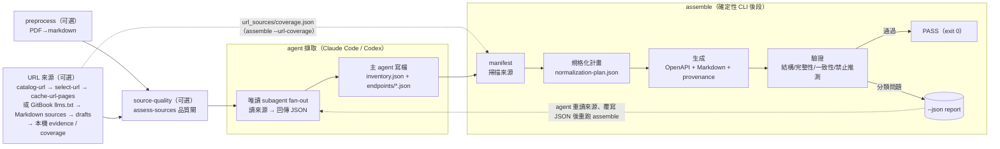
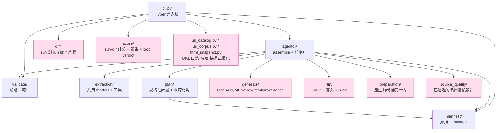

# Architecture / 架構

## Product architecture (canonical)

`loop-apidoc` is an evidence-to-contract system. Its stable product boundary is:

```text
Evidence Ledger
+ Grounded Claim Graph
+ Canonical API Contract IR
+ Deterministic Assurance Engine
+ Governed Contract Registry
```

The implementation follows the [product design decisions](DESIGN_DECISIONS.md):

- `domain/` owns the API ontology, canonical identities, immutable contract IR,
  deterministic rule packs, and pure projection compilers.
- `core/` owns immutable evidence, claim reconciliation, lifecycle, policy, governance,
  intent-oriented use cases, and typed ports.
- `adapters/` owns runtime and platform details. Models, parsers, humans, local files,
  databases, registries, and future agent runtimes are replaceable adapters.
- `evaluation/` owns immutable cases, replay, and quality/cost/latency metrics, including
  typed evidence-relationship classification accuracy. It cannot approve or mutate
  production assets.

Core and Domain perform no filesystem, network, process, browser, model, or database I/O.
Runtime output is always a proposal; deterministic reconciliation and policy decide whether
the claim is supported, missing, conflicting, unverified, waived, or superseded.
OpenAPI and the review payload are projections of the Canonical API Contract IR, not its
source of truth.

The Evidence Ledger stores exact `EvidenceFragment` values with typed locators and a digest
of normalized fragment content. Core binds a material claim path to a fragment with an
`explicit_support`, `derived_support`, `contradicts`, or `insufficient` relationship and
then verifies the binding deterministically. The trace chain is:
claim identity/path → relationship → exact fragment → source artifact. A whole-document
legacy reference is only `insufficient`; evidence-ID existence and runtime confidence do
not make a claim supported.

## Current CLI compatibility architecture / 現行 CLI 相容架構

The agent-native pipeline described below remains the shipping CLI workflow in v0.14 and is
preserved as a compatibility adapter. Agent topology, prompt strategy, command layout,
filesystem run directories, and the exact artifact set are replaceable implementation
choices; they are no longer the product's architectural center.

本文件說明 `loop-apidoc` 的整體流程、資料流與套件邊界；長期設計決策見 [`docs/DESIGN_DECISIONS.md`](DESIGN_DECISIONS.md)。

## 現行 CLI 執行模式:agent-native

`loop-apidoc` 的擷取引擎是**當前的 coding agent 自己**。在 Claude Code plugin 或 OpenAI Codex CLI 的 session 內,agent 依 [`skills/loop-apidoc/SKILL.md`](../skills/loop-apidoc/SKILL.md) 讀來源、以**唯讀 subagent fan-out** 擷取(每個 subagent 只讀檔與搜尋、回傳 JSON,**不寫檔**),主 agent 把回傳的 JSON 寫成 `inventory.json` + `endpoints/*.json`,再呼叫確定性 CLI `assemble` 跑後段 plan→generate→validate,並以 `--json` 回報結果供 agent 自行驅動修正。

擷取(agent)與後段(CLI 純函式管線)以 `inventory.json` + `endpoints/*.json` 為唯一交界:agent 負責「從來源讀出結構化 JSON」,CLI 負責「把 JSON 確定性地組裝、生成、驗證」,兩邊各自可獨立測試。

> 早期曾有以子行程 `claude -p` 擷取的 `run-agent` CLI 模式,已於 2026-06 退役(連同 NotebookLM 擷取後端一併移除);現在**唯一**擷取路徑是 agent-native。

### Skill 可攜性(Claude Code + Codex 雙棲)

`skills/loop-apidoc/SKILL.md` 是**單一可攜檔**,同一份同時供 Claude Code plugin 與 OpenAI Codex CLI 載入,不分叉。可攜性靠兩個抽象:

- **CLI 佔位符 `<APIDOC>`**:SKILL 頂部定義一次解析規則 —— 環境有 `$CLAUDE_PLUGIN_ROOT`(Claude plugin 安裝時自動帶入)走 plugin 內含 CLI(`uv run --project "$CLAUDE_PLUGIN_ROOT" loop-apidoc`),否則退到全域 `loop-apidoc`(Codex / 獨立,`uv tool install`)。前綴用陣列寫法(`RUN=(...)`;`"${RUN[@]}"`)以兼顧 bash/zsh 與含空白路徑;**不**用 `${VAR:+…}` inline 展開(zsh 不切詞會壞)。
- **工具名中性化**:描述 agent 行為時用動作(讀檔、搜尋、抓取 URL)而非單一 runtime 的工具名,擷取的唯讀 subagent fan-out 語意兩邊一致。

可攜性決策摘要見 [`docs/DESIGN_DECISIONS.md`](DESIGN_DECISIONS.md)，安裝路徑見 [`README.md`](../README.md)。

## 高層流程



`assemble` 不擷取,只組裝 agent 已寫出的 JSON:`manifest → plan → generate → validate`,再以 `--json` 回報 `run_id`/`run_dir`/`review_html`/`ok`/`status`/`report`(帶 `--score` 時另有 `score` 與 `loop`)。修正由 **agent 自行驅動**(無 CLI 內建迴圈):agent 依報告回頭重讀相關來源、覆寫對應的 `inventory.json` 或 `endpoints/<NN>.json`,再重跑 `assemble`,預設最多 3 輪;帶 `--score` 走分數自循環時改由 `--max-rounds`(預設 6)控制。`UNFIXABLE`(來源無法確認／衝突／不支援斷言)為 fail-closed,回報為缺漏／衝突而不補寫。

`assemble --architecture-mode shadow` 是 opt-in compatibility sidecar：legacy
validation report 寫出後，同一份 manifest 與 normalization plan 會經
`shadow/bridge.py` 映成 immutable evidence 與 claim proposals，再由
`EvidenceToContractService` 以 in-memory adapters 執行到 Core validation。
結果寫入 `<run-dir>/core/`；任何 shadow failure 只寫 `core/error.json`，不會改變
legacy validation、score、approval、Foundry、run status 或 exit code。預設
`legacy` 不建立 `core/`。`shadow/report.py` 是這個 compatibility package
唯一的 file-I/O exit；Core 與 Domain 仍不依賴 CLI 或 run directory。

Shadow 的 `adapters/fragments.py` 是 read-side I/O exit：它把來源實際內容具體化為
page／line range／section／table cell／JSON Pointer／CSS／XPath locator，並以片段
內容計算 digest。`core/relationships.json` 保存 claim-level relationship，
`core/projections/{openapi,review-data,provenance}.json` 保存觀測性投影；其中
provenance 可逐欄位追到 exact fragment 與 source artifact。無法從 legacy
citation 取得精確 locator 時只會得到 `insufficient`／unverified，不會假裝成
`explicit_support`。

在 agent-native boundary，選填的 v1 `evidence[]` 會以 exact manifest source identity、
typed locator、normalized fragment digest 與 material claim path 表示。`verify-extraction`
與 `assemble` 都會在建立 run-dir 前透過 fragment adapter 重新 materialize 並驗證這個
digest，並以 shared plan projection 解析 claim path。Shadow 對已宣告的 claim path 優先採用它、停用同一路徑的 legacy fallback；最終
relationship 仍由 Core 的 deterministic value comparison 決定。

`assemble --score` 在驗證報告寫出後讀取同一個 run-dir artifact 集合並產生
`score/score.{json,md}`；這是後段品質摘要，不會回頭擷取來源，也不改變
validation pass/fail 的語意。配合 `--target-score`/`--prev-score`/`--round-index`/`--max-rounds`,
`score/loop.py` 的 `loop_verdict` 會在 `--json` 的 `loop` 欄位回報
`continue`/`converged`/`plateau`/`exhausted` 等自循環判定,供 agent 決定是否再跑一輪。

URL 來源另有一條 fail-loud 的涵蓋檢核:agent 依 catalog 寫出
`url_sources/coverage.json` 帳本,經 `assemble --url-coverage` 傳入後由
`preparation/coverage.py` 解析,`preparation/assess.py` 的 `_assess_url_coverage`
產生**只有 warning** 的 `url_coverage` phase(預期 vs 實際撈取的遺漏檢查),
不影響 validation 的 severity 閘。

## 套件邊界



`cli.py`(Typer)另有 `cache-gitbook-llms` 與 `extract-markdown-drafts`：前者從一份 `llms.txt` 安全快取同網域、入口前綴下的 Markdown、sidecar 與 coverage；後者只讀 manifest 指名 Markdown，輸出具行號、非權威的端點／表格／範例草稿。兩者都不取代 agent 最終擷取與 `verify-extraction`。

URL 來源走「先建目錄、再明確選取、才快取」的分段流程(`skills/loop-apidoc/reference/url-fetching.md`):`catalog-url` 只下載入口頁一次並寫出導航 catalog(絕不自動跟連結,catalog 是**涵蓋宇宙**而非抓取清單);`select-url` 純選取(`--branch`/`--term`/`--url`,不下載);`cache-url-pages` 把 catalog 全頁快取成本機 corpus(`raw/` 原始 HTML + `body/` 正文 + `corpus.json` 精簡卡片:標題/標頭/內部連結/實體/雜湊,**不送模型**);`cache-url-entry` 是單頁(空 catalog/一頁式文件)變體;`related-url-pages` 依正文連結與共享實體輸出候選頁卡片;`normalize-html-snapshot` 把已下載的靜態 HTML 正規化成 Markdown 並寫 URL/hash provenance sidecar(`*.source.json`)。這些模組是頂層的 `url_catalog.py`/`url_corpus.py`/`html_snapshot.py`。

`assess-sources` 是擷取前的品質 gate(`source_quality/`:`loader.py`/`assess.py`/`diff.py`/`models.py`/`report.py`)；其 output 目錄可經 `assemble --source-quality` 輸入。`reject` 會在建立 run-dir 前中止，`pass` 的 report 與 source diff 會被寫入 `<run-dir>/source-quality/`，使後續 Foundry 匯入保留稽核證據。`agentcli/` 內含八個檔案:`assemble.py`(組裝 agent 寫出的 JSON)、`input_schema.py`(pydantic 型別守衛)、`source_guard.py`(三項輸入邊界檢查,違規即 `exit 2` 且不建立 run 目錄:`source` 引用格式、`endpoints[].path` 根路徑、`path` 為 `null` 的 webhook/callback 端點必須帶 `summary`;`source` 以「檔案」為範圍——整份檔無一引用命中 manifest 才擋,部分命中則交給 validate 逐筆報 `SOURCE_UNVERIFIED`)、`cross_file.py`(純函式,檢查 `endpoints/*.json` 與 `inventory.json` 的六項跨檔不變式:端點檔數等於 inventory 筆數、身份多重集合相等(有 `path` 用 `(method, path)`,`path` 為 `null` 的 webhook/callback 端點改用 `(method, summary)`)、同一身份不得寫進兩個檔案、`schema_ref` 與 `security[]` 各自指向 inventory 既有的 schema/security scheme 名稱、`endpoints[].server` 需指向某個 `environments[].name`;null-path 端點不再豁免多重集合與重複檢查——`source_guard` 已在邊界保證它們必有 `summary`)、`gate.py`(`check_extraction`,`assemble` 與 `verify-extraction` 共用的唯一聚合閘門,兩個入口因此不可能漂移)、`verify.py`(`verify-extraction` 的薄殼:建 manifest → 讀擷取目錄 → 呼叫閘門;只讀不寫,不建立 run 目錄)、`extraction.py`(把 `inventory.json` 轉成 plan 各 stage 的初始答案)、`preprocess.py`(pymupdf4llm 把 PDF 轉 markdown)。`diff/` 內含四個檔案:`loader.py`(讀取已完成 run-dir 的產物,輸入有誤拋 `DiffInputError`)、`compare.py`(跨 `openapi.yaml`/`integration-contract.json`/`provenance.json`/`validation/report.json`/`manifest.json` 分類差異)、`models.py`(`DiffFinding`/`DiffImpact`/`DiffReport`)、`report.py`(輸出 `diff/report.{json,md}`)。`preparation/` 內含 `assess.py`(`assess_preparation` 把 manifest + inventory + endpoints + plan 評成就緒度報告,phase/finding、severity `error`/`warning`、status `blocked`/`needs_attention`/`ready`;另 `_assess_url_coverage` 在有 URL 來源時附加**只有 warning** 的 `url_coverage` phase)、`coverage.py`(`load_coverage`,本套件唯一讀檔函式,fail-loud 解析 agent 寫出的 `url_sources/coverage.json` 帳本)與 `report.py`(寫出 `preparation-report.{json,md}`),在 `assemble` 內於 plan 之後、generate 之前執行,並被 `diff/` 讀回比較。`score/` 內含 `loader.py`(`load_score_inputs`)、`evaluate.py`(`evaluate_score`,五類加權 openapi_validity/completeness/consistency/source_grounding/reviewability → 0–100,`ci`/`review` profile)、`loop.py`(`loop_verdict`,分數自循環判定 `continue`/`converged`/`plateau`/`exhausted`)與 `report.py`(寫出 `score/score.{json,md}`),經 `score` 命令或 `assemble --score` 產生,不改變 validation pass/fail。

`manifest/scanner.py` 以 `DEFAULT_EXCLUDES`(`README*`/`LICENSE*`/`CHANGELOG*`/`CONTRIBUTING*`/`.DS_Store`/`.git/*`)加上 `--exclude` 傳入的 glob 排除非規格檔:命中者仍列在 `manifest.json` 但 `status: ignored`、不雜湊、不可作為來源證據(`plan/classify.py` 的 `_UNUSABLE` 含 `IGNORED`,故單一文件的 `sole_source` 歸因不會被一份 README 打斷)。

**檔案 I/O 出口**:`generate/`、`run/`、report writers、URL corpus 快取、`gitbook_llms.cache_gitbook_llms`（來源／sidecar／coverage）與 `html_snapshot.normalize_html_snapshot` 會寫檔；`markdown_drafts.collect` 是只讀 manifest 指名 Markdown 的例外，其餘 draft scanner 保持純函式。

## 資料流與關鍵 seam

| 階段 | 公開 seam | 產物 |
| --- | --- | --- |
| 前處理(可選) | `prepare_markdown(sources, dest_dir)` → `PreprocessResult` / `pdf_to_markdown(pdf_path)` | `<WORK>/sources_md/`(PDF 轉 markdown;文字檔複製;其他來源 passthrough；`sources` 可為目錄或單一檔案) |
| URL 來源(可選) | `fetch_catalog(url)` → `select_catalog(catalog, …)` → `cache_catalog_pages(catalog, out_dir)` → `find_related_pages(corpus, url)` / `normalize_html_snapshot(input, url, output)` | `<WORK>/url_sources/{catalog,selection,candidates}.json` + `<WORK>/url_corpus/`(`raw/`+`body/`+`corpus.json`);agent 另寫 `url_sources/coverage.json` 帳本傳給 `assemble --url-coverage` |
| 來源品質(可選但 skill 預設要求) | `assess_source_quality(manifest, source_set, observations, base_report)` | `<WORK>/source-quality/`;傳入 `assemble --source-quality` 後保存為 `<run-dir>/source-quality/` |
| 擷取(agent 寫出) | —(agent 依 SKILL 寫檔) | `inventory.json` + `endpoints/*.json` |
| 組裝入口 | `run_assemble_pipeline(*, sources_root, extraction_dir, output_root, run_id, generated_at, urls, url_coverage_path, source_quality_dir, excludes)` | 整個 run-dir;`--json` 回報 `run_id`/`run_dir`/`review_html`/`ok`/`status`/`report`(帶 `--score` 另有 `score`/`loop`) |
| 掃描 | `build_manifest(sources_root, urls, generated_at, excludes)` | `manifest.json` |
| inventory→plan 答案 | `inventory_to_stage_answers(inventory)` | plan 各 stage 的初始結構化答案 |
| 計畫 | `build_normalization_plan(extraction, manifest)` | `plan/normalization-plan.json` |
| 就緒度評估(產生前) | `assess_preparation(manifest, inventory, endpoint_texts, plan, url_coverage)` → `write_reports(report, run_dir)` | `<run-dir>/preparation-report.{json,md}` |
| 生成 | `generate_outputs(plan, manifest, run_dir)` | `openapi.yaml`、`api-guide.zh-TW.md`、`review.html`、`provenance.json`、`handoff/` |
| 驗證 | `validate_outputs(plan, result, manifest)`(純）／ `validate_run_dir(run_dir)`(讀檔) | `validation/report.{json,md}` |
| 評分(可選) | `load_score_inputs(run_dir)` → `evaluate_score(inputs, profile, min_score)` → `write_reports(report, score_dir)` | `<run-dir>/score/score.{json,md}` |
| 版本差異(可選) | `load_run_artifacts(run_dir)` → `build_diff_report(base, head)`(純）→ `write_reports(report, out_dir)` | `<head>/diff/report.{json,md}` |

`handoff/`(`integration-tasks.md`/`postman_collection.json`/`sdk-hints.json`)為衍生工程導引,由 `build_handoff(openapi, plan, integration)` 純函式產出,不做檔案 I/O、不重讀 `openapi.yaml`、不複製 schema;契約來源仍為 OpenAPI 與 integration-contract。

錯誤碼在 OpenAPI 內以 `components.schemas.ErrorCode` 呈現:`enum` 約束線上值,`x-loop-error-codes` 保留 code→meaning/http_status,`x-loop-error-code-map`(0.9.2 起)進一步保留無損、有來源依據的完整映射(code→message/description/http_status/`applicable_to`/`source` 引用),讓下游取得文件化語意而不把應用層錯誤碼誤當 HTTP 狀態碼。

`build_diff_report` 比較兩個已完成 run-dir,依 downstream impact 把差異分類為 `breaking`／`additive`／`changed`／`source_only`(涵蓋 OpenAPI 路徑·方法·參數·schema·security·webhook、integration-contract、provenance、validation 摘要與 manifest;第一版不比較 Markdown guide 與 generated examples)。退出碼:`0`=完成、`2`=輸入 run-dir 缺檔或格式錯誤(`DiffInputError`)。

`run_assemble_pipeline` 會先驗證擷取輸入(`inventory.json` + `endpoints/*.json`)再建 run 目錄;輸入有誤時拋 `AssembleInputError`,CLI 以退出碼 `2` 結束、不留下孤兒目錄。退出碼:`0`=驗證 PASS、`1`=驗證 FAIL、`2`=擷取輸入檔錯誤。

### Foundry 資產層(`.foundry/api/`)

生成流程保持確定性且預設不信任:CLI 僅寫出 run 目錄,不做其他。**Foundry** 層是一個獨立、明確的治理步驟,將選定的 run 轉為受管的專案資產:

```
output/<run-id>/
  → foundry import  → .foundry/api/docsets/<docset-id>/candidates/<run-id>/   (候選資產)
  → foundry approve → .foundry/api/docsets/<docset-id>/assets/<asset-id>/     (已批准、版本化)
                      + current.json (供下游使用的確定性指標)
```

- **docset** 是一組來源文件的分組,這些文件共同定義一個 API 契約。
- **import** 將已完成的 run 複製到 `candidates/` 目錄(完整性由重用的 `diff` 載入器把關)。
- **approve** 將候選資產複製到自含、不可變的 `assets/<asset-id>/artifacts/` 目錄,記錄 `asset.json`(狀態、驗證、評分、來源雜湊、產物路徑、取代關係(supersedes)、批准元資料),取代先前的已批准資產,並更新 `current.json` / `docset.json` / `catalog.json`。
- 下游工作(SDK 編寫、CI 契約檢查、整合)經由 `foundry current` / `query.load_current_asset` 讀取**當前**資產,而不是任意的 run 目錄。

`openapi.yaml` 與 `integration-contract.json` 保持為權威契約;Foundry 逐字複製它們並加入治理,不改寫契約。

## 擷取分段

擷取採分段策略,避免單一回答承載全部內容(spec §7.1)。`loop_apidoc/extraction/` 提供 stage 與 question 模型,agent 依此分段擷取、`extraction.py` 再把 `inventory.json` 對映回各 stage 餵給 plan:

```
01 來源盤點                   06 逐 endpoint 細節（method/path/參數/req/resp/範例）
02 API 系統概覽與術語          07 共用 schema / enum / 資料限制
03 環境 / base URL / 版本      08 錯誤碼與失敗行為
04 驗證 / 授權 / 簽章          09 rate limit / timeout / retry / idempotency / webhook
05 Endpoint 清單              10 來源衝突、缺漏、無法確認事項
```

agent 擷取會收斂成 `inventory.json`(系統概覽 + endpoint 清單 + 共用 schema/錯誤碼等盤點)與逐 endpoint 的 `endpoints/*.json`,作為後段 plan→generate→validate 的輸入。

## 來源追溯與驗證對齊

`provenance.json` 的 `target` 字串與 OpenAPI 位置**逐一對齊**(如 `paths.{path}.{method}`、`components.schemas.{name}`、`components.securitySchemes.{name}`),驗證的禁止推測檢查即在這些 target 上做交叉比對:任何進入輸出的內容都必須能追溯回具來源依據的計畫項目,否則視為違規。
