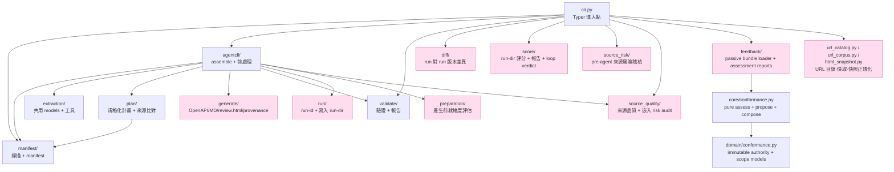

# Architecture / 架構

## Product architecture (canonical)

`loop-apidoc` is an evidence-to-contract system. Its stable product boundary is:

```text
Evidence Ledger
+ Grounded Claim Graph
+ Canonical API Contract IR
+ Deterministic Assurance Engine
+ Governed Contract Registry
```

The implementation follows the [product design decisions](DESIGN_DECISIONS.md):

- `domain/` owns the API ontology, canonical identities, immutable contract IR,
  deterministic rule packs, and pure projection compilers.
- `core/` owns immutable evidence, claim reconciliation, lifecycle, policy, governance,
  intent-oriented use cases, and typed ports.
- `adapters/` owns runtime and platform details. Models, parsers, humans, local files,
  databases, registries, and future agent runtimes are replaceable adapters.
- `evaluation/` owns immutable cases, replay, and quality/cost/latency metrics, including
  typed evidence-relationship classification accuracy. It cannot approve or mutate
  production assets.

Core and Domain perform no filesystem, network, process, browser, model, or database I/O.
Runtime output is always a proposal; deterministic reconciliation and policy decide whether
the claim is supported, missing, conflicting, unverified, waived, or superseded.
OpenAPI and the review payload are projections of the Canonical API Contract IR, not its
source of truth.

The Canonical Contract Core stays domain-neutral. Payment-only Amount Direction and Line
Currency Policy values are owned by one optional `PaymentProfile`; a non-payment contract
has no profile. Legacy v0.27 top-level collection names are read/write compatibility
views derived from the profile, so the model keeps one source of state while existing
serialized consumers remain compatible. Transport Policy and Idempotency Rule remain
Core integration semantics.

GraphQL and AsyncAPI currently stop at the tested Core compiler seam:

```text
GroundedApiContract
  → GraphqlProjectionCompiler | AsyncApiProjectionCompiler
  → deterministic in-memory projection
```

There is intentionally no GraphQL/AsyncAPI CLI, run directory, or product validation
path yet. Integration stays frozen until a named downstream consumer supplies a real
source set and acceptance contract. This keeps the compiler seam available without
claiming that format-level fixtures prove product demand or end-to-end grounding.

The Evidence Ledger stores exact `EvidenceFragment` values with typed locators and a digest
of normalized fragment content. Core binds a material claim path to a fragment with an
`explicit_support`, `derived_support`, `contradicts`, or `insufficient` relationship and
then verifies the binding deterministically. The trace chain is:
claim identity/path → relationship → exact fragment → source artifact. A whole-document
legacy reference is only `insufficient`; evidence-ID existence and runtime confidence do
not make a claim supported.

Derived support is not a model assertion: Core recomputes only allowlisted,
versioned transformations from exact fragments and checks their input/output
digests. The current OpenAPI JSON Pointer mappings cover an operation's path
and method, a response status key, local response/request-schema `$ref` names,
and request-body and schema-field property facts (including array markers).
One local `$ref` hop needs two exact fragments: the child property or schema is
primary and the parent `$ref` is a context fragment. Schema fields may use an
explicitly ordered two-hop array chain (primary, parent→child `$ref`, child→leaf
`$ref`), but Core never follows arbitrary reference depth. Malformed, mismatched,
out-of-order, or incomplete inputs remain `insufficient`.

### Documentary authority and implementation conformance

The source-grounded claim graph remains the **Normative Contract**. Supplier sources are
the sole authority for what the provider documents; the documentary relationship axis
(`explicit_support` / `derived_support` / `contradicts` / `insufficient`) retains that
meaning. Runtime evidence enters a second, independent conformance axis:

```text
approved Normative Contract + passive normalized Observation Bundle
  → ContractConformance.assess
  → confirms | contradicts | inconclusive | out_of_scope
  → bounded coverage + one of eight deterministic review routes
```

`feedback/` is the adapter/report boundary. Its MVP loader accepts normalized JSON only,
performs bounded schema and digest checks, and never calls a provider network. The command
group is an explicit governed workflow:

```text
assess → propose? → submit immutable candidate case inputs
       ├→ review → append one bound non-approval decision + corrective route
       └→ independent human approve → append bound decision/amendment
                                     → publish separate immutable exact-scope Effective asset/current
compose = non-publishing preview     current = exact-target read
provider-erratum = verified non-mutating handoff to the normative source pipeline
```

Assessment, proposal, composition, and erratum-handoff reports are written outside
`.foundry`; only `submit`, `review`, and `approve` delegate governed writes to Foundry. Domain models
and `core/conformance.py` remain pure: `ContractConformance.assess`, `propose`, and
`compose` hide integrity binding, exact scope comparison, safe proposal policy, expiry,
conflict detection, coverage, and deterministic composition.
Proposal time cannot precede the observation window's completion. A non-approval review time
cannot precede observation completion and, when a proposal exists, cannot precede its
`created_at`. Before any feedback report or governed artifact is persisted, a deterministic privacy gate rejects sensitive field
names and obvious email/phone/national-ID/SSN/passport/Luhn-valid payment-card values; low-entropy PII is omitted rather than
hashed.

All eight `FeedbackRoute` values are reachable through deterministic policy: confirmed-only
evidence closes without change; other inconclusive evidence needs evidence; high-risk
contradictions request provider clarification; harness/fixture failures request implementation
correction; out-of-scope or DNS/proxy/gateway failures request environment configuration
correction; policy-safe contradictions without documentary evidence request extraction
correction; repeated network/timeout/rate-limit failures request provider-runtime regression
review; and policy-safe grounded contradictions become amendment proposals. Only `confirms`
and `contradicts` count as assessed material claims. `inconclusive` and `out_of_scope` targets
remain untested and open.

Observation kind validation is semantic policy in pure `core/conformance_policy.py`, not only
type validation. Status/success observations must bind the selected operation and its
`/responses/<status>/status_code`; response-field/type observations must bind a schema referenced
by that operation's response and a matching `/fields/.../name` or `/fields/.../type` path.

The integrity unit for proposal and Effective composition is the complete Normative
release digest: canonical contract + documentary fragments + support relationships.
Binding only the projected contract would miss an authority-bearing evidence or
relationship change, so proposal approval and amendment composition compare the complete
release digest and fail closed on mismatch.

An Implementation Observation is immutable empirical evidence only for its declared
Applicability Envelope. It cannot upgrade documentary support or prove provider intent.
A contradictory, independently reproducible, policy-eligible observation may become a
human-review subject and then an approved, expiring **Compatibility Amendment**. Ordinary
observations cannot infer high-risk or closed-world semantics such as authentication,
cryptography, money movement, idempotency, transaction guarantees, requiredness, or closed
enums.

An **Effective Contract** is an exact-scope view, not mutable canonical state:

```text
one immutable approved Normative Contract release
+ active approved amendments matching the complete target Applicability Envelope
→ Effective Contract with per-value normative | observed_override authority and lineage
```

Scope mismatch, expiry, stale binding, or conflicting active amendments is surfaced or
fails closed. The global Foundry `current.json` stays normative; effective selection is
deployment/scope-specific and must never become one global Effective current. “Fully
verified” is bounded to the reported envelope, observation time, material-claim coverage,
and suite version. Finite evidence never establishes universal or permanent 100% truth.
An exact-scope current read also has an explicit timezone-aware query time. It rejects a
not-yet-effective or expired Effective release, a base that is no longer normative current,
or a stale
pointer/bounded-artifact bindings. The pointer's `effective_asset_digest` binds the complete
strict-validated canonical current `EffectiveAsset`, including all declared fields; unknown
fields fail closed. Asset/pointer records also bind `effective-contract.json`,
`compatibility-amendment.json`, and `provenance.json`. Current lookup bounds, parses,
digest-verifies, and lineage-checks these bindings. It returns `valid_until`,
`open_discrepancy_count`, `stale_amendment_count`, `untested_material_claim_count`, and
`unresolved_contradiction_count` with the asset.
Governed feedback and Effective JSON models reject unknown fields. Current accepts only an
`APPROVED` asset and cross-validates Effective Contract identity, applied amendment IDs,
validity/counts, approval actor/time, and provenance approval/assessment/bundle bindings.
`stale_amendment_count` is pointer-visible and digest-bound. Stale is reserved for verifiable
release/contract/source/policy/approval-time drift; expired and inapplicable remain distinct.
Free-text `revalidation_triggers` are review declarations only; without an external trigger-signal
contract they do not execute or schedule revalidation automatically.
Approval lineage uses that same bound current-head integrity read before walking supersession.
Every successor carries `supersedes` together with `supersedes_asset_digest`, forming an
immutable hash chain; governed and user-facing traversal verifies each predecessor asset digest
and amendment artifact digest. This permits a new reviewed amendment to recover expired lineage,
while making any historical asset-metadata, amendment, or supersession tampering fail closed
before it can contaminate a later approval/composition.
All governed lineage traversal is centralized in `foundry.query`, the single read-side I/O for
this chain; adapters do not implement a parallel traversal.

A formal **Provider Erratum** has documentary authority and therefore bypasses empirical
composition: acquire it as supplemental supplier material and run the complete existing
source-risk → source-quality → extraction → verification → assembly → review → Foundry
release loop. The resulting new immutable normative release supersedes its predecessor.

## Current CLI compatibility architecture / 現行 CLI 相容架構

The agent-native pipeline described below remains the shipping CLI workflow in v0.14 and is
preserved as a compatibility adapter. Agent topology, prompt strategy, command layout,
filesystem run directories, and the exact artifact set are replaceable implementation
choices; they are no longer the product's architectural center.

本文件說明 `loop-apidoc` 的整體流程、資料流與套件邊界；長期設計決策見 [`docs/DESIGN_DECISIONS.md`](DESIGN_DECISIONS.md)。

## 現行 CLI 執行模式:agent-native

`loop-apidoc` 的擷取引擎是**當前的 coding agent 自己**。在 Claude Code plugin 或 OpenAI Codex CLI 的 session 內,agent 依 [`skills/loop-apidoc/SKILL.md`](../skills/loop-apidoc/SKILL.md) 讀來源、以**唯讀 subagent fan-out** 擷取(每個 subagent 只讀檔與搜尋、回傳 JSON,**不寫檔**),主 agent 把回傳的 JSON 寫成 `inventory.json` + `endpoints/*.json`,再呼叫確定性 CLI `assemble` 跑後段 plan→generate→validate,並以 `--json` 回報結果供 agent 自行驅動修正。

擷取(agent)與後段(CLI 純函式管線)以 `inventory.json` + `endpoints/*.json` 為唯一交界:agent 負責「從來源讀出結構化 JSON」,CLI 負責「把 JSON 確定性地組裝、生成、驗證」,兩邊各自可獨立測試。

> 早期曾有以子行程 `claude -p` 擷取的 `run-agent` CLI 模式,已於 2026-06 退役(連同 NotebookLM 擷取後端一併移除);現在**唯一**擷取路徑是 agent-native。

### Skill 可攜性(Claude Code + Codex 雙棲)

`skills/loop-apidoc/SKILL.md` 是**單一可攜檔**,同一份同時供 Claude Code plugin 與 OpenAI Codex CLI 載入,不分叉。可攜性靠兩個抽象:

- **CLI 佔位符 `<APIDOC>`**:SKILL 頂部定義一次解析規則 —— 環境有 `$CLAUDE_PLUGIN_ROOT`(Claude plugin 安裝時自動帶入)走 plugin 內含 CLI(`uv run --project "$CLAUDE_PLUGIN_ROOT" loop-apidoc`),否則退到全域 `loop-apidoc`(Codex / 獨立,`uv tool install`)。前綴用陣列寫法(`RUN=(...)`;`"${RUN[@]}"`)以兼顧 bash/zsh 與含空白路徑;**不**用 `${VAR:+…}` inline 展開(zsh 不切詞會壞)。
- **工具名中性化**:描述 agent 行為時用動作(讀檔、搜尋、抓取 URL)而非單一 runtime 的工具名,擷取的唯讀 subagent fan-out 語意兩邊一致。

可攜性決策摘要見 [`docs/DESIGN_DECISIONS.md`](DESIGN_DECISIONS.md)，安裝路徑見 [`README.md`](../README.md)。

## 高層流程


```mermaid
flowchart LR
    PRE["來源取得 / preprocess<br/>PDF/Word→UTF-8 markdown"] --> PM["pre-agent manifest<br/>精確來源包"]
    URL["URL 來源（可選）<br/>catalog-url → select-url → cache-url-pages<br/>或 GitBook llms.txt → Markdown sources → drafts<br/>→ 本機 evidence / coverage"] --> PM
    PM --> SR["inspect-source-risk<br/>確定性 pre-model 風險閘"]
    SR --> QR["agent source-quality review<br/>唯讀 observations"]
    QR --> SQ["assess-sources --source-risk<br/>品質閘 + 嵌入 risk audit"]
    SQ --> EX
    URL -. "url_sources/coverage.json<br/>（assemble --url-coverage）" .-> M

    subgraph AGENT["agent 擷取（Claude Code / Codex）"]
        EX["唯讀 subagent fan-out<br/>讀來源 → 回傳 JSON"] --> WR["主 agent 寫檔<br/>inventory.json + endpoints/*.json"]
    end

    subgraph CLI["assemble（確定性 CLI 後段）"]
        M["manifest<br/>掃描來源"] --> P["規格化計畫<br/>normalization-plan.json"]
        P --> G["生成<br/>OpenAPI + Markdown + provenance"]
        G --> V["驗證<br/>結構/完整性/一致性/禁止推測"]
        V -->|通過| OK["PASS（exit 0）"]
        V -->|分類問題| R[("--json report")]
    end

    WR --> M
    R -.agent 重讀來源、覆寫 JSON 後重跑 assemble.-> EX
```

`assemble` 不擷取,只組裝 agent 已寫出的 JSON:`manifest → plan → generate → validate`,再以 `--json` 回報 `run_id`/`run_dir`/`review_html`/`ok`/`status`/`report`(帶 `--score` 時另有 `score` 與 `loop`)。選填的 `integration.json` 以 typed `transport[]`、`amount_direction[]`、`idempotency[]`、`line_currency_policy[]` 保存來源明載的領域語意，經 extraction gate、normalization plan 與 canonical claim projection 後進入固定產生的 `integration-contract.json`；request 缺少 currency 欄位不構成單幣別證據。修正由 **agent 自行驅動**(無 CLI 內建迴圈):agent 依報告回頭重讀相關來源、覆寫對應的 `inventory.json`、`endpoints/<NN>.json` 或 `integration.json`,再重跑 `assemble`,預設最多 3 輪;帶 `--score` 走分數自循環時改由 `--max-rounds`(預設 6)控制。`UNFIXABLE`(來源無法確認／衝突／不支援斷言)為 fail-closed,回報為缺漏／衝突而不補寫。

`assemble --architecture-mode shadow` 是 opt-in compatibility sidecar：legacy
validation report 寫出後，同一份 manifest 與 normalization plan 會經
`shadow/bridge.py` 映成 immutable evidence 與 claim proposals，再由
`EvidenceToContractService` 以 in-memory adapters 執行到 Core validation。
結果寫入 `<run-dir>/core/`；任何 shadow failure 只寫 `core/error.json`，不會改變
legacy validation、score、approval、Foundry、run status 或 exit code。預設
`legacy` 不建立 `core/`。`shadow/report.py` 是這個 compatibility package
唯一的 file-I/O exit；Core 與 Domain 仍不依賴 CLI 或 run directory。

`assemble --architecture-mode strict` 使用相同的 legacy-plan bridge，但它是 blocking
adapter，不會呼叫 shadow 的 safe wrapper。strict 僅在 legacy validation 通過後執行，
並逐一要求每個 legacy `supported` plan item 的所有 material claim path 都由 exact
evidence relationship 支援；未滿足時只產生 `core/grounding-report.json`，不產生
candidate release，run 失敗。成功的 `core/execution.json` 記錄 candidate eligibility
與零 approval/publication side effect，`core/release.json` 仍是未核准 candidate。
Foundry import/approval 會重新驗證這些 strict artifacts，且 `allow_failing` 不得繞過
strict 的拒絕或錯誤。Review snapshot 綁定完整 candidate file set；decision 落盤後再
獨立綁定自身 bytes。Approval 在 copy 前後比對同一組 digests，對 copied strict
candidate 再跑 eligibility，並由 normative asset manifest 綁定 `run.json`、execution、
release、contract、decision、evidence、claims 與 relationships。legacy 與 shadow 的
既有輸入與退出語意維持不變。

Shadow 的 `adapters/fragments.py` 是 read-side I/O exit：它把來源實際內容具體化為
page／line range／section／table cell／JSON Pointer／CSS／XPath locator，並以片段
內容計算 digest。`core/relationships.json` 保存 claim-level relationship，
`core/projections/{openapi,review-data,provenance}.json` 保存觀測性投影；其中
provenance 可逐欄位追到 exact fragment 與 source artifact。無法從 legacy
citation 取得精確 locator 時只會得到 `insufficient`／unverified，不會假裝成
`explicit_support`。

在 agent-native boundary，選填的 v1 `evidence[]` 會以 exact manifest source identity、
typed locator、normalized fragment digest 與 material claim path 表示。`verify-extraction`
與 `assemble` 都會在建立 run-dir 前透過 fragment adapter 重新 materialize 並驗證這個
digest，並以 shared plan projection 解析 claim path。Shadow 對已宣告的 claim path 優先採用它、停用同一路徑的 legacy fallback；最終
relationship 由 Core 決定：JSON Pointer 與 table-cell fragment 會以結構化值比較；無法
解析成值的來源文字，只有在 v1 reference 已精確綁定 claim path、且來源身分、locator、
digest 全數通過時，才會記成可審計的 `CLAIM_BOUND_EXACT_REFERENCE`。它不是全文或一般
行號引用的升格；legacy page／line citation 一律仍是 `insufficient`，且 agent 必須先重讀
片段、確認來源明確支持該值，不可把慣例、預設值或推測寫成此種 binding。
對 OpenAPI JSON Pointer 的 v1 reference，bridge 只會提出固定的 derived-support
mapping（operation path/method、response status、local response/request-schema `$ref`、
request-body property name 與陣列標記）；Core 會重新計算 pointer 結構與 digest chain。
若欄位在 request schema 的一跳 `items.$ref` 後，proposal 必須同時攜帶子欄位與父層
`$ref` 的 exact fragment；任何 locator、claim path、`$ref` 形式、context 或 digest 不符
都維持 `insufficient`。

`assemble --score` 在驗證報告寫出後讀取同一個 run-dir artifact 集合並產生
`score/score.{json,md}`；這是後段品質摘要，不會回頭擷取來源，也不改變
validation pass/fail 的語意。配合 `--target-score`/`--prev-score`/`--round-index`/`--max-rounds`,
`score/loop.py` 的 `loop_verdict` 會在 `--json` 的 `loop` 欄位回報
`continue`/`converged`/`plateau`/`exhausted` 等自循環判定,供 agent 決定是否再跑一輪。

URL 來源另有一條 fail-loud 的涵蓋檢核:agent 依 catalog 寫出
`url_sources/coverage.json` 帳本,經 `assemble --url-coverage` 傳入後由
`preparation/coverage.py` 解析,`preparation/assess.py` 的 `_assess_url_coverage`
產生**只有 warning** 的 `url_coverage` phase(預期 vs 實際撈取的遺漏檢查),
不影響 validation 的 severity 閘。

## 套件邊界


```mermaid
flowchart TD
    cli[cli.py<br/>Typer 進入點]

    cli --> manifest[manifest/<br/>掃描 + manifest]
    cli --> agentcli[agentcli/<br/>assemble + 前處理]
    cli --> validate[validate/<br/>驗證 + 報告]
    cli --> diff[diff/<br/>run 對 run 版本差異]
    cli --> score[score/<br/>run-dir 評分 + 報告 + loop verdict]
    cli --> sourcerisk[source_risk/<br/>pre-agent 來源風險稽核]
    cli --> sourcequality[source_quality/<br/>來源品質 + 嵌入 risk audit]
    cli --> feedback[feedback/<br/>passive bundle loader + assessment reports]
    cli --> urltools[url_catalog.py / url_corpus.py /<br/>html_snapshot.py<br/>URL 目錄·快取·快照正規化]

    agentcli --> manifest
    agentcli --> extraction[extraction/<br/>共用 models + 工具]
    agentcli --> plan[plan/<br/>規格化計畫 + 來源比對]
    agentcli --> generate[generate/<br/>OpenAPI/MD/review.html/provenance]
    agentcli --> validate
    agentcli --> run[run/<br/>run-id + 寫入 run-dir]
    agentcli --> preparation[preparation/<br/>產生前就緒度評估]
    agentcli --> sourcequality
    feedback --> conformance[core/conformance.py<br/>pure assess + propose + compose]
    conformance --> domain[domain/conformance.py<br/>immutable authority + scope models]

    plan --> manifest

    classDef io fill:#fde,stroke:#c69
    class generate,run,diff,score,preparation,sourcerisk,sourcequality,urltools,feedback io
```

`cli.py`(Typer)另有 `cache-gitbook-llms` 與 `extract-markdown-drafts`：前者從一份 `llms.txt` 安全快取同網域、入口前綴下的 Markdown、sidecar 與 coverage；後者只讀 manifest 指名 Markdown，輸出具行號、非權威的端點／表格／範例草稿。兩者都不取代 agent 最終擷取與 `verify-extraction`。

URL 來源走「先建目錄、再明確選取、才快取」的分段流程(`skills/loop-apidoc/reference/url-fetching.md`):`catalog-url` 只下載入口頁一次並寫出導航 catalog(絕不自動跟連結,catalog 是**涵蓋宇宙**而非抓取清單);`select-url` 純選取(`--branch`/`--term`/`--url`,不下載);`cache-url-pages` 把 catalog 全頁快取成本機 corpus(`raw/` 原始 HTML + `body/` 正文 + `corpus.json` 精簡卡片:標題/標頭/內部連結/實體/雜湊,**不送模型**);`cache-url-entry` 是單頁(空 catalog/一頁式文件)變體;`related-url-pages` 依正文連結與共享實體輸出候選頁卡片;`normalize-html-snapshot` 把已下載的靜態 HTML 正規化成 Markdown 並寫 URL/hash provenance sidecar(`*.source.json`)。受 challenge 保護但可由互動式瀏覽器合法顯示的頁面走 `import-rendered-url`：`rendered_url.py` 離線保存原始 HTML/Markdown、版本化 capture provenance 與 `fetched_rendered` coverage；`manifest --url-coverage`／`assemble --url-coverage` 只在 URL、路徑、method 與 SHA-256 全部匹配時省略該 origin probe，任何 mismatch 都在 run-dir 建立前 fail closed。這些模組是頂層的 `url_catalog.py`/`url_corpus.py`/`html_snapshot.py`/`rendered_url.py`。

`assess-sources --source-risk` 是擷取前的品質 gate，會驗證並嵌入 source-risk audit(`source_quality/`:`loader.py`/`assess.py`/`diff.py`/`models.py`/`report.py`)；其 output 目錄可經 `assemble --source-quality` 輸入。`reject` 會在建立 run-dir 前中止，`pass` 的 report 與 source diff 會被寫入 `<run-dir>/source-quality/`，使後續 Foundry 匯入保留稽核證據。`agentcli/` 內含八個檔案:`assemble.py`(組裝 agent 寫出的 JSON)、`input_schema.py`(pydantic 型別守衛)、`source_guard.py`(三項輸入邊界檢查,違規即 `exit 2` 且不建立 run 目錄:`source` 引用格式、`endpoints[].path` 根路徑、`path` 為 `null` 的 webhook/callback 端點必須帶 `summary`;`source` 以「檔案」為範圍——整份檔無一引用命中 manifest 才擋,部分命中則交給 validate 逐筆報 `SOURCE_UNVERIFIED`)、`cross_file.py`(純函式,檢查 `endpoints/*.json` 與 `inventory.json` 的六項跨檔不變式:端點檔數等於 inventory 筆數、身份多重集合相等(有 `path` 用 `(method, path)`,`path` 為 `null` 的 webhook/callback 端點改用 `(method, summary)`)、同一身份不得寫進兩個檔案、`schema_ref` 與 `security[]` 各自指向 inventory 既有的 schema/security scheme 名稱、`endpoints[].server` 需指向某個 `environments[].name`;null-path 端點不再豁免多重集合與重複檢查——`source_guard` 已在邊界保證它們必有 `summary`)、`gate.py`(`check_extraction`,`assemble` 與 `verify-extraction` 共用的唯一聚合閘門,兩個入口因此不可能漂移)、`verify.py`(`verify-extraction` 的薄殼:建 manifest → 讀擷取目錄 → 呼叫閘門;只讀不寫,不建立 run 目錄)、`extraction.py`(把 `inventory.json` 轉成 plan 各 stage 的初始答案)、`preprocess.py`(編排 PDF／DOCX→markdown，先驗證整批 DOCX 再寫檔)。`docx_normalization.py` 以 bounded、fail-closed OOXML gate 產生 deterministic Markdown 與 `.source.json` provenance，不執行或解析外部 relationship。`diff/` 內含四個檔案:`loader.py`(讀取已完成 run-dir 的產物,輸入有誤拋 `DiffInputError`)、`compare.py`(跨 `openapi.yaml`/`integration-contract.json`/`provenance.json`/`validation/report.json`/`manifest.json` 分類差異)、`models.py`(`DiffFinding`/`DiffImpact`/`DiffReport`)、`report.py`(輸出 `diff/report.{json,md}`)。`preparation/` 內含 `assess.py`(`assess_preparation` 把 manifest + inventory + endpoints + plan 評成就緒度報告,phase/finding、severity `error`/`warning`、status `blocked`/`needs_attention`/`ready`;另 `_assess_url_coverage` 在有 URL 來源時附加**只有 warning** 的 `url_coverage` phase)、`coverage.py`(`load_coverage`,本套件唯一讀檔函式,fail-loud 解析 agent 寫出的 `url_sources/coverage.json` 帳本)與 `report.py`(寫出 `preparation-report.{json,md}`),在 `assemble` 內於 plan 之後、generate 之前執行,並被 `diff/` 讀回比較。`score/` 內含 `loader.py`(`load_score_inputs`)、`evaluate.py`(`evaluate_score`,五類加權 openapi_validity/completeness/consistency/source_grounding/reviewability → 0–100,`ci`/`review` profile)、`loop.py`(`loop_verdict`,分數自循環判定 `continue`/`converged`/`plateau`/`exhausted`)與 `report.py`(寫出 `score/score.{json,md}`),經 `score` 命令或 `assemble --score` 產生,不改變 validation pass/fail。

DOCX 邊界保留 `docx_normalization.py` 作為穩定 facade 與 bounded source read；型別、純 OOXML 驗證、純 Markdown rendering、分段暫存且於可回報寫入失敗時回滾的 Markdown/provenance publication 分別位於 `docx_models.py`、`docx_validation.py`、`docx_render.py`、`docx_publish.py`。package validation 會掃描每個 Word XML part，active DDE field、markup-compatibility alternate content 與無法忠實輸出的合併儲存格一律在發布前 fail closed。

`manifest/scanner.py` 以 `DEFAULT_EXCLUDES`(`README*`/`LICENSE*`/`CHANGELOG*`/`CONTRIBUTING*`/`.DS_Store`/`.git/*`)加上 `--exclude` 傳入的 glob 排除非規格檔:命中者仍列在 `manifest.json` 但 `status: ignored`、不雜湊、不可作為來源證據(`plan/classify.py` 的 `_UNUSABLE` 含 `IGNORED`,故單一文件的 `sole_source` 歸因不會被一份 README 打斷)。

source-quality blocker observation 可攜帶來源明確連出的 `required_source_refs`；reject report 只做 ordered de-duplication，作為下一輪 bounded capture seed，不抓取、不 crawl，也不改變 reject 語意。

`inspect-source-risk` 是所有 agent source read 之前的確定性 gate。`source_risk/inspect.py` 對 manifest 指名的 UTF-8 Markdown、HTML、OpenAPI JSON/YAML 做 bounded scan（預設 `max_bytes=5 MiB`）；PDF、Word、無效 UTF-8、超限與其他 unscannable pending source 都是 blocker。固定的 `source-risk-report.{json,zh-TW.md}` 不回顯命中 payload，最多保留 1,000 筆 finding，超過時以 `SR-FINDINGS-TRUNCATED` blocker 代表其餘命中；並以 schema/ruleset version、`max_bytes`、manifest digest、逐來源 SHA-256 與 stable source-binding digest 綁定 audit；`loader.py` fail-loud 驗證，`report.py` 是寫檔出口。

`assess-sources` 現在必須帶 `--source-risk`；它只接受同 manifest/source binding 的 current pass audit，並對目前 bytes 重跑 deterministic inspection、要求完整 report 相符後才嵌入 `source-quality-report.json`。每個 `assemble` 都必須帶 `--source-quality`，重建 manifest後再次重跑檢查並驗證嵌入 audit，避免遭竄改或來源 bytes 在審查後替換；不符時 exit 2 且不建立 run-dir；這能拒絕未稽核 run，但不能證明流程外 agent 讀取來源的時間順序。

**檔案 I/O 出口**:`generate/`、`run/`、`agentcli/preprocess.py`、report writers（含 `source_risk/report.py` 與 `feedback/report.py`）、Foundry persistence（含 write-once feedback inputs 與後續附加的 governance records）、URL corpus 快取、`gitbook_llms.cache_gitbook_llms`（來源／sidecar／coverage）、`html_snapshot.normalize_html_snapshot`、`rendered_url.import_rendered_url` 與 `docx_publish.py` 會寫檔；`feedback/loader.py`、`docx_normalization.py`、`source_risk/inspect.py`／`loader.py`、`rendered_url.verified_rendered_url_sources`、`markdown_drafts.collect` 是只讀例外。`core/conformance.py`、`domain/conformance.py`、`docx_validation.py`／`docx_render.py`、其餘 draft scanner 與 GraphQL／AsyncAPI compiler 保持純函式，且 feedback／conformance Core 不做 provider network I/O。

## 資料流與關鍵 seam

| 階段 | 公開 seam | 產物 |
| --- | --- | --- |
| 前處理 | `prepare_markdown(sources, dest_dir)` → `PreprocessResult` / `pdf_to_markdown(pdf_path)` / `prepare_docx(...)` | `<WORK>/sources_md/`（PDF／DOCX 轉 markdown；DOCX 附 deterministic provenance 且整批先驗證；文字檔複製；其他來源 passthrough；`sources` 可為目錄或單一檔案） |
| URL 來源(可選) | `fetch_catalog(url)` → `select_catalog(catalog, …)` → `cache_catalog_pages(catalog, out_dir)` → `find_related_pages(corpus, url)` / `normalize_html_snapshot(input, url, output)`；受保護頁可用 `import_rendered_url(...)` 離線建立 immutable source + provenance + coverage | `<WORK>/url_sources/{catalog,selection,candidates}.json` + `<WORK>/url_corpus/`(`raw/`+`body/`+`corpus.json`); rendered import 另寫 `<SOURCES>/<file>.source.json`；`url_sources/coverage.json` 傳給 `manifest`／`assemble --url-coverage` |
| 來源風險（agent 讀取前必須） | `inspect_source_risks(sources_root, manifest, manifest_sha256, max_bytes)` → `load_verified_source_risk_report(...)` | `<WORK>/source-risk/source-risk-report.{json,zh-TW.md}`；exit 0/1/2 = pass/reject/input error |
| 來源品質(擷取前必須) | `assess_source_quality(manifest, source_set, observations, base_report, source_risk)` | `<WORK>/source-quality/`（內嵌 audit）；傳入 `assemble --source-quality` 後重驗 binding 並保存為 `<run-dir>/source-quality/` |
| 擷取(agent 寫出) | —(agent 依 SKILL 寫檔) | `inventory.json` + `endpoints/*.json` |
| 組裝入口 | `run_assemble_pipeline(*, sources_root, extraction_dir, output_root, run_id, generated_at, source_quality_dir, urls=None, url_coverage_path=None, excludes=(), extractor_model=None, architecture_mode=ArchitectureMode.LEGACY)` | 整個 run-dir;`--json` 回報 `run_id`/`run_dir`/`review_html`/`ok`/`status`/`report`(帶 `--score` 另有 `score`/`loop`) |
| 掃描 | `build_manifest(sources_root, urls, generated_at, excludes, url_coverage)` | `manifest.json`；匹配且通過 provenance 驗證的 rendered URL 不做 origin probe |
| inventory→plan 答案 | `inventory_to_stage_answers(inventory)` | plan 各 stage 的初始結構化答案 |
| 計畫 | `build_normalization_plan(extraction, manifest)` | `plan/normalization-plan.json` |
| 就緒度評估(產生前) | `assess_preparation(manifest, inventory, endpoint_texts, plan, url_coverage)` → `write_reports(report, run_dir)` | `<run-dir>/preparation-report.{json,md}` |
| 生成 | `generate_outputs(plan, manifest, run_dir)` | `openapi.yaml`、`api-guide.zh-TW.md`、`review.html`、`provenance.json`、`handoff/` |
| 驗證 | `validate_outputs(plan, result, manifest)`(純）／ `validate_run_dir(run_dir)`(讀檔) | `validation/report.{json,md}` |
| 評分(可選) | `load_score_inputs(run_dir)` → `evaluate_score(inputs, profile, min_score)` → `write_reports(report, score_dir)` | `<run-dir>/score/score.{json,md}` |
| 版本差異(可選) | `load_run_artifacts(run_dir)` → `build_diff_report(base, head)`(純）→ `write_reports(report, out_dir)` | `<head>/diff/report.{json,md}` |
| 實作回饋評估／提案(可選、被動) | `feedback assess --project --docset --asset --bundle --output` → `ContractConformance.assess(...)`(純）；`feedback propose --assessment --at --output` → `ContractConformance.propose(...)`(純） | `.foundry` 外的 `feedback-assessment.{json,md}` 與 `amendment-proposals.{json,md}`／`<proposal-id>.json`；兩者 exit 0/1/2 = closed-or-produced / valid-open-or-none / input-integrity error |
| 回饋 candidate 保存／人工決策／Effective 核准 | `feedback submit --project --docset --bundle --assessment [--proposal]` → Foundry；`feedback review --project --docset --case --reviewed-by --reviewer-version --at --disposition <rejected\|needs_evidence> --route <corrective-route> [--rationale]`；`feedback approve --project --docset --case --approved-by --approver-version --at --expires-at [--rationale] [--revalidation-trigger ...] [--supersedes-amendment]` | 明確 `status: candidate` 的 write-once digest-bound case inputs；proposal/review time 不得早於 observation completion，且 review 不得早於既有 proposal；有／無 proposal 都可寫入一次 non-approval review，route 不得為 `closed_no_change`／`amendment_proposal`；sensitive-field/email/phone/national-ID/SSN/passport/payment-card privacy gate 先於寫入，低 entropy PII 不 hash；只有 proposal 可走獨立人工 approval。三命令成功 `0`、輸入／治理／I/O 錯誤 `2`；global normative current 不變 |
| Effective 預覽／查詢 | `feedback compose --project --docset --asset --target --amendment ... --at --output`；`feedback current --project --docset --target --at <timezone-aware ISO8601>` | composition 以完整 Normative release digest（contract + documentary fragments + relationships）綁定 amendment，並在 `.foundry` 外寫 `effective-contract.{json,md}`（exit 0 no-open / 1 open / 2 error）；current 以 `effective_asset_digest` 綁定完整 current asset，另驗證三份 artifact digest；lineage 以成對 `supersedes`／`supersedes_asset_digest` 形成 hash chain，逐節驗證 predecessor asset／amendment digest，歷史竄改 fail closed；成功 stdout 揭露 `valid_until`／`open_discrepancy_count`／`untested_material_claim_count`／`unresolved_contradiction_count`（0/2） |
| Provider Erratum handoff | `feedback provider-erratum --metadata --artifact --output` | `.foundry` 外的 `provider-erratum-handoff.{json,md}`（0 success / 2 error）；只驗證 digest 並列出完整 normative pipeline，不執行、不改動 Foundry |

`handoff/`(`integration-tasks.md`/`postman_collection.json`/`sdk-hints.json`)為衍生工程導引,由 `build_handoff(openapi, plan, integration)` 純函式產出,不做檔案 I/O、不重讀 `openapi.yaml`、不複製 schema;契約來源仍為 OpenAPI 與 integration-contract。

錯誤碼在 OpenAPI 內以 `components.schemas.ErrorCode` 呈現:`enum` 約束線上值,`x-loop-error-codes` 保留 code→meaning/http_status,`x-loop-error-code-map`(0.9.2 起)進一步保留無損、有來源依據的完整映射(code→message/description/http_status/`applicable_to`/`source` 引用),讓下游取得文件化語意而不把應用層錯誤碼誤當 HTTP 狀態碼。

`build_diff_report` 比較兩個已完成 run-dir,依 downstream impact 把差異分類為 `breaking`／`additive`／`changed`／`source_only`(涵蓋 OpenAPI 路徑·方法·參數·schema·security·webhook、integration-contract、provenance、validation 摘要與 manifest;第一版不比較 Markdown guide 與 generated examples)。退出碼:`0`=完成、`2`=輸入 run-dir 缺檔或格式錯誤(`DiffInputError`)。

`run_assemble_pipeline` 會先驗證擷取輸入(`inventory.json` + `endpoints/*.json`)再建 run 目錄;輸入有誤時拋 `AssembleInputError`,CLI 以退出碼 `2` 結束、不留下孤兒目錄。退出碼:`0`=驗證 PASS、`1`=驗證 FAIL、`2`=擷取輸入檔錯誤。

### Foundry 資產層(`.foundry/api/`)

生成流程保持確定性且預設不信任:CLI 僅寫出 run 目錄,不做其他。**Foundry** 層是一個獨立、明確的治理步驟,將選定的 run 轉為受管的專案資產:

```
output/<run-id>/
  → foundry import  → .foundry/api/docsets/<docset-id>/candidates/<run-id>/   (候選資產)
  → foundry approve → .foundry/api/docsets/<docset-id>/assets/<asset-id>/     (已批准、版本化)
                      + current.json (供下游使用的確定性指標)
```

- **docset** 是一組來源文件的分組,這些文件共同定義一個 API 契約。
- **import** 將已完成的 run 複製到 `candidates/` 目錄(完整性由重用的 `diff` 載入器把關)。
- **approve** 將候選資產複製到自含、不可變的 `assets/<asset-id>/artifacts/` 目錄,記錄 `asset.json`(狀態、驗證、評分、來源雜湊、產物路徑、取代關係(supersedes)、批准元資料),取代先前的已批准資產,並更新 `current.json` / `docset.json` / `catalog.json`。
- 下游工作(SDK 編寫、CI 契約檢查、整合)經由 `foundry current` / `query.load_current_asset` 讀取**當前**資產,而不是任意的 run 目錄。

`foundry.query` remains the one public normative read seam.  The small
`foundry.integrity` module is a deliberate shared bounded read adapter beneath that
seam and the approval writer: it captures governed file bytes or deterministic tree
entries, rejects unsafe filesystem objects, and computes the declared digest.  It is
not a second public reader and it never supplies a legacy fallback; approval uses it
only while staging a new immutable asset, while query performs the verified projection
consumed by CLI, review, and feedback.

Normative `asset.json` 與 `current.json` 使用 strict、versioned `normative-asset/v1`
與 `normative-current/v1` schemas；未知欄位或缺少版本會拒絕讀取，不會默默 fallback
舊格式。Asset manifest 的 canonical SHA-256 由 current pointer 綁定，且每個可解析產物
都綁定其 raw-file 或 deterministic directory-tree digest 與 `file`／`tree` kind。`foundry`
的 current query 會 cross-check docset／asset identity、`APPROVED` status、完整 summary
與 manifest digest，再拒絕 absolute／traversal／symlink／越界／缺失或 digest 不符的產物
路徑。既有未綁定資產必須由 operator 明確執行
`foundry approve --reapprove-legacy --by <operator> --legacy-current-sha256 <trusted-current-digest>
--legacy-asset-sha256 <trusted-asset-digest>`，以新的 candidate 建立 v1 資產；兩個
exact raw-byte SHA-256 必須由 trusted backup／release inventory 提供，且會在 legacy
parsing 前比對。這個一次性路徑只接受未版本化且 summary 一致的 legacy head，拒絕 v1／未知版本，也不
改寫 legacy bytes。讀取路徑不提供 silent legacy fallback。Normative pointer 以 atomic
write-new-then-advance 發布，publication failure 會恢復舊 pointer、docset 與 catalog head，
讓 retry 保持一致。

每個 docset 的 approval 與 feedback promotion 都同時持有全域 catalog lock 與 docset
governance lock；registration 也持有同一把 catalog lock，因此跨 docset 的 catalog
read-modify-write 會序列化。Lock 取得前會拒絕 project root 到 assets 的
symlink／非目錄 ancestor，lock 會涵蓋
baseline、predecessor、staging、head publication、rollback 與 cleanup。Lock cleanup failure
會以 operational publication error 回報，並要求先確認沒有活躍交易再移除 stale lock。
Staging、immutable publication、head rollback 與 owned-output cleanup 都相對於 transaction
持有的 directory descriptors 執行；publication identity 在 rename 前取得並在 rename 後
驗證，commit 前也會拒絕已被替換的 canonical namespace。任何 head restore 或 ownership
驗證失敗都保留雙鎖供人工復原，不會猜測性刪除或把 rollback 寫入同名 replacement tree。
Feedback final-pointer 失敗會恢復原 effective current，並移除只由
本次 transaction 建立的 amendment 與 effective asset，使相同輸入可以重試。
Review update baseline 只從 manifest 宣告且 digest/kind 綁定的 artifacts 建立；manifest 與
preparation report 缺少 binding 或 bytes 改變都會 fail closed。

Implementation feedback does not alter that normative promotion path. A persisted case
lives under `.foundry/api/docsets/<docset-id>/feedback/cases/<case-id>/`: its digest-bound
Observation Bundle, assessment, optional proposal, and case manifest are write-once inputs
with explicit status `candidate`; an approval appends a bound write-once review decision
and approved amendment instead of rewriting those inputs. Approval then publishes a
separate immutable scope-specific Effective asset/current pointer. Same-target active
amendments conflict and fail closed unless an explicit same-scope supersession link carries
the prior amendment lineage into composition.
Assessment, proposal, composition preview, and Provider Erratum handoff write only to the
caller's ungoverned output directory. Every governed artifact retains base/evidence/policy
lineage. The one global `current.json` remains the Normative Contract pointer; Effective
Contract current pointers are named by an exact deployment/scope identity and cannot
replace it.

`openapi.yaml` 與 `integration-contract.json` 保持為權威契約;Foundry 逐字複製它們並加入治理,不改寫契約。

## 擷取分段

擷取採分段策略,避免單一回答承載全部內容(spec §7.1)。`loop_apidoc/extraction/` 提供 stage 與 question 模型,agent 依此分段擷取、`extraction.py` 再把 `inventory.json` 對映回各 stage 餵給 plan:

```
01 來源盤點                   06 逐 endpoint 細節（method/path/參數/req/resp/範例）
02 API 系統概覽與術語          07 共用 schema / enum / 資料限制
03 環境 / base URL / 版本      08 錯誤碼與失敗行為
04 驗證 / 授權 / 簽章          09 rate limit / timeout / retry / idempotency / webhook
05 Endpoint 清單              10 來源衝突、缺漏、無法確認事項
```

agent 擷取會收斂成 `inventory.json`(系統概覽 + endpoint 清單 + 共用 schema/錯誤碼等盤點)與逐 endpoint 的 `endpoints/*.json`,作為後段 plan→generate→validate 的輸入。

## 來源追溯與驗證對齊

`provenance.json` 的 `target` 字串與 OpenAPI 位置**逐一對齊**(如 `paths.{path}.{method}`、`components.schemas.{name}`、`components.securitySchemes.{name}`),驗證的禁止推測檢查即在這些 target 上做交叉比對:任何進入輸出的內容都必須能追溯回具來源依據的計畫項目,否則視為違規。
