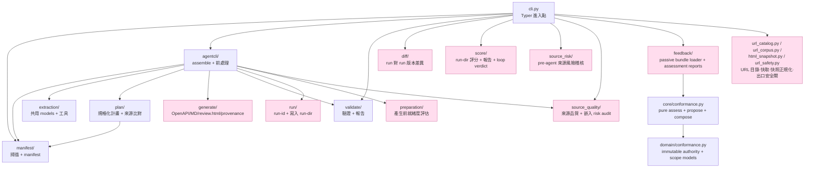

# Architecture / 架構

## Product architecture (canonical)

`loop-apidoc` is an evidence-to-contract system. Its stable product boundary is:

```text
Evidence Ledger
+ Grounded Claim Graph
+ Canonical API Contract IR
+ Deterministic Assurance Engine
+ Governed Contract Registry
```

The implementation follows the [product design decisions](DESIGN_DECISIONS.md):

- `domain/` owns the API ontology, canonical identities, immutable contract IR,
  deterministic rule packs, and pure projection compilers.
- `core/` owns immutable evidence, claim reconciliation, lifecycle, policy, governance,
  intent-oriented use cases, and typed ports.
- `adapters/` owns runtime and platform details. Models, parsers, humans, local files,
  databases, registries, and future agent runtimes are replaceable adapters.
- `evaluation/` owns immutable cases, replay, and quality/cost/latency metrics, including
  typed evidence-relationship classification accuracy. It cannot approve or mutate
  production assets.

Core and Domain perform no filesystem, network, process, browser, model, or database I/O.
Runtime output is always a proposal; deterministic reconciliation and policy decide whether
the claim is supported, missing, conflicting, unverified, waived, or superseded.
OpenAPI and the review payload are projections of the Canonical API Contract IR, not its
source of truth.

Before any Core use case invokes a source, runtime, approval, or artifact port, its Unit of
Work atomically reserves the complete source-set aggregate and returns a fencing token.
The token must accompany the CAS commit; an exact completed retry replays its durable snapshot,
while any live command is `in_progress` and cannot repeat an external effect. Pure preflight
failures release the reservation; an unknown source/runtime/approval outcome remains fenced
rather than being reissued automatically. Content-addressed artifact publication is the sole
retry-safe effect.
The optional local directory artifact sink pins its configured root with
no-follow descriptors, verifies a complete single-link content tree twice before
it returns references, and retains a hidden staging directory after a failed or
raced publication. Its path references are durable locators in a sink-owned root,
not immutable capabilities: the root must not be changed out of band between
publication and consumption. Portable POSIX cannot prove that a recursive pathname
cleanup still names its original inode, so automatic cleanup could otherwise delete
a replacement supplied by another writer.

The Canonical Contract Core stays domain-neutral. Payment-only Amount Direction and Line
Currency Policy values are owned by one optional `PaymentProfile`; a non-payment contract
has no profile. Legacy v0.27 top-level collection names are read/write compatibility
views derived from the profile, so the model keeps one source of state while existing
serialized consumers remain compatible. Transport Policy and Idempotency Rule remain
Core integration semantics.

GraphQL and AsyncAPI currently stop at the tested Core compiler seam:

```text
GroundedApiContract
  → GraphqlProjectionCompiler | AsyncApiProjectionCompiler
  → deterministic in-memory projection
```

There is intentionally no GraphQL/AsyncAPI CLI, run directory, or product validation
path yet. Integration stays frozen until a named downstream consumer supplies a real
source set and acceptance contract. This keeps the compiler seam available without
claiming that format-level fixtures prove product demand or end-to-end grounding.

The Evidence Ledger stores exact `EvidenceFragment` values with typed locators and a digest
of normalized fragment content. Core binds a material claim path to a fragment with an
`explicit_support`, `derived_support`, `contradicts`, or `insufficient` relationship and
then verifies the binding deterministically. The trace chain is:
claim identity/path → relationship → exact fragment → source artifact. A whole-document
legacy reference is only `insufficient`; evidence-ID existence and runtime confidence do
not make a claim supported.

Derived support is not a model assertion: Core recomputes only allowlisted,
versioned transformations from exact fragments and checks their input/output
digests. The current OpenAPI JSON Pointer mappings cover an operation's path
and method, a response status key, local response/request-schema `$ref` names,
and request-body and schema-field property facts (including array markers).
One local `$ref` hop needs two exact fragments: the child property or schema is
primary and the parent `$ref` is a context fragment. Schema fields may use an
explicitly ordered two-hop array chain (primary, parent→child `$ref`, child→leaf
`$ref`), but Core never follows arbitrary reference depth. Malformed, mismatched,
out-of-order, or incomplete inputs remain `insufficient`.

### Documentary authority and implementation conformance

The source-grounded claim graph remains the **Normative Contract**. Supplier sources are
the sole authority for what the provider documents; the documentary relationship axis
(`explicit_support` / `derived_support` / `contradicts` / `insufficient`) retains that
meaning. Runtime evidence enters a second, independent conformance axis:

```text
approved Normative Contract + passive normalized Observation Bundle
  → ContractConformance.assess
  → confirms | contradicts | inconclusive | out_of_scope
  → bounded coverage + one of eight deterministic review routes
```

`feedback/` is the adapter/report boundary. Its MVP loader accepts normalized JSON only,
performs bounded schema and digest checks, and never calls a provider network. The command
group is an explicit governed workflow:

```text
assess → propose? → submit immutable candidate case inputs
       ├→ review → append one bound non-approval decision + corrective route
       └→ independent human approve → append bound decision/amendment
                                     → publish separate immutable exact-scope Effective asset/current
compose = non-publishing preview     current = exact-target read
provider-erratum = verified non-mutating handoff to the normative source pipeline
```

Assessment, proposal, composition, and erratum-handoff reports are written outside
`.foundry`; only `submit`, `review`, and `approve` delegate governed writes to Foundry. Domain models
and `core/conformance.py` remain pure: `ContractConformance.assess`, `propose`, and
`compose` hide integrity binding, exact scope comparison, safe proposal policy, expiry,
conflict detection, coverage, and deterministic composition.
Proposal time cannot precede the observation window's completion. A non-approval review time
cannot precede observation completion and, when a proposal exists, cannot precede its
`created_at`. Before any feedback report or governed artifact is persisted, a deterministic privacy gate rejects sensitive field
names and obvious email/phone/national-ID/SSN/passport/Luhn-valid payment-card values; low-entropy PII is omitted rather than
hashed.

All eight `FeedbackRoute` values are reachable through deterministic policy: confirmed-only
evidence closes without change; other inconclusive evidence needs evidence; high-risk
contradictions request provider clarification; harness/fixture failures request implementation
correction; out-of-scope or DNS/proxy/gateway failures request environment configuration
correction; policy-safe contradictions without documentary evidence request extraction
correction; repeated network/timeout/rate-limit failures request provider-runtime regression
review; and policy-safe grounded contradictions become amendment proposals. Only `confirms`
and `contradicts` count as assessed material claims. `inconclusive` and `out_of_scope` targets
remain untested and open.

Observation kind validation is semantic policy in pure `core/conformance_policy.py`, not only
type validation. Status/success observations must bind the selected operation and its
`/responses/<status>/status_code`; response-field/type observations must bind a schema referenced
by that operation's response and a matching `/fields/.../name` or `/fields/.../type` path.

The integrity unit for proposal and Effective composition is the complete Normative
release digest: canonical contract + documentary fragments + support relationships.
Binding only the projected contract would miss an authority-bearing evidence or
relationship change, so proposal approval and amendment composition compare the complete
release digest and fail closed on mismatch.

An Implementation Observation is immutable empirical evidence only for its declared
Applicability Envelope. It cannot upgrade documentary support or prove provider intent.
A contradictory, independently reproducible, policy-eligible observation may become a
human-review subject and then an approved, expiring **Compatibility Amendment**. Ordinary
observations cannot infer high-risk or closed-world semantics such as authentication,
cryptography, money movement, idempotency, transaction guarantees, requiredness, or closed
enums.

An **Effective Contract** is an exact-scope view, not mutable canonical state:

```text
one immutable approved Normative Contract release
+ active approved amendments matching the complete target Applicability Envelope
→ Effective Contract with per-value normative | observed_override authority and lineage
```

Scope mismatch, expiry, stale binding, or conflicting active amendments is surfaced or
fails closed. The global Foundry `current.json` stays normative; effective selection is
deployment/scope-specific and must never become one global Effective current. “Fully
verified” is bounded to the reported envelope, observation time, material-claim coverage,
and suite version. Finite evidence never establishes universal or permanent 100% truth.
An exact-scope current read also has an explicit timezone-aware query time. It rejects a
not-yet-effective or expired Effective release, a base that is no longer normative current,
or a stale
pointer/bounded-artifact bindings. The pointer's `effective_asset_digest` binds the complete
strict-validated canonical current `EffectiveAsset`, including all declared fields; unknown
fields fail closed. Asset/pointer records also bind `effective-contract.json`,
`compatibility-amendment.json`, and `provenance.json`. Current lookup bounds, parses,
digest-verifies, and lineage-checks these bindings. It returns `valid_until`,
`open_discrepancy_count`, `stale_amendment_count`, `untested_material_claim_count`, and
`unresolved_contradiction_count` with the asset.
Governed feedback and Effective JSON models reject unknown fields. Current accepts only an
`APPROVED` asset and cross-validates Effective Contract identity, applied amendment IDs,
validity/counts, approval actor/time, and provenance approval/assessment/bundle bindings.
`stale_amendment_count` is pointer-visible and digest-bound. Stale is reserved for verifiable
release/contract/source/policy/approval-time drift; expired and inapplicable remain distinct.
Free-text `revalidation_triggers` are review declarations only; without an external trigger-signal
contract they do not execute or schedule revalidation automatically.
Approval lineage uses that same bound current-head integrity read before walking supersession.
Every successor carries `supersedes` together with `supersedes_asset_digest`, forming an
immutable hash chain; governed and user-facing traversal verifies each predecessor asset digest
and amendment artifact digest. This permits a new reviewed amendment to recover expired lineage,
while making any historical asset-metadata, amendment, or supersession tampering fail closed
before it can contaminate a later approval/composition.
All public governed lineage traversal is centralized in `foundry.query`, the single public
read-side I/O for this chain. Its package-internal `foundry.effective_binding` adapter performs
the descriptor-held pointer/asset/lineage verification shared with the Effective approval
transaction; it neither opens a project path nor exposes a parallel public reader.

A formal **Provider Erratum** has documentary authority and therefore bypasses empirical
composition: acquire it as supplemental supplier material and run the complete existing
source-risk → source-quality → extraction → verification → assembly → review → Foundry
release loop. The resulting new immutable normative release supersedes its predecessor.

## Current CLI compatibility architecture / 現行 CLI 相容架構

The agent-native pipeline described below remains the shipping CLI workflow in v0.14 and is
preserved as a compatibility adapter. Agent topology, prompt strategy, command layout,
filesystem run directories, and the exact artifact set are replaceable implementation
choices; they are no longer the product's architectural center.

本文件說明 `loop-apidoc` 的整體流程、資料流與套件邊界；長期設計決策見 [`docs/DESIGN_DECISIONS.md`](DESIGN_DECISIONS.md)。

## 現行 CLI 執行模式:agent-native

`loop-apidoc` 的擷取引擎是**當前的 coding agent 自己**。在 Claude Code plugin 或 OpenAI Codex CLI 的 session 內,agent 依 [`skills/loop-apidoc/SKILL.md`](../skills/loop-apidoc/SKILL.md) 讀來源、以**唯讀 subagent fan-out** 擷取(每個 subagent 只讀檔與搜尋、回傳 JSON,**不寫檔**),主 agent 把回傳的 JSON 寫成 `inventory.json` + `endpoints/*.json`,再呼叫確定性 CLI `assemble` 跑後段 plan→generate→validate,並以 `--json` 回報結果供 agent 自行驅動修正。

擷取(agent)與後段(CLI 純函式管線)以 `inventory.json` + `endpoints/*.json` 為唯一交界:agent 負責「從來源讀出結構化 JSON」,CLI 負責「把 JSON 確定性地組裝、生成、驗證」,兩邊各自可獨立測試。

> 早期曾有以子行程 `claude -p` 擷取的 `run-agent` CLI 模式,已於 2026-06 退役(連同 NotebookLM 擷取後端一併移除);現在**唯一**擷取路徑是 agent-native。

### Skill 可攜性(Claude Code + Codex 雙棲)

`skills/loop-apidoc/SKILL.md` 是**單一可攜檔**,同一份同時供 Claude Code plugin 與 OpenAI Codex CLI 載入,不分叉。可攜性靠兩個抽象:

- **CLI 佔位符 `<APIDOC>`**:SKILL 頂部定義一次解析規則 —— 環境有 `$CLAUDE_PLUGIN_ROOT`(Claude plugin 安裝時自動帶入)走 plugin 內含 CLI(`uv run --project "$CLAUDE_PLUGIN_ROOT" loop-apidoc`),否則退到全域 `loop-apidoc`(Codex / 獨立,`uv tool install`)。前綴用陣列寫法(`RUN=(...)`;`"${RUN[@]}"`)以兼顧 bash/zsh 與含空白路徑;**不**用 `${VAR:+…}` inline 展開(zsh 不切詞會壞)。
- **工具名中性化**:描述 agent 行為時用動作(讀檔、搜尋、抓取 URL)而非單一 runtime 的工具名,擷取的唯讀 subagent fan-out 語意兩邊一致。

可攜性決策摘要見 [`docs/DESIGN_DECISIONS.md`](DESIGN_DECISIONS.md)，安裝路徑見 [`README.md`](../README.md)。

## 高層流程


```mermaid
flowchart LR
    PRE["來源取得 / preprocess<br/>PDF/Word→UTF-8 markdown"] --> PM["pre-agent manifest<br/>精確來源包"]
    URL["URL 來源（可選）<br/>catalog-url → select-url → cache-url-pages<br/>或 GitBook llms.txt → Markdown sources → drafts<br/>→ 本機 evidence / coverage"] --> PM
    PM --> SR["inspect-source-risk<br/>確定性 pre-model 風險閘"]
    SR --> QR["agent source-quality review<br/>唯讀 observations"]
    QR --> SQ["assess-sources --source-risk<br/>品質閘 + 嵌入 risk audit"]
    SQ --> EX
    URL -. "url_sources/coverage.json<br/>（assemble --url-coverage）" .-> M

    subgraph AGENT["agent 擷取（Claude Code / Codex）"]
        EX["唯讀 subagent fan-out<br/>讀來源 → 回傳 JSON"] --> WR["主 agent 寫檔<br/>inventory.json + endpoints/*.json"]
    end

    subgraph CLI["assemble（確定性 CLI 後段）"]
        M["manifest<br/>掃描來源"] --> P["規格化計畫<br/>normalization-plan.json"]
        P --> G["生成<br/>OpenAPI + Markdown + provenance"]
        G --> V["驗證<br/>結構/完整性/一致性/禁止推測"]
        V -->|通過| OK["PASS（exit 0）"]
        V -->|分類問題| R[("--json report")]
    end

    WR --> M
    R -.agent 重讀來源、覆寫 JSON 後重跑 assemble.-> EX
```

`assemble` 不擷取,只組裝 agent 已寫出的 JSON:`manifest → plan → generate → validate`,再以 `--json` 回報 `run_id`/`run_dir`/`review_html`/`ok`/`status`/`report`(帶 `--score` 時另有 `score` 與 `loop`)。選填的 `integration.json` 以 typed `transport[]`、`amount_direction[]`、`idempotency[]`、`line_currency_policy[]` 保存來源明載的領域語意，經 extraction gate、normalization plan 與 canonical claim projection 後進入固定產生的 `integration-contract.json`；request 缺少 currency 欄位不構成單幣別證據。修正由 **agent 自行驅動**(無 CLI 內建迴圈):agent 依報告回頭重讀相關來源、覆寫對應的 `inventory.json`、`endpoints/<NN>.json` 或 `integration.json`,再重跑 `assemble`,預設最多 3 輪;帶 `--score` 走分數自循環時改由 `--max-rounds`(預設 6)控制。`UNFIXABLE`(來源無法確認／衝突／不支援斷言)為 fail-closed,回報為缺漏／衝突而不補寫。

`assemble --architecture-mode shadow` 是 opt-in compatibility sidecar：legacy
validation report 寫出後，同一份 manifest 與 normalization plan 會經
`shadow/bridge.py` 映成 immutable evidence 與 claim proposals，再由
`EvidenceToContractService` 以 in-memory adapters 執行到 Core validation。
結果寫入 `<run-dir>/core/`；任何 shadow failure 只寫 `core/error.json`，不會改變
legacy validation、score、approval、Foundry、run status 或 exit code。預設
`legacy` 不建立 `core/`。`shadow/report.py` 是這個 compatibility package
唯一的 file-I/O exit；Core 與 Domain 仍不依賴 CLI 或 run directory。

`assemble --architecture-mode strict` 使用相同的 legacy-plan bridge，但它是 blocking
adapter，不會呼叫 shadow 的 safe wrapper。strict 僅在 legacy validation 通過後執行，
並逐一要求每個 legacy `supported` plan item 的所有 material claim path 都由 exact
evidence relationship 支援；未滿足時只產生 `core/grounding-report.json`，不產生
candidate release，run 失敗。成功的 `core/execution.json` 記錄 candidate eligibility
與零 approval/publication side effect，`core/release.json` 仍是未核准 candidate。
Foundry import/approval 會重新驗證這些 strict artifacts，且 `allow_failing` 不得繞過
strict 的拒絕或錯誤。Review snapshot 綁定完整 candidate file set；decision 落盤後再
獨立綁定自身 bytes。Approval 在 copy 前後比對同一組 digests，對 copied strict
candidate 再跑 eligibility，並由 normative asset manifest 綁定 `run.json`、execution、
release、contract、decision、evidence、claims 與 relationships。legacy 與 shadow 的
既有輸入與退出語意維持不變。

Shadow 的 `adapters/fragments.py` 是 read-side I/O exit：它把來源實際內容具體化為
page／line range／section／table cell／JSON Pointer／CSS／XPath locator，並以片段
內容計算 digest。`core/relationships.json` 保存 claim-level relationship，
`core/projections/{openapi,review-data,provenance}.json` 保存觀測性投影；其中
provenance 可逐欄位追到 exact fragment 與 source artifact。無法從 legacy
citation 取得精確 locator 時只會得到 `insufficient`／unverified，不會假裝成
`explicit_support`。

在 agent-native boundary，選填的 v1 `evidence[]` 會以 exact manifest source identity、
typed locator、normalized fragment digest 與 material claim path 表示。`verify-extraction`
與 `assemble` 都會在建立 run-dir 前透過 fragment adapter 重新 materialize 並驗證這個
digest，並以 shared plan projection 解析 claim path。Shadow 對已宣告的 claim path 優先採用它、停用同一路徑的 legacy fallback；最終
relationship 由 Core 決定：JSON Pointer 與 table-cell fragment 會以結構化值比較；無法
解析成值的來源文字，只有在 v1 reference 已精確綁定 claim path、且來源身分、locator、
digest 全數通過時，才會記成可審計的 `CLAIM_BOUND_EXACT_REFERENCE`。它不是全文或一般
行號引用的升格；legacy page／line citation 一律仍是 `insufficient`，且 agent 必須先重讀
片段、確認來源明確支持該值，不可把慣例、預設值或推測寫成此種 binding。
對 OpenAPI JSON Pointer 的 v1 reference，bridge 只會提出固定的 derived-support
mapping（operation path/method、response status、local response/request-schema `$ref`、
request-body property name 與陣列標記）；Core 會重新計算 pointer 結構與 digest chain。
若欄位在 request schema 的一跳 `items.$ref` 後，proposal 必須同時攜帶子欄位與父層
`$ref` 的 exact fragment；任何 locator、claim path、`$ref` 形式、context 或 digest 不符
都維持 `insufficient`。

`assemble --score` 在驗證報告寫出後讀取同一個 run-dir artifact 集合並產生
`score/score.{json,md}`；這是後段品質摘要，不會回頭擷取來源，也不改變
validation pass/fail 的語意。配合 `--target-score`/`--prev-score`/`--round-index`/`--max-rounds`,
`score/loop.py` 的 `loop_verdict` 會在 `--json` 的 `loop` 欄位回報
`continue`/`converged`/`plateau`/`exhausted` 等自循環判定,供 agent 決定是否再跑一輪。

URL 來源另有一條 fail-loud 的涵蓋檢核:agent 依 catalog 寫出
`url_sources/coverage.json` 帳本,經 `assemble --url-coverage` 傳入後由
`url_coverage.py` 解析,`preparation/assess.py` 的 `_assess_url_coverage`
產生**只有 warning** 的 `url_coverage` phase(預期 vs 實際撈取的遺漏檢查),
不影響 validation 的 severity 閘。

## 套件邊界


```mermaid
flowchart TD
    cli[cli.py<br/>Typer 進入點]

    cli --> manifest[manifest/<br/>掃描 + manifest]
    cli --> agentcli[agentcli/<br/>assemble + 前處理]
    cli --> validate[validate/<br/>驗證 + 報告]
    cli --> diff[diff/<br/>run 對 run 版本差異]
    cli --> score[score/<br/>run-dir 評分 + 報告 + loop verdict]
    cli --> sourcerisk[source_risk/<br/>pre-agent 來源風險稽核]
    cli --> sourcequality[source_quality/<br/>來源品質 + 嵌入 risk audit]
    cli --> feedback[feedback/<br/>passive bundle loader + assessment reports]
    cli --> urltools[url_catalog.py / url_corpus.py /<br/>html_snapshot.py / url_safety.py<br/>URL 目錄·快取·快照正規化·出口安全閘]

    agentcli --> manifest
    agentcli --> extraction[extraction/<br/>共用 models + 工具]
    agentcli --> plan[plan/<br/>規格化計畫 + 來源比對]
    agentcli --> generate[generate/<br/>OpenAPI/MD/review.html/provenance]
    agentcli --> validate
    agentcli --> run[run/<br/>run-id + 寫入 run-dir]
    agentcli --> preparation[preparation/<br/>產生前就緒度評估]
    agentcli --> sourcequality
    feedback --> conformance[core/conformance.py<br/>pure assess + propose + compose]
    conformance --> domain[domain/conformance.py<br/>immutable authority + scope models]

    plan --> manifest

    classDef io fill:#fde,stroke:#c69
    class generate,run,diff,score,preparation,sourcerisk,sourcequality,urltools,feedback io
```

`cli.py`(Typer)另有 `cache-gitbook-llms` 與 `extract-markdown-drafts`：前者從一份 `llms.txt` 安全快取同網域、入口前綴下的 Markdown、sidecar 與 coverage；後者只讀 manifest 指名 Markdown，輸出具行號、非權威的端點／表格／範例草稿。兩者都不取代 agent 最終擷取與 `verify-extraction`。

URL 來源走「先建目錄、再明確選取、才快取」的分段流程(`skills/loop-apidoc/reference/url-fetching.md`):`catalog-url` 只下載入口頁一次並寫出導航 catalog(絕不自動跟連結,catalog 是**涵蓋宇宙**而非抓取清單);`select-url` 純選取(`--branch`/`--term`/`--url`,不下載);`cache-url-pages` 把 catalog 全頁快取成本機 corpus(`raw/` 原始 HTML + `body/` 正文 + `corpus.json` 精簡卡片:標題/標頭/內部連結/實體/雜湊,**不送模型**);`cache-url-entry` 是單頁(空 catalog/一頁式文件)變體;`related-url-pages` 依正文連結與共享實體輸出候選頁卡片;`normalize-html-snapshot` 把已下載的靜態 HTML 正規化成 Markdown 並寫 URL/hash provenance sidecar(`*.source.json`)。受 challenge 保護但可由互動式瀏覽器合法顯示的頁面走 `import-rendered-url`：`rendered_url.py` 離線保存原始 HTML/Markdown、版本化 capture provenance 與 `fetched_rendered` coverage；`manifest --url-coverage`／`assemble --url-coverage` 只在 URL、路徑、method 與 SHA-256 全部匹配時省略該 origin probe，任何 mismatch 都在 run-dir 建立前 fail closed。這些模組是頂層的 `url_catalog.py`/`url_corpus.py`/`html_snapshot.py`/`rendered_url.py`/`url_safety.py`。

所有對外 fetch 一律經 `url_safety.safe_client()`：這是 httpx client factory，在 `request` event hook 內驗證呼叫方自己的 URL 與每一次 redirect hop，而非只驗證起點，故 fetcher 無法忘記檢查、302 也無法繞過。準則是 HTTP(S) scheme、URL 不含 userinfo，且解析出的**每一個**位址皆 globally routable（非任一，因為單一位址落在私有網段就是常見繞過手法）；`ipaddress.is_global` 之外另排除 multicast、NAT64（`64:ff9b::/96`、`64:ff9b:1::/48`）、6to4 relay（`192.88.99.0/24`）與雲端 metadata endpoint，`trust_env=False` 使 proxy 環境變數無法讓 fetch 繞過此準則，DNS rebinding 則刻意不在範圍內；`scripts/quality_gate.py` 的 `NETWORK_MODULES` 支撐一項測試，除 `url_safety.py` 本身，任何能發出請求的模組都會讓測試失敗。URL 內含的憑證值在序列化當下（而非記憶體內）一律替換為 `[REDACTED]` 才寫入 `corpus.json`、`coverage.json`、provenance sidecar、OpenAPI snapshot 與 CLI stdout；替換是拼接進原字串而非重新編碼，故不含憑證的 query 會逐位元組原樣往返。`catalog.json` 是唯一例外——`cache-url-pages` 會讀回並據以抓取，該檔案裡的 URL 是指令而非證據，且屬於 repository-hygiene 已排除在 Git 之外的本機 run artifact。`rendered_url.canonicalize_url` 在正規化時一併 redact，故 URL identity 具 redaction 不變性，已 redact 的 artifact 仍能比對 operator 輸入的原始 `--url`。`UrlSource.fetch_url` 供發出請求用，`UrlSource.citation_id`（其 redacted 形式）供命名、比對與落地紀錄用；`plan.json`、驗證報告、產生的 Markdown 與 `review.html` 因此皆以 redacted identity 指稱一個 URL 來源，join 得以保持一致。

`assess-sources --source-risk` 是擷取前的品質 gate，會驗證並嵌入 source-risk audit(`source_quality/`:`loader.py`/`assess.py`/`diff.py`/`models.py`/`report.py`)；其 output 目錄可經 `assemble --source-quality` 輸入。`reject` 會在建立 run-dir 前中止，`pass` 的 report 與 source diff 會被寫入 `<run-dir>/source-quality/`，使後續 Foundry 匯入保留稽核證據。`agentcli/` 內含八個檔案:`assemble.py`(組裝 agent 寫出的 JSON)、`input_schema.py`(pydantic 型別守衛)、`source_guard.py`(三項輸入邊界檢查,違規即 `exit 2` 且不建立 run 目錄:`source` 引用格式、`endpoints[].path` 根路徑、`path` 為 `null` 的 webhook/callback 端點必須帶 `summary`;`source` 以「檔案」為範圍——整份檔無一引用命中 manifest 才擋,部分命中則交給 validate 逐筆報 `SOURCE_UNVERIFIED`)、`cross_file.py`(純函式,檢查 `endpoints/*.json` 與 `inventory.json` 的七項跨檔不變式:端點檔數等於 inventory 筆數、身份多重集合相等(有 `path` 用 `(method, path)`,`path` 為 `null` 的 webhook/callback 端點改用 `(method, summary)`)、同一身份不得寫進兩個檔案、`schema_ref` 與 `security[]` 各自指向 inventory 既有的 schema/security scheme 名稱、`endpoints[].server` 需指向某個 `environments[].name`、`request`/`responses[]` 的 `schema` 若恰為 inventory schema 名稱則必須同時寫 `schema_ref`;null-path 端點不再豁免多重集合與重複檢查——`source_guard` 已在邊界保證它們必有 `summary`)、`gate.py`(`check_extraction`,`assemble` 與 `verify-extraction` 共用的唯一聚合閘門,兩個入口因此不可能漂移)、`verify.py`(`verify-extraction` 的薄殼:建 manifest → 讀擷取目錄 → 呼叫閘門;只讀不寫,不建立 run 目錄)、`extraction.py`(把 `inventory.json` 轉成 plan 各 stage 的初始答案)、`preprocess.py`(編排 PDF／DOCX→markdown，先驗證整批 DOCX 再寫檔)。`operation_identity.py` 是跨檔端點 identity 的中立 pure owner。`docx_normalization.py` 以 bounded、fail-closed OOXML gate 產生 deterministic Markdown 與 `.source.json` provenance，不執行或解析外部 relationship。`diff/` 內含四個檔案:`loader.py`(讀取已完成 run-dir 的產物,輸入有誤拋 `DiffInputError`)、`compare.py`(跨 `openapi.yaml`/`integration-contract.json`/`provenance.json`/`validation/report.json`/`manifest.json` 分類差異)、`models.py`(`DiffFinding`/`DiffImpact`/`DiffReport`)、`report.py`(輸出 `diff/report.{json,md}`)。`preparation/` 內含 `assess.py`(`assess_preparation` 把 manifest + inventory + endpoints + plan 評成就緒度報告,phase/finding、severity `error`/`warning`、status `blocked`/`needs_attention`/`ready`;另 `_assess_url_coverage` 在有 URL 來源時附加**只有 warning** 的 `url_coverage` phase)與 `report.py`(寫出 `preparation-report.{json,md}`)；頂層 `url_coverage.py` 是唯一讀檔 owner，fail-loud 解析 agent 寫出的 `url_sources/coverage.json` 帳本。它們在 `assemble` 內於 plan 之後、generate 之前執行，並被 `diff/` 讀回比較。`score/` 內含 `loader.py`(`load_score_inputs`)、`evaluate.py`(`evaluate_score`,五類加權 openapi_validity/completeness/consistency/source_grounding/reviewability → 0–100,`ci`/`review` profile)、`loop.py`(`loop_verdict`,分數自循環判定 `continue`/`converged`/`plateau`/`exhausted`)與 `report.py`(寫出 `score/score.{json,md}`),經 `score` 命令或 `assemble --score` 產生,不改變 validation pass/fail。

DOCX 邊界保留 `docx_normalization.py` 作為穩定 facade 與 bounded source read；型別、純 OOXML 驗證、純 Markdown rendering、分段暫存且於可回報寫入失敗時回滾的 Markdown/provenance publication 分別位於 `docx_models.py`、`docx_validation.py`、`docx_render.py`、`docx_publish.py`。package validation 會掃描每個 Word XML part，active DDE field、markup-compatibility alternate content 與無法忠實輸出的合併儲存格一律在發布前 fail closed。

`manifest/scanner.py` 以 `DEFAULT_EXCLUDES`(`README*`/`LICENSE*`/`CHANGELOG*`/`CONTRIBUTING*`/`.DS_Store`/`.git/*`)加上 `--exclude` 傳入的 glob 排除非規格檔:命中者仍列在 `manifest.json` 但 `status: ignored`、不雜湊、不可作為來源證據(`plan/classify.py` 的 `_UNUSABLE` 含 `IGNORED`,故單一文件的 `sole_source` 歸因不會被一份 README 打斷)。

source-quality blocker observation 可攜帶來源明確連出的 `required_source_refs`；reject report 只做 ordered de-duplication，作為下一輪 bounded capture seed，不抓取、不 crawl，也不改變 reject 語意。

`inspect-source-risk` 是所有 agent source read 之前的確定性 gate。`source_risk/inspect.py` 對 manifest 指名的 UTF-8 Markdown、HTML、OpenAPI JSON/YAML 做 bounded scan（預設 `max_bytes=5 MiB`）；PDF、Word、無效 UTF-8、超限與其他 unscannable pending source 都是 blocker。固定的 `source-risk-report.{json,zh-TW.md}` 不回顯命中 payload，最多保留 1,000 筆 finding，超過時以 `SR-FINDINGS-TRUNCATED` blocker 代表其餘命中；並以 schema/ruleset version、`max_bytes`、manifest digest、逐來源 SHA-256 與 stable source-binding digest 綁定 audit；`loader.py` fail-loud 驗證，`report.py` 是寫檔出口。

`assess-sources` 現在必須帶 `--source-risk`；它只接受同 manifest/source binding 的 current pass audit，並對目前 bytes 重跑 deterministic inspection、要求完整 report 相符後才嵌入 `source-quality-report.json`。每個 `assemble` 都必須帶 `--source-quality`，重建 manifest後再次重跑檢查並驗證嵌入 audit，避免遭竄改或來源 bytes 在審查後替換；不符時 exit 2 且不建立 run-dir；這能拒絕未稽核 run，但不能證明流程外 agent 讀取來源的時間順序。

**檔案 I/O 出口**:`generate/`、`run/`、`agentcli/preprocess.py`、report writers（含 `source_risk/report.py` 與 `feedback/report.py`）、Foundry persistence（含 write-once feedback inputs 與後續附加的 governance records）、URL corpus 快取、`gitbook_llms.cache_gitbook_llms`（來源／sidecar／coverage）、`html_snapshot.normalize_html_snapshot`、`rendered_url.import_rendered_url` 與 `docx_publish.py` 會寫檔；`feedback/loader.py`、`url_coverage.py`、`docx_normalization.py`、`source_risk/inspect.py`／`loader.py`、`rendered_url.verified_rendered_url_sources`、`markdown_drafts.collect` 是只讀例外。`core/conformance.py`、`domain/conformance.py`、`docx_validation.py`／`docx_render.py`、其餘 draft scanner 與 GraphQL／AsyncAPI compiler 保持純函式，且 feedback／conformance Core 不做 provider network I/O。

### 套件職責表

各套件的職責與對外 seam（英文原文，自 `AGENTS.md` 移入）：

| Package | Responsibility |
| --- | --- |
| `loop_apidoc/domain/` | model-independent Canonical Contract IR, identities, evidence relationships, rules, and projections. The Core remains domain-neutral: payment-only amount direction and line-currency values live in one optional `PaymentProfile`; legacy top-level collection names are derived read/write compatibility views, not parallel state. |
| `loop_apidoc/domain/conformance.py` + `loop_apidoc/core/conformance.py` + `loop_apidoc/core/conformance_policy.py` | strict (`extra="forbid"`) immutable authority/scope models, pure `ContractConformance` assessment/proposal/composition, and the separate deterministic observation-target/routing policy. Status observations must bind the same operation's response-status path; response field/type observations must bind a matching field name/type path in a schema referenced by that operation's response. Only confirms/contradicts count as assessed; inconclusive/out-of-scope remain untested/open. Proposal/composition bind the complete Normative release digest. Stale amendments reflect verifiable release/contract/source/policy/approval-time drift; expiry and inapplicability remain separate. Free-text revalidation triggers are review declarations, not an external automatic trigger contract. |
| `loop_apidoc/feedback/` | passive normalized-JSON adapter behind `feedback assess`/`propose`/`submit`/`review`/`approve`/`compose`/`current`/`provider-erratum`: fail-loud approved-base/bundle loading, deterministic ungoverned reports/previews, Foundry-backed case submission/write-once non-approval review/exact-scope approval and query, and a digest-verified non-mutating erratum handoff. `feedback review` accepts immutable cases with or without proposals, requires reviewer identity/version, timezone-aware decision time no earlier than observation completion or an existing proposal's creation, `rejected|needs_evidence`, and a corrective route other than `closed_no_change`/`amendment_proposal`. Governed persistence deterministically rejects sensitive field names and obvious email/phone/national-ID/SSN/passport/Luhn-valid payment-card values; low-entropy PII is omitted, never hashed. `feedback current` requires timezone-aware `--at`, rejects not-yet-effective/expired/stale/non-current-base Effective assets, verifies all three bounded Effective artifacts, and returns bounded-validity/discrepancy counters including unresolved contradictions. It performs no provider network I/O. `loader.py`, `report.py`, `erratum.py`, and the CLI adapter are explicit read/write I/O exits; governed writes are delegated to `foundry/`. |
| `loop_apidoc/privacy.py` | single pure deterministic policy for sensitive field/value detection and display redaction shared by ungoverned feedback reports, governed Foundry persistence, and the pre-agent source-risk gate. The patterns are separated by what the match proves, not by where it is used: `SECRET_MATERIAL` (self-evidencing), `CREDENTIAL_REFERENCE` (a credential is being named — real value in a governed payload, almost always a placeholder in a source document), `CONTACT_PII`, `PII_VALUE`, and `PAYMENT_CARD_CANDIDATE`, whose only entry point is `iter_payment_card_numbers` (never used without the Luhn check, or long order/merchant IDs become cards; and never one candidate one card, or a greedy candidate that merged an adjacent number hides the card it contains — it yields the Luhn-valid windows cut at digit-group boundaries inside each candidate, so the whole-run validator no longer exists to be misused). `find_sensitive_value` unions them, so the split alone leaves governed behaviour unchanged; only `source_risk/` grades them by severity. `is_credential_key` answers a separate question — whether a *parameter name* means its value is a credential — for `url_safety`'s artifact redaction; it stays here because this module owns sensitive-name vocabulary, and it is deliberately not `FORBIDDEN_KEYS`, which is the governed-payload ban list and includes low-entropy PII. It matches long unambiguous shapes as substrings (vendor prefixes such as `X-Amz-Signature` defeat an exact set, and a miss is a silent leak) and short ambiguous names whole (`key` would otherwise eat `keywords`). `JWT_BODY` is the one JWT definition, shared with `SECRET_MATERIAL` and with `url_safety`'s path-segment check. Two pattern bodies did change governed detection and are deliberate: the card candidate no longer spans a line break (it previously joined adjacent numeric fields into cards nobody wrote), and the contact-PII domain is now a bounded label structure rather than `[^\s@]+\.[^\s@]+` — the unbounded form is quadratic over a whole document and would let one source file stall the pre-agent gate. |
| `loop_apidoc/manifest/` | scan local sources + build `manifest.json`. `LocalSource.authority` is `normative` (the default — every source that predates this field is a formal document, so the default is a fact rather than a compatibility concession) or `supplementary`, taken from the source's `.source.json` sidecar; an absent, unreadable, or authority-less sidecar means `normative`. The level is declared by the sidecar rather than a CLI flag (a one-shot declaration that does not travel with the corpus) or a directory convention (relative_path is also the citation key, so moving a file would silently change its level). (`.doc` is detected as `word-legacy`, `.xlsx`/`.xls` as `spreadsheet`, `.txt` as `plain-text`, and `.csv` as `csv`, all four reported **unsupported**: OOXML validation/rendering does not apply to an OLE compound file, a spreadsheet's merged cells and formulas have no faithful mechanical reading, `.txt`/`.csv` are not in the manifest's supported set even though their content is often plain readable text, and `preprocess` converts only `.pdf`/`.docx`, so calling any of the four supported would be a claim the pipeline cannot honour — `.docx` is unaffected. None gets a converter, by decision rather than backlog (ADR 0012); recognising the format instead of leaving it in `UNKNOWN` buys exactly one thing, a remedy that names the operator's next step. `formats.py` holds that remedy per format in both report languages, and `validate/coverage.py`, `score/evaluate.py` and `preprocess`'s passthrough line all read it from there rather than restating it) (`scanner.py` excludes non-spec furniture via `DEFAULT_EXCLUDES` + `--exclude` globs → `status: ignored`, never source evidence; `builder.py` verifies coverage-matched rendered provenance and skips only that matched origin probe) |
| `loop_apidoc/url_catalog.py` | reproducible URL navigation catalog behind `catalog-url`/`select-url`: `fetch_catalog` (bounded HTTP GET of *one* entry page, size-capped, `CatalogFetchError`), `build_catalog` (parse only sidebar/nav lists into `CatalogNode`s — entry-page fragments kept as `anchor` section identities; links are recorded, never followed), `select_catalog` (pure filter by branch/term/URL; widens nothing, fetches nothing) |
| `loop_apidoc/url_corpus.py` | token-efficient cached URL corpus behind `cache-url-pages`/`cache-url-entry`/`related-url-pages`: `cache_catalog_pages` (fetch each catalog URL once — anchors of the same document become `sections` — and write content-addressed `raw/<sha256>.html` + `body/<sha256>.txt`; failures become `status: fetch_failed` entries, not exceptions; an un-rendered SPA shell probes only same-origin `/swagger.json`, `/openapi.json`, `/v3/api-docs`, and `/api-doc/v3/sections`; only JSON with an `openapi` or `swagger` root field is stored as a separate corpus source, while failed/non-spec/generic-JSON responses are silently not recorded and the CLI warns of the shell count on stderr), `extract_page_metadata` (pure: title/headings/body/internal links/`action:`+error-code entities from `<main>`; an error-code entity needs a cue word — `error`/`code`/`錯誤`/`代碼`/`狀態` — within a tight window of the digits, and a year-shaped value is never one, so page scoring is not fed by dates, amounts, and rate limits), `find_related_pages` (pure evidence-based scoring — same branch / in-out links / shared entities — returning candidate cards without loading body text) |
| `loop_apidoc/gitbook_llms.py` | deterministic GitBook `llms.txt` filtering/cache with safe path preservation, URL sidecars, and coverage |
| `loop_apidoc/markdown_drafts/` | separate non-authoritative, line-cited Markdown endpoint/table/example drafts; never alters `source_facts` validation. Its scanner deliberately diverges from `source_facts/markdown.py` — each is looser where its own job needs it, neither is uniformly stricter, and they must not be unified, since a change made for draft output would silently move a fail-closed gate (ADR 0009, pinned in `tests/source_facts/test_scanner_divergence.py`) |
| `loop_apidoc/extraction_scaffold/` | pure projection of Markdown drafts into review-only extraction-shaped inventory/endpoint JSON; `write.py` is this feature's sole atomic output exit, and agents must copy/review output before it is used as real extraction |
| `loop_apidoc/html_snapshot.py` | `normalize-html-snapshot`: `html_to_markdown` (pure: readable main-document text, no invented content; `colspan`/`rowspan` expand into a rectangular grid — the spanning cell's text stays in its own column and the covered columns are left blank so a group-title row stays distinguishable from a parameter row, while `rowspan` carries the text down its own column; out-of-range/non-numeric spans count as 1, overlapping spans discard the whole table, a multi-row `thead` merges into one header row, and a nested table renders as its own table instead of appending its rows to the enclosing one — a misaligned parameter table becomes a source fact nobody wrote) + `normalize_html_snapshot` (writes the Markdown and a `.source.json` sidecar binding it to the raw file's URL + sha256) |
| `loop_apidoc/supplementary_note.py` | `import-supplementary-note`: imports a hand-written excerpt of supplier correspondence (email, chat, or a spreadsheet re-saved as a Markdown table) as a **supplementary** source. Shape is taken from `rendered_url.py` because the problem is the same — a file with no verifiable origin buys traceability with mandatory provenance fields, a timezone-aware timestamp, a file digest, a versioned sidecar, and fail-closed read-side validation. Supplementary sources may be cited and may fill `missing`; they never support `explicit_support`, and the normative document wins any disagreement. **The accepted breach:** an excerpt is written by a person who may err or over-read, and the pipeline cannot tell. `excerpted_by` buys accountability, not verifiability — that is the one real cost of this path and the only source class that carries it. |
| `loop_apidoc/rendered_url.py` | first-class offline browser-rendered URL import: validates original/canonical URL, timezone-aware capture metadata, capture method, safe immutable destinations, and SHA-256; writes the unchanged HTML/Markdown source, versioned provenance sidecar, and `fetched_rendered` coverage. Its read-side verifier binds coverage → sidecar → manifest local source and fails closed on any mismatch before an origin probe. |
| `loop_apidoc/source_risk/` | deterministic pre-agent gate behind `inspect-source-risk`: `models.py` (versioned `SourceRiskReport`, findings and coverage), `inspect.py` (bounded read of manifest-bound UTF-8 Markdown/HTML/OpenAPI JSON/YAML; fixed rules, a 1,000-entry report cap with fail-closed `SR-FINDINGS-TRUNCATED`, a separate 500-entry warning budget whose overflow is the warning-severity `SR-WARNINGS-TRUNCATED`, and stable `source_binding_digest`; PDF/Word, invalid UTF-8, over-`max_bytes`, and other unscannable pending sources are blockers), `loader.py` (fail-loud schema/ruleset/verdict/manifest/source-binding verification plus deterministic reinspection of current bytes), `report.py` (`source-risk-report.{json,zh-TW.md}`; findings never echo matched payloads). The ruleset covers both directions: whether a source can **manipulate** the agent (Unicode tag, bidi override, control characters, instruction-override text) and whether it **leaks material to** the agent. The leak rules reuse `privacy.py`'s deterministic patterns, and only self-evidencing material blocks: `SR-SECRET-VALUE` (blocker) is PEM private-key blocks and JWTs, whose structure is the evidence. `SR-CREDENTIAL-REFERENCE` stays a warning because a competent API document documents `Authorization: Bearer <TOKEN>`, and whether the value is real cannot be settled from the text — blocking it would reject nearly every qualifying source, and a gate that always needs a waiver is not a gate. `SR-CONTACT-PII`, `SR-PII-VALUE`, and `SR-PAYMENT-CARD` are warnings; card candidates are Luhn-validated and the card schemes' published test numbers are excluded, since a payment document necessarily documents them. A candidate is not a card: the finding is the Luhn-valid window found *inside* the candidate at digit-group boundaries, because the candidate pattern is greedy and an adjacent number on the same line (`1 4539…`) otherwise swallows the card into one run that fails Luhn and is never reported at all. Cutting only at group boundaries is the limit of that: a card glued to another number with no separator stays undetected, because cutting mid-run would manufacture cards nobody wrote. The test-number exemption matches a published number *inside* the window for the same reason the window exists — the longest valid window may have eaten the adjacent number. A candidate never spans a line break — joining two adjacent numeric fields produces a Luhn-valid card roughly one time in ten, and that card was never written by anyone — but every other Unicode space still separates one, because PDF extraction yields U+00A0 and zh-TW documents yield U+3000. Exit 0/1/2 means pass/reject/input error; source bytes are never rewritten. |
| `loop_apidoc/source_quality/` | pre-extraction source quality gate behind `assess-sources --source-risk`: `models.py` (`QualityObservation`/`QualityFinding`, `FindingSeverity`, verdict `pass`/`reject` + `SourceDiffReport`; report embeds a verified `SourceRiskReport`; blocker observations may carry explicit HTTP(S) `required_source_refs`), `loader.py` (read side: manifest, agent-written observations JSON, and a completed assessment dir — `SourceQualityInputError`), `assess.py` (`assess_source_quality`, pure: manifest usability + observations + source-risk audit → findings; any blocker ⇒ `reject`; rejected reports aggregate a bounded ordered/de-duplicated `required_source_refs` list without fetching it), `diff.py` (`build_source_diff`, pure manifest-vs-manifest added/removed/changed), `report.py` (`write_reports` → `source-quality-report.{json,zh-TW.md}` + `source-diff.{json,md}`). `assemble` requires `--source-quality`, re-loads the reports, rejects missing/stale/mismatched embedded audits and internally inconsistent reports (strict `extra="forbid"` models; `verdict` must be `reject` exactly when a blocker finding exists, and `required_source_refs` must equal the ordered de-duplicated union from those blockers), and copies a passing pair into the run-dir's `source-quality/`. |
| `loop_apidoc/freshness/` | cheap scheduled freshness gate behind `record-fingerprint`/`check-freshness`/`check-freshness-batch`: `models.py` (`SourceKind`/`SourceStatus`/`FreshnessVerdict`, `SourceSignal`/`FingerprintEntry`/`SourceFingerprint`, `SourceResult`/`FreshnessReport`, `Watchlist`/`WatchlistItem`, `BatchItemStatus`/`BatchItemResult`/`BatchReport`, `EXIT_CODES` verdict→exit-code map, `FreshnessInputError`), `signals.py` (pure `hash_bytes`/`file_signal`/OpenAPI-version detection + `classify` comparing an observed signal to a baseline entry; network `fetch_url_signal` — OpenAPI-URL sources compare `info.version`, HTML uses ETag/Last-Modified then body sha256 — writes nothing), `record.py` (`build_fingerprint` reads a completed run's manifest + URL coverage into a `SourceFingerprint`, omitting supplementary sources — the whole gate rests on a source being re-obtainable and digest-comparable, which an excerpt of correspondence is not, so including it would only yield a permanently meaningless verdict and pollute the batch scan; `write_fingerprint` — WRITE exit, refuses overwrite without `force`), `check.py` (`check_freshness` orchestration: reads the baseline fingerprint, re-derives each source's current signal via `signals.py`, aggregates into a `FreshnessReport`; writes nothing), `batch.py` (`load_watchlist` — fail-loud parse of a `freshness-watchlist.json`; `scan_watchlist` — fans `check_freshness` over each watchlist item, capturing per-item errors into that item's `BatchItemResult` rather than aborting the batch, and aggregates into a `BatchReport`; writes nothing), `report.py` (`write_reports` → `freshness-report.{json,md}` — WRITE exit; also `render_batch_markdown`/`write_batch_reports` → `freshness-scan.{json,md}` — WRITE exit) |
| `loop_apidoc/governance/` | bounded source-governance trigger behind `governance-scan`: `scan.py` (`build_governance_report`, pure classification of a batch scan into `no_action`/`review_required`/`attention_required`), `models.py` (typed trigger contract), `report.py` (`write_reports` → `governance-trigger.{json,md}` — WRITE exit). It never re-extracts, generates, imports, or approves a contract. |
| `loop_apidoc/agentcli/` | `assemble.py` (assemble agent-written JSON → plan→generate→validate, `AssembleInputError` / `RunDirectoryCollisionError`), `strict.py` (blocking exact-evidence legacy→Core candidate adapter; never approves, publishes, or mutates Foundry), `input_schema.py` (typed pydantic guards, including optional v1 exact-evidence references, operational `applies_to[]`, and typed transport/amount-direction/idempotency/line-currency semantics), `evidence.py` (read-side v1 evidence materialization/digest verifier plus pure claim-path verification shared by both entry points), `source_guard.py` (pure boundary checks for the three schema contracts a subagent can't infer: `endpoints[].path` must start with `/`, each extraction file's `source` citations must name a manifest source — per-file scope, so a partially-citing file is left to validation's per-entry `SOURCE_UNVERIFIED` — and null-path endpoints must carry a `summary`), `cross_file.py` (pure cross-file invariants: endpoint files ↔ inventory — count, identity multiset (`(method, path)`, or `(method, summary)` for null-path webhooks), no duplicates, `schema_ref`/`security[]` resolution, a `schema` that equals an inventory schema name must also set `schema_ref`, `endpoints[].server` → `environments[].name` resolution, operational applicability → existing operation/field resolution, and typed semantic operation refs → existing operations), `gate.py` (`check_extraction`, the single pure aggregator `assemble` and `verify-extraction` both call — also folds in `source_facts`' semantic completeness and deferral checks, taking the `FactIndex` as an argument), `verify.py` (the `verify-extraction` shell: build manifest + load extraction + pure gate + evidence verifier; writes nothing), `extraction.py` (convert `inventory.json` into plan stage answers), `preprocess.py` (PDF/DOCX→markdown orchestration with full DOCX preflight before batch writes) |
| `loop_apidoc/commands/` | the Typer command functions, one module per group: `acquisition.py` (`manifest` and the URL/GitBook/snapshot/rendered-URL/supplementary-note acquisition commands), `drafts.py` (`extract-markdown-drafts`, `scaffold-extraction`), `freshness.py`, `governance.py`, `source_quality.py` (`inspect-source-risk`, `assess-sources`), `extraction.py` (`verify-extraction`, `assemble`, `preprocess`), and `runs.py` (`validate`, `diff`, `score`, `evaluate`, `review`). They are plain functions that do not import `loop_apidoc.cli`; `cli.py` owns `app`, the `foundry`/`feedback` sub-apps, and registers each function under its command name in a fixed order, so every command stays top-level. Function-local imports stay local because tests monkeypatch the imported modules. |
| `loop_apidoc/docx_normalization.py` + `docx_{models,validation,render,publish}.py` | stable DOCX facade plus bounded, fail-closed OOXML validation, deterministic rendering, and staged Markdown/`.source.json` publication with rollback on reported write failures; package validation scans every Word XML part for active DDE fields, markup alternatives, merged cells, and external content without executing or resolving relationships |
| `loop_apidoc/adapters/fragments.py` | read-side I/O exit that materializes exact page/line/section/table-cell/JSON Pointer fragments from source artifacts; fragment digests use normalized fragment content, not whole-document bytes. A local source's format is read from its manifest entry; a remote snapshot has no entry, so it is classified with `manifest/formats.py::detect_format` rather than a second extension table of this module's own (#115) |
| `loop_apidoc/shadow/` | opt-in legacy/Core compatibility sidecar: `models.py` (mode, diagnostics, comparison, summaries), `bridge.py` (pure manifest/plan → evidence/support proposals/metadata; a v1 exact reference owns its declared claim path while filename-only legacy citations degrade to `insufficient`/unverified. A supplementary carrier's support proposal and evidence reference are **withdrawn** before Core sees them: filename-only citations already degrade on their own, so the exposure was the exact reference, which would otherwise carry an excerpt into a Core candidate with the manual's standing. Withdrawal rather than relabelling, because the Core model forbids a runtime proposing `insufficient` — that is Core's conclusion after verification, not a runtime assertion), `runner.py` (in-memory deterministic verification and evidence-aware projections through validate only), `report.py` (successful `core/*.json` plus `core/projections/`, or safe `core/error.json`; this package's only file-I/O exit) |
| `loop_apidoc/source_facts/` | deterministic source-fact inventory feeding the semantic completeness gate (issue #14): `models.py` (`EndpointFact`/`SourceFacts`/`FactIndex`, `by_identity()` keeping only the **intersection** when several sources document one `(METHOD, path)` — an overview index table or a deprecated v1 section would otherwise widen the requirement past what the extraction was right to ignore; ambiguity fails open), `markdown.py` (`scan_markdown`, pure, and deliberately not shared with the draft scanner — ADR 0009: endpoint declarations — `METHOD /path`, plus the labelled `URL … Method …` one-line form (`|URL|<API URL>/Login|Method|GET|`) whose method and path are both literal on that line; labels must stand alone as words, the method must be uppercase, and the value must yield a path, since a cross-line method is still an inference and stays unread (ADR 0011, boundary pinned in `tests/source_facts/test_labelled_endpoint.py`) — parameter-table field names — only tables whose first header cell is name-like, with nested-row decoration stripped, group-label rows skipped, and the table ended by a row that names itself an error-code header, since PDF conversion glues neighbouring tables into one pipe block and reading across the seam records an error message as a field — and fenced example-block counts, fence-aware so code samples never leak facts; a closing fence must carry no info string (CommonMark), and when the scan ends inside a fence `SourceFacts.unclosed_fence_line` records where it opened so the `SOURCE_FACTS_UNSCANNED` warning names the line instead of listing possible causes — the strict rule is never relaxed into guessing a fence shut, ADR 0008. **Scope limit:** only well-structured Markdown yields facts; a flattened HTML-to-text dump yields none and the gate is a no-op on it — an accepted trade-off, since guessing structure would manufacture false facts and a false fact blocks a correct extraction — the cost is disclosed at runtime as `SOURCE_FACTS_UNSCANNED`, and `collect.py` is named in ADR 0007's falsification condition), `collect.py` (`collect_facts`, the package's only read: manifest-named Markdown sources → `FactIndex`; unreadable sources are skipped, since manifest coverage already reports them), `gate.py` (`source_fact_violations`, pure: for every extracted endpoint that matches a fact by `(METHOD, path)`, a documented field absent from every structural position — and not named in `missing[]` — or a documented example with an empty `examples[]` is a violation; no match ⇒ no judgement), `deferral.py` (`deferral_violations`, pure: rejects placeholder answers like "requires further extraction"/「需進一步擷取」 outside `missing[]`). `markdown.py` also recognises **error-code tables** into per-source `ErrorCodeFact`s, and `FactIndex.documented_error_codes()` unions them across sources into the documented error-code floor — union, not the `by_identity()` intersection, because different documents tabulate different code sets rather than competing accounts of one thing (ADR 0005). Recognition is strict: an unambiguous code header, or a generic one (`代碼`/`code`/`status code`) corroborated by an enclosing error section; at least two columns; and one malformed data row discards the whole table rather than lowering the floor silently. **`gate.py` deliberately does not consume the floor** — only focus directives are judged against it. Error codes are a document-level shared catalogue with no endpoint to match against, so an unscoped requirement would hit integrations that correctly implement only part of a provider; requiring exhaustiveness stays something a requester asks for (ADR 0006). That is a decision, not an oversight, and `source_facts/gate.py` is named in ADR 0006's falsification condition |
| `loop_apidoc/focus/` | requester-authored extraction focus directives: `models.py` (strict `extra="forbid"` `FocusDirective`/`FocusResponse` contracts — `kind` is the sole determinant of severity, `intent` the sole determinant of anchor type, and the only two outcomes are `satisfied`/`not_found`; there is deliberately no "not applicable", since whether a directive applies is the requester's judgement), `loader.py` (this package's only read exit: parses `focus.json` and `<extraction>/focus-response.json`, `FocusInputError`), `gate.py` (pure: directive↔response correspondence, intent↔anchor-type agreement, anchor resolution against the extraction, and the requirement that a `not_found` answer account for every readable manifest source; also projects anchor evidence for the shared exact-evidence verifier rather than verifying it separately), `fields.py`/`codes.py` (pure anchor vocabularies built on the shared field-name and typed error-catalogue readers), `report.py` (this package's only write exit: `<run-dir>/focus/focus-report.{json,zh-TW.md}`). Structural violations fold into `agentcli/gate.py`, so they fail before a run directory exists. The documented error-code floor is judged outside this package, in `validate/focus.py` (`omitted_error_codes`, shared by the `assemble` issue and the `verify-extraction` forecast so the two cannot disagree); `codes.py` stays the anchor vocabulary that resolves a reported code against the typed catalogue and is deliberately not the floor's source. Focus material never reaches provenance, the score, or Foundry (ADR 0004). |
| `loop_apidoc/operation_identity.py` | the one neutral definition of an endpoint's cross-file identity key (`METHOD /path`, or `METHOD (webhook) <summary>` when a webhook's path is null), shared by extraction cross-file invariants, focus anchors, and source-fact coverage |
| `loop_apidoc/extraction/` | shared models + utilities (models, stages, questions, store, jsonblock) used by the agent extraction |
| `loop_apidoc/plan/` | normalization plan + source-match classification. Two single-document questions, deliberately **not** the same function. `sole_source()` counts every usable document, supplementary carriers included: it is what lets a citation naming a section rather than a file stay attributable, and an excerpt is a second document — with one in the corpus that attribution is ambiguous and stays `UNVERIFIED`. `sole_normative_source()` ignores supplementary carriers, and `source_guard.source_violations` keys off **that** one, so adding an excerpt never refuses the whole run at the boundary, before a run directory exists. Attributing a locator asserts something about a document; skipping a boundary check only defers reporting to per-entry validation — which is why the safe answer differs (rationale in both docstrings; boundary pinned in `tests/plan/test_classify.py`). A supplementary carrier supplements a corpus; it never redefines what that corpus is. Also including typed `transport[]` / `amount_direction[]` / `idempotency[]` / `line_currency_policy[]`; `claim_projection.py` is the pure, shared legacy-plan → material-claim projection used by the v1 gate and shadow bridge |
| `loop_apidoc/generate/` | OpenAPI / Markdown / `review.html` / provenance / always-written `integration-contract.json` generation (`integration.py` carries source-backed typed domain semantics, operational rules, and integration mechanics; `review.py` builds the offline manual-review page; `handoff.py`'s `build_handoff` emits the derived `handoff/` pack — `integration-tasks.md` / `postman_collection.json` / `sdk-hints.json` — from OpenAPI + plan + integration, duplicating no schema) |
| `loop_apidoc/validate/` | structure / completeness / consistency / no-speculation checks + report. `authority.py` (pure) names **each** plan item whose only support is a supplementary carrier as a warning-severity `SUPPLEMENTARY_SUPPORT`, scored under source grounding. Deliberately per-item rather than one run-level warning: `SOURCE_FACTS_UNSCANNED` already proved that a run-level warning goes to background noise, and "the only basis for this normative claim is an email" must not end up there. The plan item's status stays `supported` — `unverified` means the citation does not resolve to a manifest source, while an excerpt resolves fine, so reusing it would make that code's remedy ("re-read the affected scope") advise something impossible. Also `coverage.py` also flags supported/readable sources with zero material citations, while `response_contract.py` reports successful path responses with no usable schema fields and computes response-contract metrics. `fact_coverage.py` (pure) makes the semantic completeness gate's no-op visible: `agentcli/fact_coverage.py` computes one per-source projection (endpoint facts scanned, facts matching an extracted endpoint identity) from the `FactIndex` and extraction `assemble`/`verify-extraction` already hold — it lives in `agentcli/` so `validate/` never depends on the extraction gate's vocabulary, and a source with zero facts, zero matches, or an unread tail behind a refused closing fence (`unclosed_fence_line`, ADR 0008 — reported even when earlier facts matched, since a half-read source is the more dangerous shape) becomes a warning-severity `SOURCE_FACTS_UNSCANNED` issue scored under source grounding. `validate_outputs` takes the projection, never the `FactIndex`; no projection means the check was not evaluated, so `validate_run_dir` never emits it. `verify-extraction` forecasts the same projection without entering `--json` or changing its exit code (ADR 0007) |
| `loop_apidoc/run/` | run-id generation, result/status models, and persisting the plan into the run dir |
| `loop_apidoc/diff/` | run-to-run version diff: `loader.py` (load a completed run-dir's artifacts, `DiffInputError`), `compare.py` (classify changes across `integration-contract.json` / `provenance.json` / `validation/report.json` / `manifest.json` and assemble `build_diff_report`), `openapi_compare.py` (access and classify `openapi.yaml` changes), `findings.py` (finding primitives: `_finding`, `_sorted_findings`, `_summary`; the lowest layer, imports neither sibling), `models.py` (`DiffFinding` / `DiffImpact` / `DiffReport`), `report.py` (render + write `diff/report.{json,md}`) |
| `loop_apidoc/review/` | local single-user Foundry review workbench behind `review`: `workflow.py` opens/imports a candidate, compares it with the current asset (or a baseline), persists only structured `review/decision.json` handoff, and approves on an explicit human action; `binding.py` fingerprints the reviewed artifacts and rejects stale decisions; `web.py` is a loopback-only, token-protected standard-library UI adapter. It never calls a model or replaces deterministic validation. |
| `loop_apidoc/preparation/` | pre-generation readiness assessment: `assess.py` (`assess_preparation` grades `manifest` + inventory + endpoint texts + `plan` into a `PreparationReport` of phases/findings with severity `error`/`warning` and status `blocked`/`needs_attention`/`ready`; also `_assess_url_coverage` appends a **warning-only** `url_coverage` phase — expected-vs-fetched URL omission check — but only when the run has URL sources), `report.py` (`write_reports` → `preparation-report.{json,md}`). The neutral `url_coverage.py` owner, outside this package, parses + fail-loud validates the agent-written `url_sources/coverage.json` ledger. Runs *inside* `assemble` between plan and generate; also read back by `diff/` as a supporting artifact |
| `loop_apidoc/score/` | deterministic documentation-quality score for a completed run-dir: `loader.py` (`load_score_inputs`, `ScoreInputError`), `evaluate.py` (`evaluate_score` — weighted categories openapi_validity / completeness / consistency / source_grounding / reviewability → 0–100 plus response operation/field/hollow metrics, `ci` / `review` profiles), `report.py` (`write_reports` → `score/score.{json,md}`). Surfaced via the `score` command and `assemble --score`; **never** changes validation pass/fail or exit code |
| `loop_apidoc/foundry/` | project-local asset governance under `.foundry/api/`: governed JSON models are strict (`extra="forbid"`); descriptor capabilities are deliberately separated into `descriptor_namespace.py` (pinned namespace/ownership), `descriptor_tree.py` (trusted tree copy), `descriptor_io.py` (bounded JSON/immutable-entry content), and `head_io.py` (mutable-head CAS/snapshot/rollback), while `store.py` owns only high-level transactions and persistence policy. `strict_artifacts.py` fail-closed revalidates a declared strict run's execution record, evidence, claims, contract, decision, and unapproved release before import or approval, while review binds the complete candidate file set and approval revalidates copied strict bytes before the normative manifest binds every strict companion artifact; `feedback.py` is the public facade for write-once case/decision persistence, and `effective_approval.py` owns the pinned Effective amendment/asset/current promotion transaction and rollback. `query.py` is the single **public** read-side I/O seam for bound exact-scope pointer/asset/artifact validation and lineage traversal; its package-internal `effective_binding.py` helper accepts already-held descriptors only and is shared with `effective_approval.py`, never exported as a second reader. `integrity.py` is a deliberate shared, bounded Foundry read adapter used by query and approval to capture file/tree bytes and digests; it is not an alternate public reader or a legacy fallback. Catalog mutations share one global lock; promotion also holds a docset lock. Staging, publication, rollback, and ownership-verified cleanup use transaction-pinned directory descriptors, reject canonical namespace replacement, and retain locks when recovery is uncertain. Current accepts only `APPROVED` assets and cross-validates Effective Contract identity, applied amendment IDs, validity/counts, approval actor/time, and provenance approval/assessment/bundle bindings. The pointer digest binds the complete strict-validated canonical `EffectiveAsset`, including all declared fields, so unknown fields fail closed. Successor ID/digest pairs form the verified immutable chain. `stale_amendment_count` is pointer-visible and digest-bound. The global `current.json` remains normative. |

## 資料流與關鍵 seam

| 階段 | 公開 seam | 產物 |
| --- | --- | --- |
| 前處理 | `prepare_markdown(sources, dest_dir)` → `PreprocessResult` / `pdf_to_markdown(pdf_path)` / `prepare_docx(...)` | `<WORK>/sources_md/`（PDF／DOCX 轉 markdown；DOCX 附 deterministic provenance 且整批先驗證；文字檔複製；其他來源 passthrough；`sources` 可為目錄或單一檔案） |
| URL 來源(可選) | `fetch_catalog(url)` → `select_catalog(catalog, …)` → `cache_catalog_pages(catalog, out_dir)` → `find_related_pages(corpus, url)` / `normalize_html_snapshot(input, url, output)`；受保護頁可用 `import_rendered_url(...)` 離線建立 immutable source + provenance + coverage(以上皆經 `url_safety.safe_client()` 出口驗證) | `<WORK>/url_sources/{catalog,selection,candidates}.json` + `<WORK>/url_corpus/`(`raw/`+`body/`+`corpus.json`); rendered import 另寫 `<SOURCES>/<file>.source.json`；`url_sources/coverage.json` 傳給 `manifest`／`assemble --url-coverage`(憑證於序列化時 redact,`catalog.json` 除外——其 URL 為指令而非證據) |
| 來源風險（agent 讀取前必須） | `inspect_source_risks(sources_root, manifest, manifest_sha256, max_bytes)` → `load_verified_source_risk_report(...)` | `<WORK>/source-risk/source-risk-report.{json,zh-TW.md}`；exit 0/1/2 = pass/reject/input error |
| 來源品質(擷取前必須) | `assess_source_quality(manifest, source_set, observations, base_report, source_risk)` | `<WORK>/source-quality/`（內嵌 audit）；傳入 `assemble --source-quality` 後重驗 binding 並保存為 `<run-dir>/source-quality/` |
| 擷取(agent 寫出) | —(agent 依 SKILL 寫檔) | `inventory.json` + `endpoints/*.json` |
| 組裝入口 | `run_assemble_pipeline(*, sources_root, extraction_dir, output_root, run_id, generated_at, source_quality_dir, urls=None, url_coverage_path=None, excludes=(), extractor_model=None, architecture_mode=ArchitectureMode.LEGACY)` | 整個 run-dir;`--json` 回報 `run_id`/`run_dir`/`review_html`/`ok`/`status`/`report`(帶 `--score` 另有 `score`/`loop`) |
| 掃描 | `build_manifest(sources_root, urls, generated_at, excludes, url_coverage)` | `manifest.json`；匹配且通過 provenance 驗證的 rendered URL 不做 origin probe |
| inventory→plan 答案 | `inventory_to_stage_answers(inventory)` | plan 各 stage 的初始結構化答案 |
| 計畫 | `build_normalization_plan(extraction, manifest)` | `plan/normalization-plan.json` |
| 就緒度評估(產生前) | `assess_preparation(manifest, inventory, endpoint_texts, plan, url_coverage)` → `write_reports(report, run_dir)` | `<run-dir>/preparation-report.{json,md}` |
| 生成 | `generate_outputs(plan, manifest, run_dir)` | `openapi.yaml`、`api-guide.zh-TW.md`、`review.html`、`provenance.json`、`handoff/` |
| 驗證 | `validate_outputs(plan, result, manifest)`(純）／ `validate_run_dir(run_dir)`(讀檔) | `validation/report.{json,md}` |
| 評分(可選) | `load_score_inputs(run_dir)` → `evaluate_score(inputs, profile, min_score)` → `write_reports(report, score_dir)` | `<run-dir>/score/score.{json,md}` |
| 版本差異(可選) | `load_run_artifacts(run_dir)` → `build_diff_report(base, head)`(純）→ `write_reports(report, out_dir)` | `<head>/diff/report.{json,md}` |
| 實作回饋評估／提案(可選、被動) | `feedback assess --project --docset --asset --bundle --output` → `ContractConformance.assess(...)`(純）；`feedback propose --assessment --at --output` → `ContractConformance.propose(...)`(純） | `.foundry` 外的 `feedback-assessment.{json,md}` 與 `amendment-proposals.{json,md}`／`<proposal-id>.json`；兩者 exit 0/1/2 = closed-or-produced / valid-open-or-none / input-integrity error |
| 回饋 candidate 保存／人工決策／Effective 核准 | `feedback submit --project --docset --bundle --assessment [--proposal]` → Foundry；`feedback review --project --docset --case --reviewed-by --reviewer-version --at --disposition <rejected\|needs_evidence> --route <corrective-route> [--rationale]`；`feedback approve --project --docset --case --approved-by --approver-version --at --expires-at [--rationale] [--revalidation-trigger ...] [--supersedes-amendment]` | 明確 `status: candidate` 的 write-once digest-bound case inputs；proposal/review time 不得早於 observation completion，且 review 不得早於既有 proposal；有／無 proposal 都可寫入一次 non-approval review，route 不得為 `closed_no_change`／`amendment_proposal`；sensitive-field/email/phone/national-ID/SSN/passport/payment-card privacy gate 先於寫入，低 entropy PII 不 hash；只有 proposal 可走獨立人工 approval。三命令成功 `0`、輸入／治理／I/O 錯誤 `2`；global normative current 不變 |
| Effective 預覽／查詢 | `feedback compose --project --docset --asset --target --amendment ... --at --output`；`feedback current --project --docset --target --at <timezone-aware ISO8601>` | composition 以完整 Normative release digest（contract + documentary fragments + relationships）綁定 amendment，並在 `.foundry` 外寫 `effective-contract.{json,md}`（exit 0 no-open / 1 open / 2 error）；current 以 `effective_asset_digest` 綁定完整 current asset，另驗證三份 artifact digest；lineage 以成對 `supersedes`／`supersedes_asset_digest` 形成 hash chain，逐節驗證 predecessor asset／amendment digest，歷史竄改 fail closed；成功 stdout 揭露 `valid_until`／`open_discrepancy_count`／`untested_material_claim_count`／`unresolved_contradiction_count`（0/2） |
| Provider Erratum handoff | `feedback provider-erratum --metadata --artifact --output` | `.foundry` 外的 `provider-erratum-handoff.{json,md}`（0 success / 2 error）；只驗證 digest 並列出完整 normative pipeline，不執行、不改動 Foundry |

`handoff/`(`integration-tasks.md`/`postman_collection.json`/`sdk-hints.json`)為衍生工程導引,由 `build_handoff(openapi, plan, integration)` 純函式產出,不做檔案 I/O、不重讀 `openapi.yaml`、不複製 schema;契約來源仍為 OpenAPI 與 integration-contract。

錯誤碼在 OpenAPI 內以 `components.schemas.ErrorCode` 呈現:`enum` 約束線上值,`x-loop-error-codes` 保留 code→meaning/http_status,`x-loop-error-code-map`(0.9.2 起)進一步保留無損、有來源依據的完整映射(code→message/description/http_status/`applicable_to`/`source` 引用),讓下游取得文件化語意而不把應用層錯誤碼誤當 HTTP 狀態碼。

`build_diff_report` 比較兩個已完成 run-dir,依 downstream impact 把差異分類為 `breaking`／`additive`／`changed`／`source_only`(涵蓋 OpenAPI 路徑·方法·參數·schema·security·webhook、integration-contract、provenance、validation 摘要與 manifest;第一版不比較 Markdown guide 與 generated examples)。退出碼:`0`=完成、`2`=輸入 run-dir 缺檔或格式錯誤(`DiffInputError`)。

`run_assemble_pipeline` 會先驗證擷取輸入(`inventory.json` + `endpoints/*.json`)再建 run 目錄;輸入有誤時拋 `AssembleInputError`,CLI 以退出碼 `2` 結束、不留下孤兒目錄。退出碼:`0`=驗證 PASS、`1`=驗證 FAIL、`2`=擷取輸入檔錯誤。

### Foundry 資產層(`.foundry/api/`)

生成流程保持確定性且預設不信任:CLI 僅寫出 run 目錄,不做其他。**Foundry** 層是一個獨立、明確的治理步驟,將選定的 run 轉為受管的專案資產:

```
output/<run-id>/
  → foundry import  → .foundry/api/docsets/<docset-id>/candidates/<run-id>/   (候選資產)
  → foundry approve → .foundry/api/docsets/<docset-id>/assets/<asset-id>/     (已批准、版本化)
                      + current.json (供下游使用的確定性指標)
```

- **docset** 是一組來源文件的分組,這些文件共同定義一個 API 契約。
- **import** 將已完成的 run 複製到 `candidates/` 目錄(完整性由重用的 `diff` 載入器把關)；成功的同 run-id overwrite 在治理交易鎖內只保留一個、即時前任 candidate 的 backup。較舊 backup 先以 identity-pinned quarantine 可回復地暫置；交易完成後會退役到隱藏 tombstone，而非以 pathname 實體刪除。Portable POSIX 沒有 expected-inode `unlink`，因此 physical removal 是可信任 operator maintenance 的工作，不能由可能遭目錄交換的交易自動猜測執行。
- **approve** 將候選資產複製到自含、不可變的 `assets/<asset-id>/artifacts/` 目錄,記錄 `asset.json`(狀態、驗證、評分、來源雜湊、產物路徑、取代關係(supersedes)、批准元資料),取代先前的已批准資產,並更新 `current.json` / `docset.json` / `catalog.json`。
- 下游工作(SDK 編寫、CI 契約檢查、整合)經由 `foundry current` / `query.load_current_asset` 讀取**當前**資產,而不是任意的 run 目錄。

`foundry.query` remains the one public normative read seam.  The small
`foundry.integrity` module is a deliberate shared bounded read adapter beneath that
seam and the approval writer: it captures governed file bytes or deterministic tree
entries, rejects unsafe filesystem objects, and computes the declared digest.  It is
not a second public reader and it never supplies a legacy fallback; approval uses it
only while staging a new immutable asset, while query performs the verified projection
consumed by CLI, review, and feedback.

Foundry writes are capability-owned rather than routed through a broad persistence
facade: `descriptor_namespace.py` pins and mutates namespace entries,
`descriptor_tree.py` copies trusted artifact trees, `descriptor_io.py` owns bounded
JSON and immutable-entry content, and `head_io.py` owns mutable-head snapshots,
compare-and-swap publication, and rollback. `store.py` retains transactions and
high-level persistence policy only; callers import the lower-level owner they use.
`feedback.py` remains the public case/review facade; `effective_approval.py` owns the
single pinned-docset Effective amendment/asset/current publication transaction and its
attempt-owned rollback. The public Effective read API remains in `query.py`.

Normative `asset.json` 與 `current.json` 使用 strict、versioned `normative-asset/v1`
與 `normative-current/v1` schemas；未知欄位或缺少版本會拒絕讀取，不會默默 fallback
舊格式。Asset manifest 的 canonical SHA-256 由 current pointer 綁定，且每個可解析產物
都綁定其 raw-file 或 deterministic directory-tree digest 與 `file`／`tree` kind。`foundry`
的 current query 會 cross-check docset／asset identity、`APPROVED` status、完整 summary
與 manifest digest，再拒絕 absolute／traversal／symlink／越界／缺失或 digest 不符的產物
路徑。既有未綁定資產必須由 operator 明確執行
`foundry approve --reapprove-legacy --by <operator> --legacy-current-sha256 <trusted-current-digest>
--legacy-asset-sha256 <trusted-asset-digest>`，以新的 candidate 建立 v1 資產；兩個
exact raw-byte SHA-256 必須由 trusted backup／release inventory 提供，且會在 legacy
parsing 前比對。這個一次性路徑只接受未版本化且 summary 一致的 legacy head，拒絕 v1／未知版本，也不
改寫 legacy bytes。讀取路徑不提供 silent legacy fallback。Normative pointer 以 atomic
write-new-then-advance 發布，publication failure 會恢復舊 pointer、docset 與 catalog head，
讓 retry 保持一致。

每個 docset 的 approval 與 feedback promotion 都同時持有全域 catalog lock 與 docset
governance lock；registration 也持有同一把 catalog lock，因此跨 docset 的 catalog
read-modify-write 會序列化。Lock 取得前會拒絕 project root 到 assets 的
symlink／非目錄 ancestor，lock 會涵蓋
baseline、predecessor、staging、head publication、rollback 與 cleanup。Lock cleanup failure
會以 operational publication error 回報，並要求先確認沒有活躍交易再移除 stale lock。
Staging、immutable publication、head rollback 與 owned-output quarantine 都相對於 transaction
持有的 directory descriptors 執行；publication identity 在 rename 前取得並在 rename 後
驗證，commit 前也會拒絕已被替換的 canonical namespace。任何 head restore 或 ownership
驗證失敗都保留雙鎖供人工復原，不會猜測性刪除或把 rollback 寫入同名 replacement tree。
Feedback final-pointer 失敗會恢復原 effective current，並移除只由
本次 transaction 建立的 amendment 與 effective asset，使相同輸入可以重試。
Review update baseline 只從 manifest 宣告且 digest/kind 綁定的 artifacts 建立；manifest 與
preparation report 缺少 binding 或 bytes 改變都會 fail closed。
Effective artifacts are exposed only through
`query.read_current_effective_artifact`, which returns a verified byte snapshot.  The
former path-returning `resolve_current_effective_artifact` API is intentionally retired:
silently changing that name to return bytes would hide a security-relevant public-contract
break.

Implementation feedback does not alter that normative promotion path. A persisted case
lives under `.foundry/api/docsets/<docset-id>/feedback/cases/<case-id>/`: its digest-bound
Observation Bundle, assessment, optional proposal, and case manifest are write-once inputs
with explicit status `candidate`; an approval appends a bound write-once review decision
and approved amendment instead of rewriting those inputs. Approval then publishes a
separate immutable scope-specific Effective asset/current pointer. Same-target active
amendments conflict and fail closed unless an explicit same-scope supersession link carries
the prior amendment lineage into composition.
Assessment, proposal, composition preview, and Provider Erratum handoff write only to the
caller's ungoverned output directory. Every governed artifact retains base/evidence/policy
lineage. The one global `current.json` remains the Normative Contract pointer; Effective
Contract current pointers are named by an exact deployment/scope identity and cannot
replace it.

`openapi.yaml` 與 `integration-contract.json` 保持為權威契約;Foundry 逐字複製它們並加入治理,不改寫契約。

## 擷取分段

擷取採分段策略,避免單一回答承載全部內容(spec §7.1)。`loop_apidoc/extraction/` 提供 stage 與 question 模型,agent 依此分段擷取、`extraction.py` 再把 `inventory.json` 對映回各 stage 餵給 plan:

```
01 來源盤點                   06 逐 endpoint 細節（method/path/參數/req/resp/範例）
02 API 系統概覽與術語          07 共用 schema / enum / 資料限制
03 環境 / base URL / 版本      08 錯誤碼與失敗行為
04 驗證 / 授權 / 簽章          09 rate limit / timeout / retry / idempotency / webhook
05 Endpoint 清單              10 來源衝突、缺漏、無法確認事項
```

agent 擷取會收斂成 `inventory.json`(系統概覽 + endpoint 清單 + 共用 schema/錯誤碼等盤點)與逐 endpoint 的 `endpoints/*.json`,作為後段 plan→generate→validate 的輸入。

## 來源追溯與驗證對齊

`provenance.json` 的 `target` 字串與 OpenAPI 位置**逐一對齊**(如 `paths.{path}.{method}`、`components.schemas.{name}`、`components.securitySchemes.{name}`),驗證的禁止推測檢查即在這些 target 上做交叉比對:任何進入輸出的內容都必須能追溯回具來源依據的計畫項目,否則視為違規。

## 決策邊界

以下每則 ADR 的 `**Falsified if:**` 段落以反引號點名了該決策所依賴的檔案。改動這些檔案,就等於讓對應的決策重新回到視線內:先重讀該 ADR,確認決策仍然成立,再決定是否更新或取代它。`tests/docs/test_adr_boundary_list.py` 會比對本表與 `docs/adr/`,新增 ADR 或變更其守護路徑卻沒有同步本表時,`make verify` 會失敗。

| ADR | 決策 | 守護路徑 |
| --- | --- | --- |
| [0001](adr/0001-keep-a-general-core-with-payment-profile.md) | Keep a general contract core with an optional payment profile | `loop_apidoc/agentcli/input_schema.py`, `loop_apidoc/plan/models.py`, `loop_apidoc/domain/models.py`, `loop_apidoc/validate/integration.py` |
| [0002](adr/0002-separate-documentary-and-empirical-authority.md) | Separate documentary and empirical authority | `loop_apidoc/domain/conformance.py`, `loop_apidoc/core/conformance.py`, `loop_apidoc/feedback/` |
| [0003](adr/0003-measure-coverage-on-a-platform-independent-denominator.md) | Measure coverage on a platform-independent denominator | `pyproject.toml`, `loop_apidoc/foundry/store.py`, `tests/foundry/test_store.py` |
| [0004](adr/0004-focus-directives-never-enter-comparable-artifacts.md) | Focus directives never enter comparable artifacts | `loop_apidoc/generate/provenance.py`, `loop_apidoc/score/evaluate.py`, `loop_apidoc/foundry/` |
| [0005](adr/0005-the-error-code-floor-comes-from-source-structure-alone.md) | The documented error-code floor comes from source structure alone | `loop_apidoc/source_facts/markdown.py`, `loop_apidoc/source_facts/models.py`, `loop_apidoc/validate/focus.py` |
| [0006](adr/0006-requiring-exhaustive-error-codes-stays-a-directive.md) | Requiring exhaustive error codes stays something a requester asks for | `loop_apidoc/source_facts/gate.py` |
| [0007](adr/0007-source-fact-scanning-stays-limited-to-well-structured-markdown.md) | Source-fact scanning stays limited to well-structured Markdown, and the cost is disclosed | `loop_apidoc/source_facts/collect.py`, `loop_apidoc/validate/fact_coverage.py` |
| [0008](adr/0008-an-unclosed-fence-is-reported-not-guessed-shut.md) | An unclosed fence is reported, not guessed shut | `loop_apidoc/source_facts/markdown.py`, `loop_apidoc/validate/fact_coverage.py` |
| [0009](adr/0009-the-two-markdown-scanners-stay-separate.md) | The two Markdown scanners stay separate, and their divergences are pinned | `loop_apidoc/source_facts/markdown.py`, `loop_apidoc/markdown_drafts/markdown.py`, `tests/source_facts/test_scanner_divergence.py` |
| [0010](adr/0010-supplementary-carriers-are-accountable-not-verifiable.md) | Supplementary carriers buy accountability, not verifiability | `loop_apidoc/agentcli/source_guard.py`, `loop_apidoc/validate/authority.py`, `loop_apidoc/shadow/bridge.py`, `loop_apidoc/freshness/record.py`, `loop_apidoc/manifest/models.py` |
| [0011](adr/0011-a-labelled-method-is-a-literal-not-an-inference.md) | A labelled method on the declaration line is a literal, not an inference | `loop_apidoc/source_facts/markdown.py`, `tests/source_facts/test_labelled_endpoint.py` |
| [0012](adr/0012-no-converter-for-legacy-word-or-spreadsheets.md) | No converter is built for legacy Word or spreadsheets — the operator converts, the pipeline says so | `loop_apidoc/manifest/formats.py`, `loop_apidoc/preparation/assess.py`, `loop_apidoc/validate/coverage.py`, `loop_apidoc/score/evaluate.py`, `loop_apidoc/commands/extraction.py`, `loop_apidoc/agentcli/preprocess.py` |
| [0013](adr/0013-a-pdf-case-asserts-derivability-not-a-second-pipeline.md) | A PDF case asserts that its Markdown is derivable, rather than running a second pipeline from the PDF | `tests/test_benchmarks.py`, `scripts/quality_gate.py`, `benchmarks/ecpay-creditcard-pdf/source-derivation.json`, `uv.lock` |
| [0014](adr/0014-a-leaked-third-party-document-is-purged-by-the-owner-not-the-gate.md) | A leaked third-party document is purged from history by the repository owner, and the gate never does it | `scripts/quality_gate.py`, `tests/test_quality_gate.py` |
| [0015](adr/0015-a-url-in-an-artifact-is-either-evidence-or-an-instruction.md) | A URL in an artifact is either evidence or an instruction, and only evidence is redacted | `tests/test_url_redaction_contract.py`, `loop_apidoc/url_catalog.py`, `scripts/quality_gate.py`, `loop_apidoc/rendered_url.py`, `loop_apidoc/url_safety.py`, `loop_apidoc/privacy.py`, `loop_apidoc/manifest/models.py`, `tests/test_citation_identity_contract.py` |
| [0016](adr/0016-core-graduates-when-every-restored-benchmark-reaches-exact-evidence-parity.md) | Core replaces the legacy path only when every restored benchmark reaches exact-evidence parity | `loop_apidoc/shadow/models.py`, `loop_apidoc/commands/extraction.py`, `loop_apidoc/foundry/strict_artifacts.py` |
| [0017](adr/0017-graphql-and-asyncapi-stay-out-of-the-run-until-a-named-consumer-exists.md) | GraphQL and AsyncAPI stay out of the run until a named consumer exists | `loop_apidoc/cli.py`, `loop_apidoc/commands/`, `loop_apidoc/domain/graphql_projection.py`, `loop_apidoc/domain/asyncapi_projection.py` |
