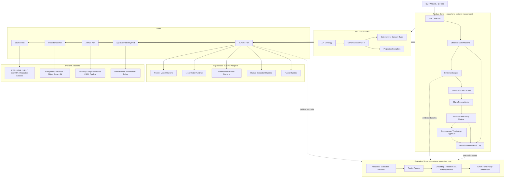
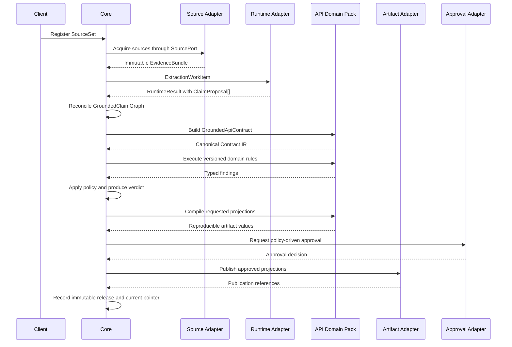

# Model-Independent loop-apidoc Architecture

**Date:** 2026-07-20
**Status:** Implemented as the model-independent foundation; existing CLI retained as a compatibility adapter

## 1. Purpose

This document defines a greenfield architecture for `loop-apidoc`. It does not prescribe
how to refactor or preserve the current implementation.

The product is defined as an **evidence-to-contract system**:

> Transform heterogeneous source evidence into validated, governed, versioned API contract
> assets that downstream systems can safely depend on.

Models are replaceable readers that propose claims. They are not the source of truth, the
contract authority, or the validation authority.

## 2. Design goals

The architecture must be:

1. **Model independent** — no product rule depends on a model vendor, model family, prompt
   format, context window, or agent topology.
2. **Platform independent** — no product rule depends on a CLI, filesystem, database,
   browser, cloud provider, Git host, or document platform.
3. **Runtime replaceable** — frontier models, local models, deterministic parsers, human
   extraction, and future agent runtimes implement the same typed runtime port.
4. **Source grounded** — every accepted contract claim is bound to immutable source
   evidence, or is explicitly classified as missing, conflicting, unverified, waived, or
   superseded.
5. **Deterministically assured** — a runtime cannot approve its own output. Acceptance is
   decided by model-independent rules and policy.
6. **Governable** — generation, approval, publication, freshness, and supersession are
   distinct lifecycle states.
7. **Projection based** — OpenAPI, integration contracts, guides, review pages, collections,
   examples, and SDK inputs are derived views. None is the canonical truth by itself.

## 3. Non-goals

This design does not:

- choose a programming language, framework, database, cloud, or deployment topology;
- choose a model vendor or define model-specific prompts;
- prescribe one-agent, multi-agent, endpoint fan-out, or fixed-round correction;
- make OpenAPI the sole canonical representation;
- treat a benchmark score as a production validation verdict;
- define an implementation migration from the existing repository;
- require human approval for every deployment.

Approval is policy driven. High-risk policies may require a human decision; lower-risk
policies may permit deterministic automatic promotion.

## 4. Considered approaches

### 4.1 Output-centric compiler

The runtime generates OpenAPI directly and validators inspect the result.

This is simple, but OpenAPI cannot faithfully represent all evidence bindings, source
conflicts, missing facts, waivers, integration mechanics, or governance state. It also lets
the output format distort the source-derived domain model.

**Decision:** rejected.

### 4.2 Workflow-centric orchestrator

A workflow engine defines extraction stages and invokes replaceable runtimes at each stage.

This provides runtime portability, but it makes orchestration mechanics appear to be the
product. Agent roles, context splitting, retry rounds, and concurrency policies are likely
to change faster than evidence and contract semantics.

**Decision:** rejected as the architectural center. A lifecycle state machine remains useful
inside the application core.

### 4.3 Evidence-centric hexagonal architecture

Immutable evidence, grounded claims, a canonical contract representation, deterministic
assurance, and governed releases form the product. Runtime and platform integrations sit
behind typed ports.

**Decision:** selected.

## 5. Architecture overview



The dependency rule is strict:

> Outer layers may depend on inner contracts. Product Core and Domain must not depend on a
> model vendor, agent framework, transport, storage engine, interface, or deployment platform.

## 6. Product Core

Product Core owns the evidence-to-asset lifecycle. It is deterministic except where it calls
an explicit port and records the returned observation.

### 6.1 Use Case API

The Core exposes intent-oriented operations rather than storage or model operations:

- register a source set;
- acquire or refresh evidence;
- request claim proposals;
- reconcile claims;
- build a contract snapshot;
- validate a contract snapshot;
- request review or approval;
- publish an approved release;
- compare releases;
- check freshness;
- supersede or revoke a release.

The same API can be driven by a CLI, service endpoint, CI job, IDE, or web interface.

### 6.2 Evidence Ledger

The Evidence Ledger records immutable observations about source material:

```text
SourceSet
  id
  version
  sources[]
  lineage

SourceArtifact
  id
  media_type
  content_digest
  acquisition_metadata
  acquired_at

EvidenceFragment
  id
  source_artifact_id
  locator
  fragment_digest
  normalized_view_refs[]
```

A normalized view, such as Markdown derived from a PDF, never replaces the source artifact.
It is linked to the immutable original and has its own digest and transformation metadata.

The Core does not know how a PDF, HTML page, private portal, repository, or object store is
read. Source Adapters produce `EvidenceBundle` values through the Source Port.

### 6.3 Grounded Claim Graph

Runtimes propose claims; the Core owns grounded claims.

```text
ClaimProposal
  id
  claim_kind
  subject
  predicate
  value
  evidence_refs[]
  runtime_observation

GroundedClaim
  id
  canonical_identity
  claim_kind
  value
  evidence_refs[]
  status
  lineage
```

Grounded claim status is one of:

- `supported`
- `missing`
- `conflicting`
- `unverified`
- `waived`
- `superseded`

Runtime confidence may be preserved as diagnostic metadata, but it never determines claim
status.

### 6.4 Claim Reconciliation

Claim Reconciliation deterministically handles:

- duplicate proposals;
- multiple evidence fragments supporting one claim;
- incompatible values for one canonical identity;
- old and new source-set versions;
- absent or invalid evidence references;
- disagreement between runtimes;
- changes to Domain identity rules.

Runtime consensus is not evidence. Two models making the same unsupported assertion still
produce an unverified claim.

### 6.5 Lifecycle State Machine

The canonical lifecycle is:

```text
registered
  -> acquired
  -> claims_proposed
  -> reconciled
  -> contract_built
  -> validated
  -> review_required | approval_ready
  -> approved
  -> published
  -> stale
  -> superseded | revoked
```

Every transition declares:

- required input state;
- required artifacts;
- deterministic guards;
- permitted actor or policy;
- emitted events;
- retry and idempotency semantics;
- invalidation conditions.

Runtime topology is not part of the lifecycle. A single model, a model swarm, a parser, or a
human can all satisfy a `claims_proposed` transition through the Runtime Port.

### 6.6 Validation and Policy Engine

The Core contains the generic engine that:

- executes versioned Domain rule packs;
- aggregates findings;
- assigns severity according to a named policy profile;
- calculates a deterministic verdict;
- groups shared root causes;
- creates typed correction requests;
- records waivers and their scope;
- prevents a runtime from approving its own output.

API-specific validation rules live in Domain. Rule execution, severity semantics, waiver
semantics, and decision recording live in Core.

### 6.7 Governance

Core governance owns:

- candidate, approved, published, stale, superseded, and revoked states;
- immutable contract releases;
- deterministic current pointers;
- supersession lineage;
- approval policy;
- actor and decision records;
- time-bounded and scope-bounded waivers;
- source, claim, contract, and release diffs;
- freshness state;
- downstream dependency impact;
- audit events.

Generation is never equivalent to publication.

### 6.8 Core ports

The Core defines, but does not implement:

- `RuntimePort`
- `SourcePort`
- `EvidenceStore`
- `ContractStore`
- `ArtifactSink`
- `ApprovalPort`
- `IdentityProvider`
- `Clock`
- `EventSink`

No direct filesystem, network, process, browser, model, or database call is permitted in the
Core.

## 7. API Domain Pack

Domain is the stable API-integration knowledge of the product. It contains no model calls,
prompt text, platform I/O, workflow transport, or storage implementation.

### 7.1 API ontology

The ontology includes:

- API system;
- environment and server;
- operation;
- path and method;
- webhook and callback;
- parameter;
- request and response;
- schema, field, enum, and union;
- security scheme and operation security;
- error model and applicability;
- example;
- operational constraint;
- encryption and signature mechanism;
- field condition;
- integration test case;
- evidence binding;
- gap, conflict, waiver, and verification state.

### 7.2 Identity rules

The Domain Pack defines canonical identities for:

- operations;
- webhooks and callbacks;
- schemas and fields;
- security schemes;
- error codes;
- integration mechanisms;
- contract claims.

Identity rules must not depend on output filenames, extraction file order, agent roles, or
runtime task boundaries.

### 7.3 Canonical Contract IR

The canonical contract is not an OpenAPI document or runtime response:

```text
GroundedApiContract
  metadata
  environments
  operations
  webhooks
  schemas
  security
  errors
  integration_mechanics
  operational_constraints
  claims
  gaps
  conflicts
  waivers
  evidence_bindings
```

The IR must preserve information that common output formats cannot express, including source
conflicts, missing facts, unverified claims, waiver decisions, cryptographic sequences,
conditional requiredness, and claim-level provenance.

### 7.4 Deterministic domain rules

The API Domain Pack supplies rules for:

- operation, webhook, and callback identity;
- path and method legality;
- request and response completeness;
- schema and reference resolution;
- nested and polymorphic field structure;
- security attachment;
- server selection;
- error-code applicability;
- callback verification;
- cryptographic chain completeness;
- conditional requiredness;
- integration cross-references;
- projection compatibility;
- claim-to-evidence requirements.

Domain rules never infer unstated provider behavior from REST, OAuth, payment, HTTP, or SDK
conventions.

### 7.5 Projection compilers

Versioned deterministic projection compilers derive:

- OpenAPI;
- integration contracts;
- human-readable guides;
- review-view data;
- examples;
- Postman or similar collections;
- SDK authoring inputs;
- contract-test inputs.

Projection data is derived and reproducible. Writing it to a filesystem, registry, portal,
repository, or CI artifact is an Artifact Adapter responsibility.

## 8. Runtime Port and Runtime Adapters

Runtime Adapters turn typed work items into claim proposals. They do not establish truth,
validate the contract, approve releases, or mutate Core state directly.

### 8.1 Runtime work item

```text
ExtractionWorkItem
  task_id
  evidence_scope[]
  requested_claim_kinds[]
  output_schema
  grounding_constraints
  resource_budget
  deadline
  correlation_id
```

The work item does not specify a prompt, model, subagent count, context strategy, or tool
protocol.

### 8.2 Runtime result

```text
RuntimeResult
  claim_proposals[]
  diagnostics[]
  runtime_identity
  runtime_version
  execution_trace_ref
  resource_usage
```

Each claim proposal must carry evidence references. Missing evidence produces an unverified
proposal; it is never silently accepted.

### 8.3 Adapter responsibilities

A Runtime Adapter may implement:

- provider SDK calls;
- prompt construction;
- structured-output mapping;
- tool and function calling;
- context selection;
- session management;
- native multi-agent or subagent execution;
- concurrency;
- vision and document capabilities;
- transport retries;
- timeout, cancellation, and rate-limit handling;
- token, cost, latency, and runtime telemetry;
- capability discovery.

### 8.4 Adapter prohibitions

A Runtime Adapter must not:

- define source truth;
- resolve source conflicts as final decisions;
- assign production validation verdicts;
- approve or publish assets;
- modify governance state;
- define API identity rules;
- write directly to Core storage;
- silently infer missing contract facts;
- convert semantic validation failure into a transport retry.

Transport failures may be retried inside the adapter. Semantic correction is requested by the
Core as a new typed work item with a new correlation record.

### 8.5 Supported runtime classes

The Runtime Port must support:

- frontier model runtimes;
- local model runtimes;
- deterministic parser runtimes;
- human extraction runtimes;
- hybrid runtimes;
- future provider-managed agent runtimes.

The Core has no `agent` concept. Agent topology is an adapter implementation detail.

## 9. Platform Adapters

Runtime Adapter is not a catch-all for platform I/O.

### 9.1 Source Adapters

Source Adapters read local files, URLs, browsers, object storage, Git, API registries, and
enterprise document systems. They produce immutable `EvidenceBundle` values.

### 9.2 Persistence Adapters

Persistence Adapters implement Core stores using filesystems, relational databases, object
storage, content-addressed stores, Git, or hosted services.

### 9.3 Artifact Adapters

Artifact Adapters publish projections to directories, Git commits or pull requests, API
registries, developer portals, CI artifacts, and SDK pipelines.

### 9.4 Approval and identity adapters

Approval and identity adapters integrate CLI confirmation, web review, IAM, Git review, CI
policy, and organization-specific authorization.

## 10. Evaluation System

Evaluation is separate from production validation.

Validation answers:

> Does this contract satisfy the active deterministic rules and acceptance policy?

Evaluation answers:

> How well does a runtime, policy, Domain version, or Core version perform across a
> representative dataset?

### 10.1 Evaluation datasets

Each versioned evaluation case contains:

- an immutable source bundle;
- expected claims;
- expected missing facts;
- expected conflicts;
- expected evidence bindings;
- expected contract projections where appropriate;
- a risk classification;
- evaluator version metadata.

### 10.2 Evaluation metrics

The system measures:

- claim precision and recall;
- field and example omission rate;
- unsupported assertion rate;
- evidence-reference correctness;
- conflict-detection recall;
- deterministic contract validity;
- human review effort;
- runtime cost and latency;
- retries and failure modes;
- cross-run stability;
- policy false-accept and false-reject rates.

No single weighted score is the authoritative production verdict.

### 10.3 Replay

The Replay Runner can hold the evidence bundle constant while varying:

- runtime;
- model;
- prompt or adapter version;
- Domain Pack version;
- Core policy;
- source parser;
- projection compiler.

This separates runtime regression from Domain or Core regression.

### 10.4 Evaluation isolation

Evaluation:

- cannot mutate production assets;
- cannot establish source truth;
- cannot approve runtime configuration;
- cannot replace validation decisions;
- consumes immutable evidence, events, traces, and telemetry through public ports.

Evaluation may propose a runtime or policy configuration. Promotion of that configuration is
a governed Core decision.

## 11. End-to-end data flow



If validation fails, Core emits a typed correction request. It may call the same runtime, a
different runtime, a deterministic parser, or a human adapter. Correction is not defined as
"retry the model"; it is a new evidence-scoped claim proposal operation.

## 12. Error model

Errors are separated by authority and retry semantics.

### 12.1 Adapter failures

Examples: network timeout, provider rate limit, unavailable file, unsupported media type.

- Adapter returns a typed operational failure.
- Core records the observation.
- Retry policy is bounded and explicit.
- Adapter failure cannot be represented as a missing API fact.

### 12.2 Claim failures

Examples: evidence reference missing, conflicting values, unsupported assertion.

- Core classifies the claim state.
- Runtime self-confidence does not alter classification.
- Correction requests are evidence scoped.

### 12.3 Contract failures

Examples: unresolved schema reference, incomplete callback verification, invalid operation
identity.

- Domain rules return typed findings.
- Core policy assigns acceptance severity and verdict.
- Findings identify affected claim and evidence scope.

### 12.4 Governance failures

Examples: approval absent, waiver expired, source stale, current release superseded.

- Publication is blocked by lifecycle preconditions.
- Existing immutable releases are not rewritten.
- Revocation and supersession create new audit events.

## 13. Testing strategy

### 13.1 Domain tests

- ontology and identity examples;
- deterministic rule tables;
- projection golden tests;
- conflict, missing, waiver, and evidence-binding semantics;
- property tests for stable identities and reproducible projections.

### 13.2 Core tests

- lifecycle transition tables;
- claim reconciliation;
- policy and severity behavior;
- idempotency;
- release immutability;
- freshness and diff behavior;
- audit-event completeness;
- contract tests for every port.

### 13.3 Adapter tests

- conformance to typed port contracts;
- capability negotiation;
- transport error mapping;
- cancellation and timeout;
- telemetry completeness;
- evidence-scope enforcement;
- prevention of direct Core-state mutation.

### 13.4 Evaluation tests

- dataset immutability;
- replay reproducibility;
- metric versioning;
- evaluator calibration;
- isolation from production state;
- attribution of regressions to runtime, Domain, Core, or source parsing.

## 14. Security and trust boundaries

- Source content and runtime output are untrusted inputs.
- Runtime Adapters receive only authorized evidence scopes.
- Credentials remain in Platform Adapters and are never embedded in evidence or runtime
  results.
- Runtime results cannot mutate stores directly.
- Publication requires Core governance authorization.
- Every approved release records source, Domain, Core, policy, runtime, and projection
  versions.
- Audit records are append-only from the product perspective.

## 15. Durable design decisions

The following decisions remain valuable even as models and platforms change:

1. Source material is the only factual authority.
2. Unknown, missing, conflicting, and unverified states are first-class data.
3. Sources and normalized views are immutable, hashed, and versioned.
4. Runtime output is a proposal, not an accepted contract.
5. Runtime generation and deterministic assurance are separate failure domains.
6. Canonical contract representation is independent of output format.
7. Every accepted claim has an evidence binding.
8. Acceptance fails closed under the active policy.
9. Generation, approval, and publication are separate lifecycle transitions.
10. Published releases are immutable and have deterministic current pointers.
11. Freshness and diff are part of the asset lifecycle.
12. Runtime identity is recorded but is not part of contract identity.

## 16. Explicitly disposable design choices

The following choices must remain replaceable and are not architectural invariants:

- agent-native execution;
- skills as workflow engines;
- per-endpoint subagents;
- fixed role matrices;
- fixed correction rounds;
- model tiers;
- prompt text;
- context partitioning strategies;
- CLI command structure;
- filesystem layouts;
- a particular artifact set;
- OpenAPI as sole canonical truth;
- a single quality score as acceptance authority.

## 17. Product boundary

The product core is:

```text
Evidence Ledger
+ Grounded Claim Graph
+ Canonical API Contract IR
+ Deterministic Assurance Engine
+ Governed Contract Registry
```

Replaceable dependencies are:

```text
Models
Agents
Prompts
Tools
Browsers
Storage
CLI and UI
Artifact destinations
```

Evaluation independently observes runtime quality, Core regression, Domain-rule correctness,
and end-to-end business outcomes.

The resulting product is not an AI document-generation pipeline. It is:

> A platform that compiles source evidence into validated, approved, publishable API contract
> assets.

## 18. Implementation planning boundary

This architecture contains four independently plannable subsystems:

1. **Domain and canonical contract foundation** — API ontology, claim identity, canonical IR,
   deterministic rule-pack contracts, and projection contracts.
2. **Evidence and Product Core** — evidence ledger, claim graph, reconciliation, lifecycle,
   policy, governance, and ports.
3. **Adapter ecosystem** — source, runtime, persistence, artifact, identity, and approval
   adapter contracts plus reference adapters.
4. **Evaluation system** — datasets, replay, metrics, comparisons, and promotion evidence.

Implementation planning must define dependency order and acceptance criteria for these
subsystems without reintroducing a model, platform, or runtime dependency into Core or Domain.
